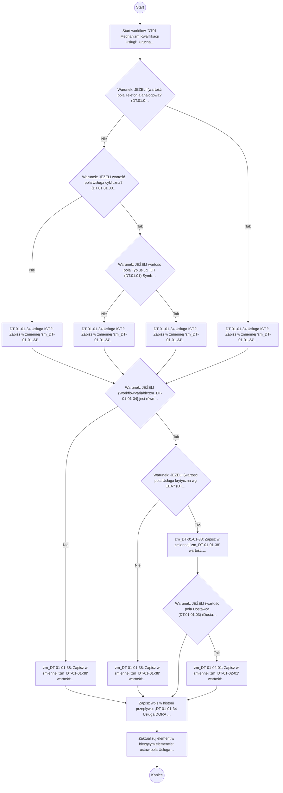

# DT01 Mechanizm Kwalifikacji Usługi

> Wyliczenie wartości pól w formularzu DT.01.01.01:
> 1. Usługa ICT wg DORA? (DT.01.01.34)
> 2. Usługa krytyczna wg DORA? (DT.01.01.38)
> 3. Zwiększone ryzyko koncentracji? (DT.01.02.01)

## Podstawowe informacje

- **Lista źródłowa:** Kwalifikacja Usług
- **Plik źródłowy:** `DT01_Mechanizm_Kwalifikacji_Usługi (1).nwf`
- **Inne listy używane przez workflow:** Zadania przepływu pracy

## Diagram przepływu



## Kroki workflow

- `[n1]` Start workflow 'DT01 Mechanizm Kwalifikacji Usługi'. Uruchamiane: ręcznie, przy utworzeniu elementu, przy zmianie elementu.
  > **Wskazówka migracji**: Wyzwalacz procesu (Triggers: ręcznie, przy utworzeniu elementu, przy zmianie elementu). Punkt wejścia przyjmujący parametr itemId.
  ```plsql
  -- Pobranie bieżącego elementu przed rozpoczęciem logiki workflow:
  l_item_json := shp_api.get_list_item(
      p_site_url   => c_site_url,
      p_list_title => 'Kwalifikacja Usług',
      p_item_id    => p_item_id
  );
  ```
  <details><summary>Szczegóły techniczne</summary>

  ```
  StartManually = true
  StartOnCreate = true
  StartOnChange = true
  WorkflowName = DT01 Mechanizm Kwalifikacji Usługi
  WorkflowDescription = Wyliczenie wartości pól w formularzu DT.01.01.01:
1. Usługa ICT wg DORA? (DT.01.01.34)
2. Usługa krytyczna wg DORA? (DT.01.01.38)
3. Zwiększone ryzyko koncentracji? (DT.01.02.01)
  WorkflowDuration = -1
  TaskListId = {2DC84853-CA02-4D4C-8521-8A3C2CD72A3A}
  StartPage = _layouts/15/NintexWorkflow/StartWorkflow.aspx
  VerboseLogging = false
  Category = List
  ContentType = 
  StartOnCreateCondition = false
  StartOnChangeCondition = false
  HistoryLogging = true
  RequireManagePermission = false
  HistoryListName = NintexWorkflowHistory
  ChangeComments = 
  Id = {0076FF37-500D-4E62-A445-D54959D8E0C3}
  SkipValidation = false
  ContentTypeName = Wszystkie
  DisplayStatusColumn = false
  StartFromMenu = false
  StartFromMenuLabel = 
  EcbId = 00000000-0000-0000-0000-000000000000
  CustomActionSequence = 0
  CustomActionIcon = _layouts/15/NintexWorkflow/Images/StartWorkflowECB.png
  UsesConditionalStart = false
  ```
  </details>
- `[n2]` Warunek: JEŻELI (wartość pola Telefonia analogowa? (DT.01.01.31) (DT_x002e_01) z bieżącego elementu jest równe Tak) LUB (wartość pola Model kontraktowania (DT.01.01.10) (Model_x0020_kontraktowy_x0020__x) z bieżącego elementu jest równe ATU)
  > **Wskazówka migracji**: Bramka decyzyjna (Exclusive Gateway / IF): sprawdzenie warunku logicznego: (wartość pola Telefonia analogowa? (DT.01.01.31) (DT_x002e_01) z bieżącego elementu jest równe Tak) LUB (wartość pola Model kontraktowania (DT.01.01.10) (Model_x0020_kontraktowy_x0020__x) z bieżącego elementu jest równe ATU).
  ```plsql
  IF (json_value(l_item_json, '$.data.DT_x002e_01') = 'Tak') OR (json_value(l_item_json, '$.data.Model_x0020_kontraktowy_x0020__x') = 'ATU') THEN
      -- Gałąź Tak
  ELSE
      -- Gałąź Nie
  END IF;
  ```
  <details><summary>Szczegóły techniczne</summary>

  ```
  ConditionUse=Child
  ```
  </details>
    - `[n3]` Warunek: JEŻELI wartość pola Usługa cykliczna? (DT.01.01.33) (DT_x002e_03) z bieżącego elementu jest równe Tak
      > **Wskazówka migracji**: Bramka decyzyjna (Exclusive Gateway / IF): sprawdzenie warunku logicznego: wartość pola Usługa cykliczna? (DT.01.01.33) (DT_x002e_03) z bieżącego elementu jest równe Tak.
      ```plsql
      IF json_value(l_item_json, '$.data.DT_x002e_03') = 'Tak' THEN
          -- Gałąź Tak
      ELSE
          -- Gałąź Nie
      END IF;
      ```
      <details><summary>Szczegóły techniczne</summary>

      ```
      ConditionUse=Child
      ```
      </details>
        - `[n4]` DT-01-01-34 Usługa ICT?: Zapisz w zmiennej 'zm_DT-01-01-34' wartość: Nie.
          > **Wskazówka migracji**: Obliczenie/odczyt i zapis do zmiennej lokalnej 'zm_DT-01-01-34'.
          ```plsql
          l_zm_dt_01_01_34 := 'Nie';
          ```
          <details><summary>Szczegóły techniczne</summary>

          ```
          ValueType = Text
          VariableName = 
          Value = Nie
          ```
          </details>
        - `[n5]` Warunek: JEŻELI wartość pola Typ usługi ICT (DT.01.01):Symbol usługi (Typ_x0020_us_x0142_ugi_x0020_ICT0) z bieżącego elementu jest równe eba_TA:S00
          > **Wskazówka migracji**: Bramka decyzyjna (Exclusive Gateway / IF): sprawdzenie warunku logicznego: wartość pola Typ usługi ICT (DT.01.01):Symbol usługi (Typ_x0020_us_x0142_ugi_x0020_ICT0) z bieżącego elementu jest równe eba_TA:S00.
          ```plsql
          IF json_value(l_item_json, '$.data.Typ_x0020_us_x0142_ugi_x0020_ICT0') = 'eba_TA:S00' THEN
              -- Gałąź Tak
          ELSE
              -- Gałąź Nie
          END IF;
          ```
          <details><summary>Szczegóły techniczne</summary>

          ```
          ConditionUse=Child
          ```
          </details>
            - `[n6]` DT-01-01-34 Usługa ICT?: Zapisz w zmiennej 'zm_DT-01-01-34' wartość: Tak.
              > **Wskazówka migracji**: Obliczenie/odczyt i zapis do zmiennej lokalnej 'zm_DT-01-01-34'.
              ```plsql
              l_zm_dt_01_01_34 := 'Tak';
              ```
              <details><summary>Szczegóły techniczne</summary>

              ```
              ValueType = Text
              VariableName = 
              Value = Tak
              ```
              </details>
            - `[n7]` DT-01-01-34 Usługa ICT?: Zapisz w zmiennej 'zm_DT-01-01-34' wartość: Nie.
              > **Wskazówka migracji**: Obliczenie/odczyt i zapis do zmiennej lokalnej 'zm_DT-01-01-34'.
              ```plsql
              l_zm_dt_01_01_34 := 'Nie';
              ```
              <details><summary>Szczegóły techniczne</summary>

              ```
              ValueType = Text
              VariableName = 
              Value = Nie
              ```
              </details>
    - `[n8]` DT-01-01-34 Usługa ICT?: Zapisz w zmiennej 'zm_DT-01-01-34' wartość: Nie.
      > **Wskazówka migracji**: Obliczenie/odczyt i zapis do zmiennej lokalnej 'zm_DT-01-01-34'.
      ```plsql
      l_zm_dt_01_01_34 := 'Nie';
      ```
      <details><summary>Szczegóły techniczne</summary>

      ```
      ValueType = Text
      VariableName = 
      Value = Nie
      ```
      </details>
- `[n9]` Warunek: JEŻELI {WorkflowVariable:zm_DT-01-01-34} jest równe Tak
  > **Wskazówka migracji**: Bramka decyzyjna (Exclusive Gateway / IF): sprawdzenie warunku logicznego: {WorkflowVariable:zm_DT-01-01-34} jest równe Tak.
  ```plsql
  IF l_zm_dt_01_01_34 = 'Tak' THEN
      -- Gałąź Tak
  ELSE
      -- Gałąź Nie
  END IF;
  ```
  <details><summary>Szczegóły techniczne</summary>

  ```
  ConditionUse=Child
  ```
  </details>
    - `[n10]` zm_DT-01-01-38: Zapisz w zmiennej 'zm_DT-01-01-38' wartość: Nie.
      > **Wskazówka migracji**: Obliczenie/odczyt i zapis do zmiennej lokalnej 'zm_DT-01-01-38'.
      ```plsql
      l_zm_dt_01_01_38 := 'Nie';
      ```
      <details><summary>Szczegóły techniczne</summary>

      ```
      ValueType = Text
      VariableName = 
      Value = Nie
      ```
      </details>
    - `[n11]` Warunek: JEŻELI (wartość pola Usługa krytyczna wg EBA? (DT.01.01.37) (Us_x0142_uga_x0020_krytyczna_x00) z bieżącego elementu jest równe Tak) LUB (wartość pola Czy usługa związana z funkcją krytyczną (DT.01.01.35) (Funkcja_x0020_krytyczna) z bieżącego elementu nie zawiera F0)
      > **Wskazówka migracji**: Bramka decyzyjna (Exclusive Gateway / IF): sprawdzenie warunku logicznego: (wartość pola Usługa krytyczna wg EBA? (DT.01.01.37) (Us_x0142_uga_x0020_krytyczna_x00) z bieżącego elementu jest równe Tak) LUB (wartość pola Czy usługa związana z funkcją krytyczną (DT.01.01.35) (Funkcja_x0020_krytyczna) z bieżącego elementu nie zawiera F0).
      ```plsql
      IF (json_value(l_item_json, '$.data.Us_x0142_uga_x0020_krytyczna_x00') = 'Tak') OR (json_value(l_item_json, '$.data.Funkcja_x0020_krytyczna') NOT LIKE '%' || 'F0' || '%') THEN
          -- Gałąź Tak
      ELSE
          -- Gałąź Nie
      END IF;
      ```
      <details><summary>Szczegóły techniczne</summary>

      ```
      ConditionUse=Child
      ```
      </details>
        - `[n12]` zm_DT-01-01-38: Zapisz w zmiennej 'zm_DT-01-01-38' wartość: Nie.
          > **Wskazówka migracji**: Obliczenie/odczyt i zapis do zmiennej lokalnej 'zm_DT-01-01-38'.
          ```plsql
          l_zm_dt_01_01_38 := 'Nie';
          ```
          <details><summary>Szczegóły techniczne</summary>

          ```
          ValueType = Text
          VariableName = 
          Value = Nie
          ```
          </details>
        - `[n13]` zm_DT-01-01-38: Zapisz w zmiennej 'zm_DT-01-01-38' wartość: Tak.
          > **Wskazówka migracji**: Obliczenie/odczyt i zapis do zmiennej lokalnej 'zm_DT-01-01-38'.
          ```plsql
          l_zm_dt_01_01_38 := 'Tak';
          ```
          <details><summary>Szczegóły techniczne</summary>

          ```
          ValueType = Text
          VariableName = 
          Value = Tak
          ```
          </details>
        - `[n14]` Warunek: JEŻELI (wartość pola Dostawca (DT.01.01.03) (Dostawca_x0020__x0028_DT_x002e_0) z bieżącego elementu) ORAZ (wartość pola Są inne usł. krytyczne Dostawcy? (DT.01.02.16) (S_x0105__x0020_inne_x0020_us_x01) z bieżącego elementu jest równe Tak)
          > **Wskazówka migracji**: Bramka decyzyjna (Exclusive Gateway / IF): sprawdzenie warunku logicznego: (wartość pola Dostawca (DT.01.01.03) (Dostawca_x0020__x0028_DT_x002e_0) z bieżącego elementu) ORAZ (wartość pola Są inne usł. krytyczne Dostawcy? (DT.01.02.16) (S_x0105__x0020_inne_x0020_us_x01) z bieżącego elementu jest równe Tak).
          ```plsql
          IF (json_value(l_item_json, '$.data.Dostawca_x0020__x0028_DT_x002e_0') = NULL) AND (json_value(l_item_json, '$.data.S_x0105__x0020_inne_x0020_us_x01') = 'Tak') THEN
              -- Gałąź Tak
          ELSE
              -- Gałąź Nie
          END IF;
          ```
          <details><summary>Szczegóły techniczne</summary>

          ```
          ConditionUse=Child
          ```
          </details>
            - `[n15]` zm_DT-01-02-01: Zapisz w zmiennej 'zm_DT-01-02-01' wartość: Tak.
              > **Wskazówka migracji**: Obliczenie/odczyt i zapis do zmiennej lokalnej 'zm_DT-01-02-01'.
              ```plsql
              l_zm_dt_01_02_01 := 'Tak';
              ```
              <details><summary>Szczegóły techniczne</summary>

              ```
              ValueType = Text
              VariableName = 
              Value = Tak
              ```
              </details>
- `[n16]` Zapisz wpis w historii przepływu: „DT-01-01-34 Usługa DORA ICT: {WorkflowVariable:zm_DT-01-01-34}” (…)
  > **Wskazówka migracji**: Zapis audytowy do dziennika zdarzeń (Audit Log).
  ```plsql
  apex_debug.info('Workflow: ' || 'DT-01-01-34 Usługa DORA ICT: ' || l_zm_dt_01_01_34 || '
  DT-01-01-38 Usługa DORA ICT Krytyczna: ' || l_zm_dt_01_01_38 || '
  DT-01-02-01: Ryzyko koncentracji: ' || l_zm_dt_01_02_01);
  ```
  <details><summary>Szczegóły techniczne</summary>

  ```
  Message = DT-01-01-34 Usługa DORA ICT: {WorkflowVariable:zm_DT-01-01-34}
DT-01-01-38 Usługa DORA ICT Krytyczna: {WorkflowVariable:zm_DT-01-01-38}
DT-01-02-01: Ryzyko koncentracji: {WorkflowVariable:zm_DT-01-02-01}
  ```
  </details>
- `[n17]` Zaktualizuj element w bieżącym elemencie: ustaw pola Usługa ICT wg DORA? (DT.01.01.34) (Us_x0142_uga_x0020_kwalifikowana), Usługa krytyczna wg DORA? (DT.01.01.38) (Us_x0142_uga_x0020_krytyczna_x000), Ryzyko koncentracji? (DT.01.02.01) (Zwi_x0119_kszone_x0020_ryzyko_x0).
  > **Wskazówka migracji**: Aktualizacja danych elementu (Usługa ICT wg DORA? (DT.01.01.34) (Us_x0142_uga_x0020_kwalifikowana), Usługa krytyczna wg DORA? (DT.01.01.38) (Us_x0142_uga_x0020_krytyczna_x000), Ryzyko koncentracji? (DT.01.02.01) (Zwi_x0119_kszone_x0020_ryzyko_x0)). W systemie docelowym UPDATE lub REST PATCH/MERGE.
  ```plsql
  l_resp := shp_api.update_list_item(
      p_site_url    => c_site_url,
      p_list_title  => 'Kwalifikacja Usług',
      p_item_id     => p_item_id,
      p_fields_json => json_object(
          'Us_x0142_uga_x0020_kwalifikowana' value l_us_uga_ict_wg_dora_dt_01_01_34,
          'Us_x0142_uga_x0020_krytyczna_x000' value l_us_uga_krytyczna_wg_dora_dt_01_01_38,
          'Zwi_x0119_kszone_x0020_ryzyko_x0' value l_ryzyko_koncentracji_dt_01_02_01
      )
  );
  ```
  <details><summary>Szczegóły techniczne</summary>

  ```
  ListId = {45763939-B649-439D-9A1B-39D6AB430FBF}
  ThisItem = True
  ```
  </details>

## Zmienne przepływu pracy

| Zmienna | Typ | Opis / Rola |
|---|---|---|
| `zm_DT-01-01-34` | Text | DT-01-01-34 Usługa ICT? |
| `zm_DT-01-01-38` | Text | zm_DT-01-01-38 |
| `zm_DT-01-02-01` | Text | zm_DT-01-02-01 |

## Pola odczytywane / zapisywane

| Pole | Odczyt | Zapis |
|---|---|---|
| Telefonia analogowa? (DT.01.01.31) (DT_x002e_01) | X |  |
| Usługa cykliczna? (DT.01.01.33) (DT_x002e_03) | X |  |
| Dostawca (DT.01.01.03) (Dostawca_x0020__x0028_DT_x002e_0) | X |  |
| Czy usługa związana z funkcją krytyczną (DT.01.01.35) (Funkcja_x0020_krytyczna) | X |  |
| Model kontraktowania (DT.01.01.10) (Model_x0020_kontraktowy_x0020__x) | X |  |
| Są inne usł. krytyczne Dostawcy? (DT.01.02.16) (S_x0105__x0020_inne_x0020_us_x01) | X |  |
| Typ usługi ICT (DT.01.01):Symbol usługi (Typ_x0020_us_x0142_ugi_x0020_ICT0) | X |  |
| Usługa krytyczna wg EBA? (DT.01.01.37) (Us_x0142_uga_x0020_krytyczna_x00) | X |  |
| Usługa krytyczna wg DORA? (DT.01.01.38) (Us_x0142_uga_x0020_krytyczna_x000) |  | X |
| Usługa ICT wg DORA? (DT.01.01.34) (Us_x0142_uga_x0020_kwalifikowana) |  | X |
| Ryzyko koncentracji? (DT.01.02.01) (Zwi_x0119_kszone_x0020_ryzyko_x0) |  | X |

### Słownik pól i identyfikatory techniczne

| Nazwa biznesowa | SharePoint InternalName | Typ | Odczyt | Zapis |
|---|---|---|---|---|
| Telefonia analogowa? (DT.01.01.31) | `DT_x002e_01` | Tekst/Ref | Tak | - |
| Usługa cykliczna? (DT.01.01.33) | `DT_x002e_03` | Tekst/Ref | Tak | - |
| Dostawca (DT.01.01.03) | `Dostawca_x0020__x0028_DT_x002e_0` | Tekst/Ref | Tak | - |
| Czy usługa związana z funkcją krytyczną (DT.01.01.35) | `Funkcja_x0020_krytyczna` | Tekst/Ref | Tak | - |
| Model kontraktowania (DT.01.01.10) | `Model_x0020_kontraktowy_x0020__x` | Tekst/Ref | Tak | - |
| Są inne usł. krytyczne Dostawcy? (DT.01.02.16) | `S_x0105__x0020_inne_x0020_us_x01` | Tekst/Ref | Tak | - |
| Typ usługi ICT (DT.01.01):Symbol usługi | `Typ_x0020_us_x0142_ugi_x0020_ICT0` | Tekst/Ref | Tak | - |
| Usługa krytyczna wg EBA? (DT.01.01.37) | `Us_x0142_uga_x0020_krytyczna_x00` | Tekst/Ref | Tak | - |
| Usługa krytyczna wg DORA? (DT.01.01.38) | `Us_x0142_uga_x0020_krytyczna_x000` | Tekst/Ref | - | Tak |
| Usługa ICT wg DORA? (DT.01.01.34) | `Us_x0142_uga_x0020_kwalifikowana` | Tekst/Ref | - | Tak |
| Ryzyko koncentracji? (DT.01.02.01) | `Zwi_x0119_kszone_x0020_ryzyko_x0` | Tekst/Ref | - | Tak |

## Kompletna procedura orkiestracji PL/SQL (Oracle APEX / SHP_API)

Poniższy kod stanowi gotowy, kompletny szkielet procedury PL/SQL do wdrożenia w Oracle APEX, realizujący całą logikę workflow za pośrednictwem pakietu `SHP_API`:

```plsql
CREATE OR REPLACE PROCEDURE process_wf_dt01_mechanizm_kwalifikacji_us_ugi (
    p_item_id IN NUMBER
) AS
    c_site_url CONSTANT VARCHAR2(400) := 'https://sharepoint.domain.com/sites/...';
    l_item_json CLOB;
    l_resp      CLOB;
    l_ref_json  CLOB;
    -- Zmienne workflow:
    l_zm_dt_01_01_34               VARCHAR2(4000);
    l_zm_dt_01_01_38               VARCHAR2(4000);
    l_zm_dt_01_02_01               VARCHAR2(4000);
BEGIN
    apex_debug.info('Start workflow: DT01 Mechanizm Kwalifikacji Usługi, item_id: ' || p_item_id);

    -- 1. Pobranie danych biezacego elementu
    l_item_json := shp_api.get_list_item(
        p_site_url   => c_site_url,
        p_list_title => 'Kwalifikacja Usług',
        p_item_id    => p_item_id
    );

    -- 2. Logika biznesowa workflow
    IF (json_value(l_item_json, '$.data.DT_x002e_01') = 'Tak') OR (json_value(l_item_json, '$.data.Model_x0020_kontraktowy_x0020__x') = 'ATU') THEN
        l_zm_dt_01_01_34 := 'Nie';
    ELSE
        IF json_value(l_item_json, '$.data.DT_x002e_03') = 'Tak' THEN
            IF json_value(l_item_json, '$.data.Typ_x0020_us_x0142_ugi_x0020_ICT0') = 'eba_TA:S00' THEN
                l_zm_dt_01_01_34 := 'Nie';
            ELSE
                l_zm_dt_01_01_34 := 'Tak';
            END IF;
        ELSE
            l_zm_dt_01_01_34 := 'Nie';
        END IF;
    END IF;
    IF l_zm_dt_01_01_34 = 'Tak' THEN
        IF (json_value(l_item_json, '$.data.Us_x0142_uga_x0020_krytyczna_x00') = 'Tak') OR (json_value(l_item_json, '$.data.Funkcja_x0020_krytyczna') NOT LIKE '%' || 'F0' || '%') THEN
            l_zm_dt_01_01_38 := 'Tak';
            IF (json_value(l_item_json, '$.data.Dostawca_x0020__x0028_DT_x002e_0') = NULL) AND (json_value(l_item_json, '$.data.S_x0105__x0020_inne_x0020_us_x01') = 'Tak') THEN
                l_zm_dt_01_02_01 := 'Tak';
            END IF;
        ELSE
            l_zm_dt_01_01_38 := 'Nie';
        END IF;
    ELSE
        l_zm_dt_01_01_38 := 'Nie';
    END IF;
    apex_debug.info('Workflow: ' || 'DT-01-01-34 Usługa DORA ICT: ' || l_zm_dt_01_01_34 || '
    DT-01-01-38 Usługa DORA ICT Krytyczna: ' || l_zm_dt_01_01_38 || '
    DT-01-02-01: Ryzyko koncentracji: ' || l_zm_dt_01_02_01);
    l_resp := shp_api.update_list_item(
        p_site_url    => c_site_url,
        p_list_title  => 'Kwalifikacja Usług',
        p_item_id     => p_item_id,
        p_fields_json => json_object(
            'Us_x0142_uga_x0020_kwalifikowana' value l_us_uga_ict_wg_dora_dt_01_01_34,
            'Us_x0142_uga_x0020_krytyczna_x000' value l_us_uga_krytyczna_wg_dora_dt_01_01_38,
            'Zwi_x0119_kszone_x0020_ryzyko_x0' value l_ryzyko_koncentracji_dt_01_02_01
        )
    );

    apex_debug.info('Koniec workflow: DT01 Mechanizm Kwalifikacji Usługi, item_id: ' || p_item_id);
END process_wf_dt01_mechanizm_kwalifikacji_us_ugi;
/
```
