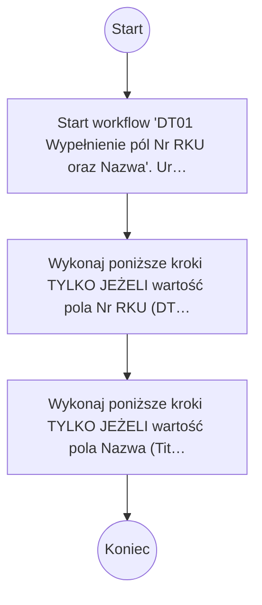

# DT01 Wypełnienie pól Nr RKU oraz Nazwa

## Podstawowe informacje

- **Lista źródłowa:** Kwalifikacja Usług
- **Plik źródłowy:** `DT01_Wypełnienie_pól_Nr_RKU_oraz_Nazwa.nwf`
- **Inne listy używane przez workflow:** Zadania przepływu pracy

## Diagram przepływu



## Kroki workflow

- `[n1]` Start workflow 'DT01 Wypełnienie pól Nr RKU oraz Nazwa'. Uruchamiane: ręcznie, przy utworzeniu elementu, przy zmianie elementu.
  > **Wskazówka migracji**: Wyzwalacz procesu (Triggers: ręcznie, przy utworzeniu elementu, przy zmianie elementu). Punkt wejścia przyjmujący parametr itemId.
  ```plsql
  -- Pobranie bieżącego elementu przed rozpoczęciem logiki workflow:
  l_item_json := shp_api.get_list_item(
      p_site_url   => c_site_url,
      p_list_title => 'Kwalifikacja Usług',
      p_item_id    => p_item_id
  );
  ```
  <details><summary>Szczegóły techniczne</summary>

  ```
  StartManually = true
  StartOnCreate = true
  StartOnChange = true
  WorkflowName = DT01 Wypełnienie pól Nr RKU oraz Nazwa
  WorkflowDescription = 
  WorkflowDuration = -1
  TaskListId = {2DC84853-CA02-4D4C-8521-8A3C2CD72A3A}
  StartPage = _layouts/15/NintexWorkflow/StartWorkflow.aspx
  VerboseLogging = false
  Category = List
  ContentType = 
  StartOnCreateCondition = false
  StartOnChangeCondition = false
  HistoryLogging = true
  RequireManagePermission = false
  HistoryListName = NintexWorkflowHistory
  ChangeComments = 
  Id = {FD6DC49C-7328-42E4-9F30-EA2F17E7BE7A}
  SkipValidation = false
  ContentTypeName = Wszystkie
  DisplayStatusColumn = false
  StartFromMenu = false
  StartFromMenuLabel = 
  EcbId = 00000000-0000-0000-0000-000000000000
  CustomActionSequence = 0
  CustomActionIcon = _layouts/15/NintexWorkflow/Images/StartWorkflowECB.png
  UsesConditionalStart = false
  ```
  </details>
    - `[n2]` Wykonaj poniższe kroki TYLKO JEŻELI wartość pola Nr RKU (DT.01.01) (Nr_x0020_RKU) z bieżącego elementu jest puste
      > **Wskazówka migracji**: Warunek wykonania bloku podrzędnego: IF (wartość pola Nr RKU (DT.01.01) (Nr_x0020_RKU) z bieżącego elementu jest puste).
      ```plsql
      IF json_value(l_item_json, '$.data.Nr_x0020_RKU') IS NULL THEN
          -- Akcje warunkowe
      END IF;
      ```
        - Ustaw pole Nr RKU (DT.01.01) (Nr_x0020_RKU) na wartość: „RKU-{ItemProperty:ID}”.
          > **Wskazówka migracji**: Ustawienie pola Nr RKU (DT.01.01) (Nr_x0020_RKU) = 'RKU-{ItemProperty:ID}'.
          ```plsql
          l_resp := shp_api.update_list_item(
              p_site_url    => c_site_url,
              p_list_title  => 'Kwalifikacja Usług',
              p_item_id     => p_item_id,
              p_fields_json => json_object('Nr_x0020_RKU' value 'RKU-' || TO_CHAR(p_item_id))
          );
          ```
          <details><summary>Szczegóły techniczne</summary>

          ```
          LookupField = Nr_x0020_RKU
          LookupFieldType = Text
          LookupFieldValue = RKU-{ItemProperty:ID}
          ```
          </details>
    - `[n3]` Wykonaj poniższe kroki TYLKO JEŻELI wartość pola Nazwa (Title) z bieżącego elementu jest puste
      > **Wskazówka migracji**: Warunek wykonania bloku podrzędnego: IF (wartość pola Nazwa (Title) z bieżącego elementu jest puste).
      ```plsql
      IF json_value(l_item_json, '$.data.Title') IS NULL THEN
          -- Akcje warunkowe
      END IF;
      ```
        - Ustaw pole Nazwa (Title) na wartość: „{ItemProperty:Nazwa_x0020_us_x0142_ugi_x0020__}”.
          > **Wskazówka migracji**: Ustawienie pola Nazwa (Title) = '{ItemProperty:Nazwa_x0020_us_x0142_ugi_x0020__}'.
          ```plsql
          l_resp := shp_api.update_list_item(
              p_site_url    => c_site_url,
              p_list_title  => 'Kwalifikacja Usług',
              p_item_id     => p_item_id,
              p_fields_json => json_object('Title' value json_value(l_item_json, '$.data.Nazwa_x0020_us_x0142_ugi_x0020__'))
          );
          ```
          <details><summary>Szczegóły techniczne</summary>

          ```
          LookupField = Title
          LookupFieldType = Text
          LookupFieldValue = {ItemProperty:Nazwa_x0020_us_x0142_ugi_x0020__}
          ```
          </details>

## Pola odczytywane / zapisywane

| Pole | Odczyt | Zapis |
|---|---|---|
| Nr RKU (DT.01.01) (Nr_x0020_RKU) | X | X |
| Nazwa (Title) | X | X |

### Słownik pól i identyfikatory techniczne

| Nazwa biznesowa | SharePoint InternalName | Typ | Odczyt | Zapis |
|---|---|---|---|---|
| Nr RKU (DT.01.01) | `Nr_x0020_RKU` | Tekst/Ref | Tak | Tak |
| Nazwa | `Title` | Tekst/Ref | Tak | Tak |

## Kompletna procedura orkiestracji PL/SQL (Oracle APEX / SHP_API)

Poniższy kod stanowi gotowy, kompletny szkielet procedury PL/SQL do wdrożenia w Oracle APEX, realizujący całą logikę workflow za pośrednictwem pakietu `SHP_API`:

```plsql
CREATE OR REPLACE PROCEDURE process_wf_dt01_wype_nienie_p_l_nr_rku_oraz_nazwa (
    p_item_id IN NUMBER
) AS
    c_site_url CONSTANT VARCHAR2(400) := 'https://sharepoint.domain.com/sites/...';
    l_item_json CLOB;
    l_resp      CLOB;
    l_ref_json  CLOB;
BEGIN
    apex_debug.info('Start workflow: DT01 Wypełnienie pól Nr RKU oraz Nazwa, item_id: ' || p_item_id);

    -- 1. Pobranie danych biezacego elementu
    l_item_json := shp_api.get_list_item(
        p_site_url   => c_site_url,
        p_list_title => 'Kwalifikacja Usług',
        p_item_id    => p_item_id
    );

    -- 2. Logika biznesowa workflow
    IF json_value(l_item_json, '$.data.Nr_x0020_RKU') IS NULL THEN
        l_resp := shp_api.update_list_item(
            p_site_url    => c_site_url,
            p_list_title  => 'Kwalifikacja Usług',
            p_item_id     => p_item_id,
            p_fields_json => json_object('Nr_x0020_RKU' value 'RKU-' || TO_CHAR(p_item_id))
        );
    END IF;
    IF json_value(l_item_json, '$.data.Title') IS NULL THEN
        l_resp := shp_api.update_list_item(
            p_site_url    => c_site_url,
            p_list_title  => 'Kwalifikacja Usług',
            p_item_id     => p_item_id,
            p_fields_json => json_object('Title' value json_value(l_item_json, '$.data.Nazwa_x0020_us_x0142_ugi_x0020__'))
        );
    END IF;

    apex_debug.info('Koniec workflow: DT01 Wypełnienie pól Nr RKU oraz Nazwa, item_id: ' || p_item_id);
END process_wf_dt01_wype_nienie_p_l_nr_rku_oraz_nazwa;
/
```
