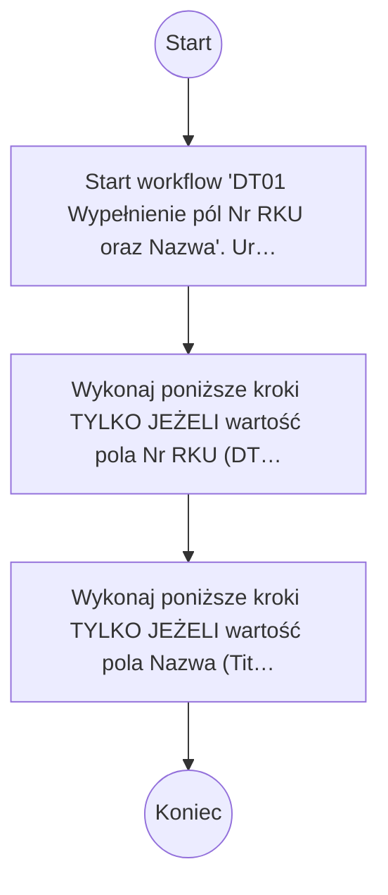

# DT01 Wypełnienie pól Nr RKU oraz Nazwa

## Podstawowe informacje

- **Lista źródłowa:** Kwalifikacja Usług
- **Plik źródłowy:** `DT01_Wypełnienie_pól_Nr_RKU_oraz_Nazwa.nwf`
- **Inne listy używane przez workflow:** Zadania przepływu pracy

## Diagram przepływu



## Kroki workflow

- Start workflow 'DT01 Wypełnienie pól Nr RKU oraz Nazwa'. Uruchamiane: ręcznie, przy utworzeniu elementu, przy zmianie elementu.
  <details><summary>Szczegóły techniczne</summary>

  ```
  StartManually = true
  StartOnCreate = true
  StartOnChange = true
  WorkflowName = DT01 Wypełnienie pól Nr RKU oraz Nazwa
  WorkflowDescription = 
  WorkflowDuration = -1
  TaskListId = {2DC84853-CA02-4D4C-8521-8A3C2CD72A3A}
  StartPage = _layouts/15/NintexWorkflow/StartWorkflow.aspx
  VerboseLogging = false
  Category = List
  ContentType = 
  StartOnCreateCondition = false
  StartOnChangeCondition = false
  HistoryLogging = true
  RequireManagePermission = false
  HistoryListName = NintexWorkflowHistory
  ChangeComments = 
  Id = {FD6DC49C-7328-42E4-9F30-EA2F17E7BE7A}
  SkipValidation = false
  ContentTypeName = Wszystkie
  DisplayStatusColumn = false
  StartFromMenu = false
  StartFromMenuLabel = 
  EcbId = 00000000-0000-0000-0000-000000000000
  CustomActionSequence = 0
  CustomActionIcon = _layouts/15/NintexWorkflow/Images/StartWorkflowECB.png
  UsesConditionalStart = false
  ```
  </details>
    - Wykonaj poniższe kroki TYLKO JEŻELI wartość pola Nr RKU (DT.01.01) (Nr_x0020_RKU) z bieżącego elementu jest puste
        - Ustaw pole Nr RKU (DT.01.01) (Nr_x0020_RKU) na wartość: „RKU-{ItemProperty:ID}”.
          <details><summary>Szczegóły techniczne</summary>

          ```
          LookupField = Nr_x0020_RKU
          LookupFieldType = Text
          LookupFieldValue = RKU-{ItemProperty:ID}
          ```
          </details>
    - Wykonaj poniższe kroki TYLKO JEŻELI wartość pola Nazwa (Title) z bieżącego elementu jest puste
        - Ustaw pole Nazwa (Title) na wartość: „{ItemProperty:Nazwa_x0020_us_x0142_ugi_x0020__}”.
          <details><summary>Szczegóły techniczne</summary>

          ```
          LookupField = Title
          LookupFieldType = Text
          LookupFieldValue = {ItemProperty:Nazwa_x0020_us_x0142_ugi_x0020__}
          ```
          </details>

## Pola odczytywane / zapisywane

| Pole | Odczyt | Zapis |
|---|---|---|
| Nr RKU (DT.01.01) (Nr_x0020_RKU) | X | X |
| Nazwa (Title) | X | X |
