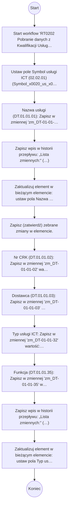

# RT0202 Pobranie danych z Kwalifikacji Usługi

> Przepływ pobiera do Rejestru Usług ICT dane zarejestrowane wstępnie w rejestrze Kwalifikacji Usług

## Podstawowe informacje

- **Lista źródłowa:** Rejestr Usług ICT
- **Plik źródłowy:** `RT0202_Pobranie_danych_z_Kwalifikacji_Usługi.nwf`
- **Inne listy używane przez workflow:** Kwalifikacja Usług, Zadania przepływu pracy

## Diagram przepływu



## Kroki workflow

- Start workflow 'RT0202 Pobranie danych z Kwalifikacji Usługi'. Uruchamiane: ręcznie, przy utworzeniu elementu, przy zmianie elementu.
  <details><summary>Szczegóły techniczne</summary>

  ```
  StartManually = true
  StartOnCreate = true
  StartOnChange = true
  WorkflowName = RT0202 Pobranie danych z Kwalifikacji Usługi
  WorkflowDescription = Przepływ pobiera do Rejestru Usług ICT dane zarejestrowane wstępnie w rejestrze Kwalifikacji Usług
  WorkflowDuration = -1
  TaskListId = {2DC84853-CA02-4D4C-8521-8A3C2CD72A3A}
  StartPage = _layouts/15/NintexWorkflow/StartWorkflow.aspx
  VerboseLogging = false
  Category = List
  ContentType = 
  StartOnCreateCondition = true
  StartOnChangeCondition = true
  HistoryLogging = true
  RequireManagePermission = false
  HistoryListName = NintexWorkflowHistory
  ChangeComments = 
  Id = {A9815B9F-33F7-453F-BF3E-D001A301C5AB}
  SkipValidation = false
  ContentTypeName = Wszystkie
  DisplayStatusColumn = false
  StartFromMenu = false
  StartFromMenuLabel = 
  EcbId = 00000000-0000-0000-0000-000000000000
  CustomActionSequence = 0
  CustomActionIcon = _layouts/15/NintexWorkflow/Images/StartWorkflowECB.png
  UsesConditionalStart = true
  ```
  </details>
- Ustaw pole Symbol usługi ICT (02.02.01) (Symbol_x0020_us_x0142_ugi_x0020_) na wartość: „ICT-{ItemProperty:ID}”.
  <details><summary>Szczegóły techniczne</summary>

  ```
  LookupField = Symbol_x0020_us_x0142_ugi_x0020_
  LookupFieldType = Text
  LookupFieldValue = ICT-{ItemProperty:ID}
  ```
  </details>
- Nazwa usługi (DT.01.01.01): Zapisz w zmiennej 'zm_DT-01-01-01' wartość: wartość pola Nazwa usługi (DT.01.01.01) (Nazwa_x0020_us_x0142_ugi_x0020__) z elementu wyszukanego po Kwalifikacja Usług (DT.01.01) (Us_x0142_uga_x0020_kwalifikowana) (dopasowanie po ID).
  <details><summary>Szczegóły techniczne</summary>

  ```
  ValueType = Text
  VariableName = 
  Value = 
  ```
  </details>
- Zapisz wpis w historii przepływu: „Lista zmiennych:” (…)
  <details><summary>Szczegóły techniczne</summary>

  ```
  Message = Lista zmiennych:
zm_DT-01-01-01: {WorkflowVariable:zm_DT-01-01-01}

  ```
  </details>
- Zaktualizuj element w bieżącym elemencie: ustaw pola Nazwa usługi ICT (02.02.02) (Title).
  <details><summary>Szczegóły techniczne</summary>

  ```
  ListId = {D7273010-E4C3-4D13-8006-F60B440402E8}
  ThisItem = True
  ```
  </details>
- Zapisz (zatwierdź) zebrane zmiany w elemencie.
    - Nr CRK (DT.01.01.02): Zapisz w zmiennej 'zm_DT-01-01-02' wartość: wartość pola Nr CRK (DT.01.01.02) (Umowa_x0020__x0028_DT_x002e_01_x) z elementu wyszukanego po Kwalifikacja Usług (DT.01.01) (Us_x0142_uga_x0020_kwalifikowana) (dopasowanie po ID).
      <details><summary>Szczegóły techniczne</summary>

      ```
      ValueType = Text
      VariableName = 
      Value = 
      ```
      </details>
    - Dostawca (DT.01.01.03): Zapisz w zmiennej 'zm_DT-01-01-03' wartość: wartość pola Dostawca (DT.01.01.03) (Dostawca_x0020__x0028_DT_x002e_0) z elementu wyszukanego po Kwalifikacja Usług (DT.01.01) (Us_x0142_uga_x0020_kwalifikowana) (dopasowanie po ID).
      <details><summary>Szczegóły techniczne</summary>

      ```
      ValueType = Text
      VariableName = 
      Value = 
      ```
      </details>
    - Typ usługi ICT: Zapisz w zmiennej 'zm_DT-01-01-32' wartość: wartość pola Typ usługi ICT (DT.01.01.32) (Typ_x0020_us_x0142_ugi_x0020_ICT) z elementu wyszukanego po Kwalifikacja Usług (DT.01.01) (Us_x0142_uga_x0020_kwalifikowana) (dopasowanie po ID).
      <details><summary>Szczegóły techniczne</summary>

      ```
      ValueType = Text
      VariableName = 
      Value = 
      ```
      </details>
    - Funkcja (DT.01.01.35): Zapisz w zmiennej 'zm_DT-01-01-35' wartość: wartość pola Czy usługa związana z funkcją krytyczną (DT.01.01.35) (Funkcja_x0020_krytyczna) z elementu wyszukanego po Kwalifikacja Usług (DT.01.01) (Us_x0142_uga_x0020_kwalifikowana) (dopasowanie po ID).
      <details><summary>Szczegóły techniczne</summary>

      ```
      ValueType = Text
      VariableName = 
      Value = 
      ```
      </details>
- Zapisz wpis w historii przepływu: „Lista zmiennych:” (…)
  <details><summary>Szczegóły techniczne</summary>

  ```
  Message = Lista zmiennych:
zm_DT-01-01-02: {WorkflowVariable:zm_DT-01-01-02}
zm_DT-01-01-03: {WorkflowVariable:zm_DT-01-01-03}
zm_DT-01-01-32: {WorkflowVariable:zm_DT-01-01-32}
zm_DT-01-01-35: {WorkflowVariable:zm_DT-01-01-35}

  ```
  </details>
- Zaktualizuj element w bieżącym elemencie: ustaw pola Typ usługi ICT (02.02) (Typ_x0020_us_x0142_ugi_x0020_ICT), Dostawca usług ICT (02.02.0030) (Kod_x0020_dostawcy_x0020_us_x014), Funkcja (06.01) (Id_x002e__x0020_funkcji_x0020__x), Nr CRK (02.02.0010) (Ustalenie_x0020_umowne_x0020__x0).
  <details><summary>Szczegóły techniczne</summary>

  ```
  ListId = {D7273010-E4C3-4D13-8006-F60B440402E8}
  ThisItem = True
  ```
  </details>

## Pola odczytywane / zapisywane

| Pole | Odczyt | Zapis |
|---|---|---|
| Dostawca (DT.01.01.03) (Dostawca_x0020__x0028_DT_x002e_0) | X |  |
| Czy usługa związana z funkcją krytyczną (DT.01.01.35) (Funkcja_x0020_krytyczna) | X |  |
| Funkcja (06.01) (Id_x002e__x0020_funkcji_x0020__x) |  | X |
| Dostawca usług ICT (02.02.0030) (Kod_x0020_dostawcy_x0020_us_x014) |  | X |
| Nazwa usługi (DT.01.01.01) (Nazwa_x0020_us_x0142_ugi_x0020__) | X |  |
| Symbol usługi ICT (02.02.01) (Symbol_x0020_us_x0142_ugi_x0020_) |  | X |
| Nazwa (Title) |  | X |
| Typ usługi ICT (DT.01.01.32) (Typ_x0020_us_x0142_ugi_x0020_ICT) | X | X |
| Nr CRK (DT.01.01.02) (Umowa_x0020__x0028_DT_x002e_01_x) | X |  |
| Usługa ICT wg DORA? (DT.01.01.34) (Us_x0142_uga_x0020_kwalifikowana) | X |  |
| Nr CRK (02.02.0010) (Ustalenie_x0020_umowne_x0020__x0) |  | X |
