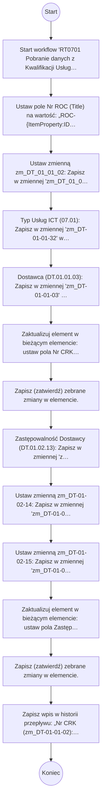

# RT0701 Pobranie danych z Kwalifikacji Usługi do RT0701

## Podstawowe informacje

- **Lista źródłowa:** Rejestr Ocen
- **Plik źródłowy:** `RT0701_Pobranie_danych_z_Kwalifikacji_Usługi_do_RT0701.nwf`
- **Inne listy używane przez workflow:** Kwalifikacja Usług, Zadania przepływu pracy

## Diagram przepływu



## Kroki workflow

- Start workflow 'RT0701 Pobranie danych z Kwalifikacji Usługi do RT0701'. Uruchamiane: ręcznie, przy utworzeniu elementu, przy zmianie elementu.
  <details><summary>Szczegóły techniczne</summary>

  ```
  StartManually = true
  StartOnCreate = true
  StartOnChange = true
  WorkflowName = RT0701 Pobranie danych z Kwalifikacji Usługi do RT0701
  WorkflowDescription = 
  WorkflowDuration = -1
  TaskListId = {2DC84853-CA02-4D4C-8521-8A3C2CD72A3A}
  StartPage = _layouts/15/NintexWorkflow/StartWorkflow.aspx
  VerboseLogging = false
  Category = List
  ContentType = 
  StartOnCreateCondition = true
  StartOnChangeCondition = true
  HistoryLogging = true
  RequireManagePermission = false
  HistoryListName = NintexWorkflowHistory
  ChangeComments = 
  Id = {0E6B5C9E-ECA3-476A-890F-C2E70E9D2F67}
  SkipValidation = false
  ContentTypeName = Wszystkie
  DisplayStatusColumn = false
  StartFromMenu = false
  StartFromMenuLabel = 
  EcbId = 00000000-0000-0000-0000-000000000000
  CustomActionSequence = 0
  CustomActionIcon = _layouts/15/NintexWorkflow/Images/StartWorkflowECB.png
  UsesConditionalStart = true
  ```
  </details>
- Ustaw pole Nr ROC (Title) na wartość: „ROC-{ItemProperty:ID}”.
  <details><summary>Szczegóły techniczne</summary>

  ```
  LookupField = Title
  LookupFieldType = Text
  LookupFieldValue = ROC-{ItemProperty:ID}
  ```
  </details>
    - Ustaw zmienną zm_DT_01_01_02: Zapisz w zmiennej 'zm_DT_01_01_02' wartość: wartość pola Nr CRK (DT.01.01.02) (Umowa_x0020__x0028_DT_x002e_01_x) z elementu wyszukanego po Kwalifikacja usług (07.01) (Kwalifikacja_x0020_us_x0142_ug_x) (dopasowanie po ID).
      <details><summary>Szczegóły techniczne</summary>

      ```
      ValueType = Text
      VariableName = 
      Value = 
      ```
      </details>
    - Typ Usług ICT (07.01): Zapisz w zmiennej 'zm_DT-01-01-32' wartość: wartość pola Typ usługi ICT (DT.01.01.32) (Typ_x0020_us_x0142_ugi_x0020_ICT) z elementu wyszukanego po Kwalifikacja usług (07.01) (Kwalifikacja_x0020_us_x0142_ug_x) (dopasowanie po ID).
      <details><summary>Szczegóły techniczne</summary>

      ```
      ValueType = Text
      VariableName = 
      Value = 
      ```
      </details>
    - Dostawca (DT.01.01.03): Zapisz w zmiennej 'zm_DT-01-01-03' wartość: wartość pola Dostawca (DT.01.01.03) (Dostawca_x0020__x0028_DT_x002e_0) z elementu wyszukanego po Kwalifikacja usług (07.01) (Kwalifikacja_x0020_us_x0142_ug_x) (dopasowanie po ID).
      <details><summary>Szczegóły techniczne</summary>

      ```
      ValueType = Text
      VariableName = 
      Value = 
      ```
      </details>
- Zaktualizuj element w bieżącym elemencie: ustaw pola Nr CRK (07.01.0010) (Numer_x0020_referencyjny_x0020__), Typ usług ICT (07.01) (Typ_x0020_us_x0142_ug_x0020_ICT_), Dostawca usług ICT (02.02.0030) (Kod_x0020_dostawcy_x0020_us_x014).
  <details><summary>Szczegóły techniczne</summary>

  ```
  ListId = {EA9F2CE5-D851-4AA4-9925-1DF84AB6D7B6}
  ThisItem = True
  ```
  </details>
- Zapisz (zatwierdź) zebrane zmiany w elemencie.
    - Zastępowalność Dostawcy (DT.01.02.13): Zapisz w zmiennej 'zm_DT-01-02-13' wartość: wartość pola Zastępowalność Dostawcy (DT.01.02.13) (Zast_x0119_powalno_x015b__x0107_) z elementu wyszukanego po Kwalifikacja usług (07.01) (Kwalifikacja_x0020_us_x0142_ug_x) (dopasowanie po ID).
      <details><summary>Szczegóły techniczne</summary>

      ```
      ValueType = Text
      VariableName = 
      Value = 
      ```
      </details>
    - Ustaw zmienną zm_DT-01-02-14: Zapisz w zmiennej 'zm_DT-01-02-14' wartość: wartość pola Możliwość reintegracji usług (DT.01.02.14) (Mo_x017c_liwo_x015b__x0107__x002) z elementu wyszukanego po Kwalifikacja usług (07.01) (Kwalifikacja_x0020_us_x0142_ug_x) (dopasowanie po ID).
      <details><summary>Szczegóły techniczne</summary>

      ```
      ValueType = Text
      VariableName = 
      Value = 
      ```
      </details>
    - Ustaw zmienną zm_DT-01-02-15: Zapisz w zmiennej 'zm_DT-01-02-15' wartość: wartość pola Skutek zaprzestania świadczenia usł. (DT.01.02.15) (Skutki_x0020_zaprzestania_x0020_) z elementu wyszukanego po Kwalifikacja usług (07.01) (Kwalifikacja_x0020_us_x0142_ug_x) (dopasowanie po ID).
      <details><summary>Szczegóły techniczne</summary>

      ```
      ValueType = Text
      VariableName = 
      Value = 
      ```
      </details>
- Zaktualizuj element w bieżącym elemencie: ustaw pola Zastępowalność Dostawcy (07.01.0050) (Zast_x0119_powalno_x015b__x0107_), Możliwość reintegracji usług (07.01.0090) (Mo_x017c_liwo_x015b__x0107__x002), Skutki zaprzestania świadczenia usł. (07.01.00100) (_x0030_0100_x0020_Skutki_x0020_z).
  <details><summary>Szczegóły techniczne</summary>

  ```
  ListId = {EA9F2CE5-D851-4AA4-9925-1DF84AB6D7B6}
  ThisItem = True
  ```
  </details>
- Zapisz (zatwierdź) zebrane zmiany w elemencie.
- Zapisz wpis w historii przepływu: „Nr CRK (zm_DT-01-01-02): {WorkflowVariable:zm_DT_01_01_02}” (…)
  <details><summary>Szczegóły techniczne</summary>

  ```
  Message = Nr CRK (zm_DT-01-01-02): {WorkflowVariable:zm_DT_01_01_02}
Typ usług ICT (zm_DT-01-01-32): {WorkflowVariable:zm_DT-01-01-32}
Dostawca (zm_DT-01-01-03):{WorkflowVariable:zm_DT-01-01-03}
Zastępowalność Dostawcy (zm_DT-01-02-13): {WorkflowVariable:zm_DT-01-02-13}
Możliwość reintegracji usług (zm_DT-01-02-14): {WorkflowVariable:zm_DT-01-02-14}
Skutki zaprzestania świadczenia usł. (zm_DT-01-02-15): {WorkflowVariable:zm_DT-01-02-15}
  ```
  </details>

## Pola odczytywane / zapisywane

| Pole | Odczyt | Zapis |
|---|---|---|
| Dostawca (DT.01.01.03) (Dostawca_x0020__x0028_DT_x002e_0) | X |  |
| Dostawca usług ICT (02.02.0030) (Kod_x0020_dostawcy_x0020_us_x014) |  | X |
| Kwalifikacja usług (07.01) (Kwalifikacja_x0020_us_x0142_ug_x) | X |  |
| Możliwość reintegracji usług (DT.01.02.14) (Mo_x017c_liwo_x015b__x0107__x002) | X | X |
| Nr CRK (07.01.0010) (Numer_x0020_referencyjny_x0020__) |  | X |
| Skutek zaprzestania świadczenia usł. (DT.01.02.15) (Skutki_x0020_zaprzestania_x0020_) | X |  |
| Nazwa (Title) |  | X |
| Typ usług ICT (07.01) (Typ_x0020_us_x0142_ug_x0020_ICT_) |  | X |
| Typ usługi ICT (DT.01.01.32) (Typ_x0020_us_x0142_ugi_x0020_ICT) | X |  |
| Nr CRK (DT.01.01.02) (Umowa_x0020__x0028_DT_x002e_01_x) | X |  |
| Zastępowalność Dostawcy (DT.01.02.13) (Zast_x0119_powalno_x015b__x0107_) | X | X |
| Skutki zaprzestania świadczenia usł. (07.01.00100) (_x0030_0100_x0020_Skutki_x0020_z) |  | X |
