# NWF002

> Powiadomienie SIZCOM2

## Podstawowe informacje

- **Lista źródłowa:** (nieznana)
- **Plik źródłowy:** `NWF002.nwf`
- **Inne listy używane przez workflow:** INF008 - Rejestr danych, Zadania przepływu pracy

## Diagram przepływu

```mermaid
flowchart TD
  start((Start))
  n1["Start workflow 'NWF002'. Uruchamiane: ręcznie."]
  start --> n1
  n2["Wstrzymaj wykonanie przepływu o 5 min."]
  n1 --> n2
  n3["Wyszukaj elementy na liście 'INF008 - Rejestr danych' wg wa…"]
  n2 --> n3
  n4{"Pętla: dla każdego elementu w kolekcji  (bieżący element ->…"}
  n3 --> n4
  n5["Pobierz element z indeksu 0 kolekcji  do zmiennej ."]
  n4 -- Kolejny element --> n5
  n6["Zapisz wpis w historii przepływu: „GUID: {WorkflowVariable:…"]
  n5 --> n6
  n7["Wyszukaj elementy na liście '{WorkflowVariable:zm_INF008_GU…"]
  n6 --> n7
  n8["Zapisz wpis w historii przepływu: „Metadane: {WorkflowVaria…"]
  n7 --> n8
  n9{"Pętla: dla każdego elementu w kolekcji  (bieżący element ->…"}
  n8 --> n9
  n10["Pobierz element z indeksu 0 kolekcji  do zmiennej ."]
  n9 -- Kolejny element --> n10
  n11["Zbuduj ciąg tekstowy i przypisz do zmiennej (brak). Wartość…"]
  n10 --> n11
  n12["Pobierz element z indeksu 0 kolekcji  do zmiennej ."]
  n11 --> n12
  n13["Zbuduj ciąg tekstowy i przypisz do zmiennej (brak). Wartość…"]
  n12 --> n13
  n14["Pobierz element z indeksu 0 kolekcji  do zmiennej ."]
  n13 --> n14
  n15["Pobierz element z indeksu 0 kolekcji  do zmiennej ."]
  n14 --> n15
  n16["Zbuduj ciąg tekstowy i przypisz do zmiennej (brak). Wartość…"]
  n15 --> n16
  n17["Pobierz element z indeksu 0 kolekcji  do zmiennej ."]
  n16 --> n17
  n18["Ustaw zmienną: Zapisz w zmiennej 'zm_UtworzonyPrzez_txt' wa…"]
  n17 --> n18
  n19["Zbuduj ciąg tekstowy i przypisz do zmiennej (brak). Wartość…"]
  n18 --> n19
  n20["Pobierz element z indeksu 0 kolekcji  do zmiennej ."]
  n19 --> n20
  n21["Zbuduj ciąg tekstowy i przypisz do zmiennej (brak). Wartość…"]
  n20 --> n21
  n22["Pobierz element z indeksu 0 kolekcji  do zmiennej ."]
  n21 --> n22
  n23["Zbuduj ciąg tekstowy i przypisz do zmiennej (brak). Wartość…"]
  n22 --> n23
  n24["Pobierz element z indeksu 0 kolekcji  do zmiennej ."]
  n23 --> n24
  n25["Zbuduj ciąg tekstowy i przypisz do zmiennej (brak). Wartość…"]
  n24 --> n25
  n26["Pobierz element z indeksu 0 kolekcji  do zmiennej ."]
  n25 --> n26
  n27["Zbuduj ciąg tekstowy i przypisz do zmiennej (brak). Wartość…"]
  n26 --> n27
  n28["Zlicz liczbę elementów w kolekcji  do zmiennej ."]
  n27 --> n28
  n28 -- Następny --> n9
  n9 -- Następny --> n4
  n29["Zbuduj ciąg tekstowy i przypisz do zmiennej (brak). Wartość…"]
  n4 -- Koniec pętli --> n29
  n30["Zbuduj ciąg tekstowy i przypisz do zmiennej (brak). Wartość…"]
  n29 --> n30
  n31["Wyślij powiadomienie e-mail: temat 'Test komunikatu SIZCOM2…"]
  n30 --> n31
  n32["Wyślij powiadomienie e-mail: temat 'Informacja o nowych dok…"]
  n31 --> n32
  n33["Uruchom przepływ pracy 'NWF003' (synchronicznie - czeka na …"]
  n32 --> n33
  stop((Koniec))
  n33 --> stop
```



## Kroki workflow

- `[n1]` Start workflow 'NWF002'. Uruchamiane: ręcznie.
  > **Wskazówka migracji**: Wyzwalacz procesu (Triggers: ręcznie). Punkt wejścia przyjmujący parametr itemId.
  ```plsql
  -- Pobranie bieżącego elementu przed rozpoczęciem logiki workflow:
  l_item_json := shp_api.get_list_item(
      p_site_url   => c_site_url,
      p_list_title => 'Lista_Docelowa',
      p_item_id    => p_item_id
  );
  ```
  <details><summary>Szczegóły techniczne</summary>

  ```
  StartManually = true
  StartOnCreate = false
  StartOnChange = false
  WorkflowName = NWF002
  WorkflowDescription = Powiadomienie SIZCOM2
  WorkflowDuration = -1
  TaskListId = {CADFC681-2919-480C-987A-90D00F8E1831}
  StartPage = _layouts/15/NintexWorkflow/StartWorkflow.aspx
  VerboseLogging = false
  Category = Site
  ContentType = 
  StartOnCreateCondition = false
  StartOnChangeCondition = false
  HistoryLogging = true
  RequireManagePermission = false
  HistoryListName = NintexWorkflowHistory
  ChangeComments = 
  Id = {5BDC9606-C67A-4161-9711-A3F3CE9A0E1A}
  SkipValidation = false
  ContentTypeName = Wszystkie
  DisplayStatusColumn = true
  StartFromMenu = false
  StartFromMenuLabel = 
  EcbId = 00000000-0000-0000-0000-000000000000
  CustomActionSequence = 0
  CustomActionIcon = 
  UsesConditionalStart = true
  ```
  </details>
- `[n2]` Wstrzymaj wykonanie przepływu o 5 min.
  > **Wskazówka migracji**: Opóźnienie wykonania procesu o 5 min.
  ```plsql
  -- Wstrzymanie wykonania o 5 min:
  DBMS_SESSION.SLEEP(300);
  ```
  <details><summary>Szczegóły techniczne</summary>

  ```
  Czas = 5 min
  Sekundy = 300
  ```
  </details>
- `[n3]` Wyszukaj elementy na liście 'INF008 - Rejestr danych' wg warunku: Typ_x0020_no_x015b_nika jest równe 'Biblioteka dokumentów' (zapis: ID -> zm_INF008_Identyfikator_zb, GUID0 -> zm_INF008_GUID_zb).
  > **Wskazówka migracji**: Wyszukanie elementów na liście INF008 - Rejestr danych (warunek: Typ_x0020_no_x015b_nika jest równe 'Biblioteka dokumentów').
  ```plsql
  -- Pobranie elementów z listy INF008 - Rejestr danych:
  l_resp := shp_api.get_list_items(
      p_site_url   => c_site_url,
      p_list_title => 'INF008 - Rejestr danych',
      p_caml_query => '<Query><Where>...</Where></Query>'
  );
  ```
  <details><summary>Szczegóły techniczne</summary>

  ```
  Lista = INF008 - Rejestr danych
  Warunek = Typ_x0020_no_x015b_nika jest równe 'Biblioteka dokumentów'
  Mapowania = ['ID -> zm_INF008_Identyfikator_zb', 'GUID0 -> zm_INF008_GUID_zb']
  ```
  </details>
- `[n4]` Pętla: dla każdego elementu w kolekcji  (bieżący element -> ).
  > **Wskazówka migracji**: Iteracja pętli po elementach kolekcji .
  ```plsql
  -- Pętla: Dla każdego raportu
  FOR i IN 1..l_var.COUNT LOOP
      l_var := l_var(i);
  ```
  <details><summary>Szczegóły techniczne</summary>

  ```
  Target = 
  Value = 
  ```
  </details>
    - `[n5]` Pobierz element z indeksu 0 kolekcji  do zmiennej .
      > **Wskazówka migracji**: Operacja tablicowa (Get) na kolekcji .
      ```plsql
      l_res := l_var(1);
      ```
      <details><summary>Szczegóły techniczne</summary>

      ```
      Target = 
      Operation = Get
      Index = 
      Output = 
      ```
      </details>
    - `[n6]` Zapisz wpis w historii przepływu: „GUID: {WorkflowVariable:zm_INF008_GUID_txt}”
      > **Wskazówka migracji**: Zapis audytowy do dziennika zdarzeń (Audit Log).
      ```plsql
      apex_debug.info('Workflow: ' || 'GUID: ' || l_zm_inf008_guid_txt);
      ```
      <details><summary>Szczegóły techniczne</summary>

      ```
      Message = GUID: {WorkflowVariable:zm_INF008_GUID_txt}
      ```
      </details>
    - `[n7]` Wyszukaj elementy na liście '{WorkflowVariable:zm_INF008_GUID_txt}' wg warunku: Powiadomienie jest równe '0' (zapis: ID -> zm_Identyfikator_zb, FileLeafRef -> zm_NazwaRaportu_zb, EncodedAbsUrl -> zm_URL_zb, Author -> zm_UtworzonyPrzez_zb, DataRaportu -> zm_DataSpr_zb, Linia_x0020_raport_x00f3_w -> zm_LiniaRaportów_zb, Raport -> zm_Metadane_zb, JezykRaportu -> zm_Jezyk_zb, DataWydania -> zm_DataWydania_zb, Title -> zm_Tytul_zb).
      > **Wskazówka migracji**: Wyszukanie elementów na liście {WorkflowVariable:zm_INF008_GUID_txt} (warunek: Powiadomienie jest równe '0').
      ```plsql
      -- Pobranie elementów z listy {WorkflowVariable:zm_INF008_GUID_txt}:
      l_resp := shp_api.get_list_items(
          p_site_url   => c_site_url,
          p_list_title => '{WorkflowVariable:zm_INF008_GUID_txt}',
          p_caml_query => '<Query><Where>...</Where></Query>'
      );
      ```
      <details><summary>Szczegóły techniczne</summary>

      ```
      Lista = {WorkflowVariable:zm_INF008_GUID_txt}
      Warunek = Powiadomienie jest równe '0'
      Mapowania = ['ID -> zm_Identyfikator_zb', 'FileLeafRef -> zm_NazwaRaportu_zb', 'EncodedAbsUrl -> zm_URL_zb', 'Author -> zm_UtworzonyPrzez_zb', 'DataRaportu -> zm_DataSpr_zb', 'Linia_x0020_raport_x00f3_w -> zm_LiniaRaportów_zb', 'Raport -> zm_Metadane_zb', 'JezykRaportu -> zm_Jezyk_zb', 'DataWydania -> zm_DataWydania_zb', 'Title -> zm_Tytul_zb']
      ```
      </details>
    - `[n8]` Zapisz wpis w historii przepływu: „Metadane: {WorkflowVariable:zm_Metadane_zb}, Tytuł:  {WorkflowVariable:zm_Tytul_zb}”
      > **Wskazówka migracji**: Zapis audytowy do dziennika zdarzeń (Audit Log).
      ```plsql
      apex_debug.info('Workflow: ' || 'Metadane: ' || l_zm_metadane_zb || ', Tytuł:  ' || l_zm_tytul_zb);
      ```
      <details><summary>Szczegóły techniczne</summary>

      ```
      Message = Metadane: {WorkflowVariable:zm_Metadane_zb}, Tytuł:  {WorkflowVariable:zm_Tytul_zb}
      ```
      </details>
    - `[n9]` Pętla: dla każdego elementu w kolekcji  (bieżący element -> ).
      > **Wskazówka migracji**: Iteracja pętli po elementach kolekcji .
      ```plsql
      -- Pętla: Dla każdego dokumentu
      FOR i IN 1..l_var.COUNT LOOP
          l_var := l_var(i);
      ```
      <details><summary>Szczegóły techniczne</summary>

      ```
      Target = 
      Value = 
      ```
      </details>
            - `[n10]` Pobierz element z indeksu 0 kolekcji  do zmiennej .
              > **Wskazówka migracji**: Operacja tablicowa (Get) na kolekcji .
              ```plsql
              l_res := l_var(1);
              ```
              <details><summary>Szczegóły techniczne</summary>

              ```
              Target = 
              Operation = Get
              Index = 
              Output = 
              ```
              </details>
            - `[n11]` Zbuduj ciąg tekstowy i przypisz do zmiennej (brak). Wartość: {WorkflowVariable:zm_Metadane_not}
<html>
<a href="https://teams.sp.creditagricole/team/ITMM/{WorkflowVariable:zm_Metada
              > **Wskazówka migracji**: Przypisanie sformatowanego tekstu do zmiennej .
              ```plsql
              l_built_string := l_zm_metadane_not || '
              <html>
              <a href="https://teams.sp.creditagricole/team/ITMM/' || l_zm_metadane_txt || '/">' || l_zm_metadane_txt || '</a>
              </html>';
              ```
              <details><summary>Szczegóły techniczne</summary>

              ```
              Input = {WorkflowVariable:zm_Metadane_not}
<html>
<a href="https://teams.sp.creditagricole/team/ITMM/{WorkflowVariable:zm_Metadane_txt}/">{WorkflowVariable:zm_Metadane_txt}</a>
</html>
              Output = 
              ```
              </details>
            - `[n12]` Pobierz element z indeksu 0 kolekcji  do zmiennej .
              > **Wskazówka migracji**: Operacja tablicowa (Get) na kolekcji .
              ```plsql
              l_res := l_var(1);
              ```
              <details><summary>Szczegóły techniczne</summary>

              ```
              Target = 
              Operation = Get
              Index = 
              Output = 
              ```
              </details>
            - `[n13]` Zbuduj ciąg tekstowy i przypisz do zmiennej (brak). Wartość: {WorkflowVariable:zm_Tytul_not}
<html>
  <a>{WorkflowVariable:zm_Tytul_txt}</a>
</html>
              > **Wskazówka migracji**: Przypisanie sformatowanego tekstu do zmiennej .
              ```plsql
              l_built_string := l_zm_tytul_not || '
              <html>
                <a>' || l_zm_tytul_txt || '</a>
              </html>';
              ```
              <details><summary>Szczegóły techniczne</summary>

              ```
              Input = {WorkflowVariable:zm_Tytul_not}
<html>
  <a>{WorkflowVariable:zm_Tytul_txt}</a>
</html>
              Output = 
              ```
              </details>
            - `[n14]` Pobierz element z indeksu 0 kolekcji  do zmiennej .
              > **Wskazówka migracji**: Operacja tablicowa (Get) na kolekcji .
              ```plsql
              l_res := l_var(1);
              ```
              <details><summary>Szczegóły techniczne</summary>

              ```
              Target = 
              Operation = Get
              Index = 
              Output = 
              ```
              </details>
            - `[n15]` Pobierz element z indeksu 0 kolekcji  do zmiennej .
              > **Wskazówka migracji**: Operacja tablicowa (Get) na kolekcji .
              ```plsql
              l_res := l_var(1);
              ```
              <details><summary>Szczegóły techniczne</summary>

              ```
              Target = 
              Operation = Get
              Index = 
              Output = 
              ```
              </details>
            - `[n16]` Zbuduj ciąg tekstowy i przypisz do zmiennej (brak). Wartość: {WorkflowVariable:zm_URL_not}
<html><a href="{WorkflowVariable:zm_URL_txt}">{WorkflowVariable:zm_NazwaRaportu_txt}</a></
              > **Wskazówka migracji**: Przypisanie sformatowanego tekstu do zmiennej .
              ```plsql
              l_built_string := l_zm_url_not || '
              <html><a href="' || l_zm_url_txt || '">' || l_zm_nazwaraportu_txt || '</a></html>';
              ```
              <details><summary>Szczegóły techniczne</summary>

              ```
              Input = {WorkflowVariable:zm_URL_not}
<html><a href="{WorkflowVariable:zm_URL_txt}">{WorkflowVariable:zm_NazwaRaportu_txt}</a></html>
              Output = 
              ```
              </details>
            - `[n17]` Pobierz element z indeksu 0 kolekcji  do zmiennej .
              > **Wskazówka migracji**: Operacja tablicowa (Get) na kolekcji .
              ```plsql
              l_res := l_var(1);
              ```
              <details><summary>Szczegóły techniczne</summary>

              ```
              Target = 
              Operation = Get
              Index = 
              Output = 
              ```
              </details>
            - `[n18]` Ustaw zmienną: Zapisz w zmiennej 'zm_UtworzonyPrzez_txt' wartość: zmienna zm_UtworzonyPrzez_os.
              > **Wskazówka migracji**: Obliczenie/odczyt i zapis do zmiennej lokalnej 'zm_UtworzonyPrzez_txt'.
              ```plsql
              l_zm_utworzonyprzez_txt := l_zm_utworzonyprzez_os;
              ```
              <details><summary>Szczegóły techniczne</summary>

              ```
              ValueType = Text
              VariableName = 
              Value = 
              ```
              </details>
            - `[n19]` Zbuduj ciąg tekstowy i przypisz do zmiennej (brak). Wartość: {WorkflowVariable:zm_UtworzonyPrzez_not}
<html>
  <a>{WorkflowVariable:zm_UtworzonyPrzez_txt}</a>
</html>
              > **Wskazówka migracji**: Przypisanie sformatowanego tekstu do zmiennej .
              ```plsql
              l_built_string := l_zm_utworzonyprzez_not || '
              <html>
                <a>' || l_zm_utworzonyprzez_txt || '</a>
              </html>';
              ```
              <details><summary>Szczegóły techniczne</summary>

              ```
              Input = {WorkflowVariable:zm_UtworzonyPrzez_not}
<html>
  <a>{WorkflowVariable:zm_UtworzonyPrzez_txt}</a>
</html>
              Output = 
              ```
              </details>
            - `[n20]` Pobierz element z indeksu 0 kolekcji  do zmiennej .
              > **Wskazówka migracji**: Operacja tablicowa (Get) na kolekcji .
              ```plsql
              l_res := l_var(1);
              ```
              <details><summary>Szczegóły techniczne</summary>

              ```
              Target = 
              Operation = Get
              Index = 
              Output = 
              ```
              </details>
            - `[n21]` Zbuduj ciąg tekstowy i przypisz do zmiennej (brak). Wartość: {WorkflowVariable:zm_DataSpr_not}
<html>
  <a>fn-FormatDate({WorkflowVariable:zm_DataSpr_date}, "dd/mm/yyyy")</a>
</html
              > **Wskazówka migracji**: Przypisanie sformatowanego tekstu do zmiennej .
              ```plsql
              l_built_string := l_zm_dataspr_not || '
              <html>
                <a>fn-FormatDate(' || l_zm_dataspr_date || ', "dd/mm/yyyy")</a>
              </html>';
              ```
              <details><summary>Szczegóły techniczne</summary>

              ```
              Input = {WorkflowVariable:zm_DataSpr_not}
<html>
  <a>fn-FormatDate({WorkflowVariable:zm_DataSpr_date}, "dd/mm/yyyy")</a>
</html>
              Output = 
              ```
              </details>
            - `[n22]` Pobierz element z indeksu 0 kolekcji  do zmiennej .
              > **Wskazówka migracji**: Operacja tablicowa (Get) na kolekcji .
              ```plsql
              l_res := l_var(1);
              ```
              <details><summary>Szczegóły techniczne</summary>

              ```
              Target = 
              Operation = Get
              Index = 
              Output = 
              ```
              </details>
            - `[n23]` Zbuduj ciąg tekstowy i przypisz do zmiennej (brak). Wartość: {WorkflowVariable:zm_DataWydania_not}
<html>
  <a>fn-FormatDate({WorkflowVariable:zm_DataWydania_date}, "dd/MM/yyyy")</a
              > **Wskazówka migracji**: Przypisanie sformatowanego tekstu do zmiennej .
              ```plsql
              l_built_string := l_zm_datawydania_not || '
              <html>
                <a>fn-FormatDate(' || l_zm_datawydania_date || ', "dd/MM/yyyy")</a>
              </html>';
              ```
              <details><summary>Szczegóły techniczne</summary>

              ```
              Input = {WorkflowVariable:zm_DataWydania_not}
<html>
  <a>fn-FormatDate({WorkflowVariable:zm_DataWydania_date}, "dd/MM/yyyy")</a>
</html>
              Output = 
              ```
              </details>
            - `[n24]` Pobierz element z indeksu 0 kolekcji  do zmiennej .
              > **Wskazówka migracji**: Operacja tablicowa (Get) na kolekcji .
              ```plsql
              l_res := l_var(1);
              ```
              <details><summary>Szczegóły techniczne</summary>

              ```
              Target = 
              Operation = Get
              Index = 
              Output = 
              ```
              </details>
            - `[n25]` Zbuduj ciąg tekstowy i przypisz do zmiennej (brak). Wartość: {WorkflowVariable:zm_LiniaRaportów_not}
<html>
  <a>{WorkflowVariable:zm_LiniaRaportów_txt}</a>
</html>
              > **Wskazówka migracji**: Przypisanie sformatowanego tekstu do zmiennej .
              ```plsql
              l_built_string := l_zm_liniaraport_w_not || '
              <html>
                <a>' || l_zm_liniaraport_w_txt || '</a>
              </html>';
              ```
              <details><summary>Szczegóły techniczne</summary>

              ```
              Input = {WorkflowVariable:zm_LiniaRaportów_not}
<html>
  <a>{WorkflowVariable:zm_LiniaRaportów_txt}</a>
</html>
              Output = 
              ```
              </details>
            - `[n26]` Pobierz element z indeksu 0 kolekcji  do zmiennej .
              > **Wskazówka migracji**: Operacja tablicowa (Get) na kolekcji .
              ```plsql
              l_res := l_var(1);
              ```
              <details><summary>Szczegóły techniczne</summary>

              ```
              Target = 
              Operation = Get
              Index = 
              Output = 
              ```
              </details>
            - `[n27]` Zbuduj ciąg tekstowy i przypisz do zmiennej (brak). Wartość: {WorkflowVariable:zm_Jezyk_not}
<html>
<a>{WorkflowVariable:zm_Jezyk_not}</a>
</html>
              > **Wskazówka migracji**: Przypisanie sformatowanego tekstu do zmiennej .
              ```plsql
              l_built_string := l_zm_jezyk_not || '
              <html>
              <a>' || l_zm_jezyk_not || '</a>
              </html>';
              ```
              <details><summary>Szczegóły techniczne</summary>

              ```
              Input = {WorkflowVariable:zm_Jezyk_not}
<html>
<a>{WorkflowVariable:zm_Jezyk_not}</a>
</html>
              Output = 
              ```
              </details>
            - `[n28]` Zlicz liczbę elementów w kolekcji  do zmiennej .
              > **Wskazówka migracji**: Operacja tablicowa (Count) na kolekcji .
              ```plsql
              l_res := l_var.COUNT;
              ```
              <details><summary>Szczegóły techniczne</summary>

              ```
              Target = 
              Operation = Count
              Index = -1
              Output = 
              ```
              </details>
- `[n29]` Zbuduj ciąg tekstowy i przypisz do zmiennej (brak). Wartość: {WorkflowVariable:zm_TreśćBiblioteki_not}
 <tr style="text-align: left; vertical-align: middle;">
  <td style="width: 5%
  > **Wskazówka migracji**: Przypisanie sformatowanego tekstu do zmiennej .
  ```plsql
  l_built_string := l_zm_tre_biblioteki_not || '
   <tr style="text-align: left; vertical-align: middle;">
    <td style="width: 5%" align="center">' || l_zm_metadane_not || '</td>
    <td style="width: 15%" align="left">' || l_zm_liniaraport_w_not || '</td>
    <td style="width: 10%" align="center">' || l_zm_datawydania_not || '</td>
    <td style="width: 15%" align="left">' || l_zm_utworzonyprzez_not || '</td>
    <td style="width: 40%" align="left">' || l_zm_url_not || '</td>
   </tr>';
  ```
  <details><summary>Szczegóły techniczne</summary>

  ```
  Input = {WorkflowVariable:zm_TreśćBiblioteki_not}
 <tr style="text-align: left; vertical-align: middle;">
  <td style="width: 5%" align="center">{WorkflowVariable:zm_Metadane_not}</td>
  <td style="width: 15%" align="left">{WorkflowVariable:zm_LiniaRaportów_not}</td>
  <td style="width: 10%" align="center">{WorkflowVariable:zm_DataWydania_not}</td>
  <td style="width: 15%" align="left">{WorkflowVariable:zm_UtworzonyPrzez_not}</td>
  <td style="width: 40%" align="left">{WorkflowVariable:zm_URL_not}</td>
 </tr>
  Output = 
  ```
  </details>
- `[n30]` Zbuduj ciąg tekstowy i przypisz do zmiennej (brak). Wartość: {WorkflowVariable:zm_Treść_SIZCOM2_not}
<!DOCTYPE html>
<html>
 <table width="85%" border="1" cellpadding="1">
  <tbody>
  > **Wskazówka migracji**: Przypisanie sformatowanego tekstu do zmiennej .
  ```plsql
  l_built_string := l_zm_tre_sizcom2_not || '
  <!DOCTYPE html>
  <html>
   <table width="85%" border="1" cellpadding="1">
    <tbody>
     <tr high="10px" align="center" vertical-align="middle">
      <th style="width: 5%" align="center">Biblioteka</th>
      <th style="width: 15%" align="center">Kategoria</th>
      <th style="width: 10%" align="center">Data wydania</th>
      <th style="width: 15%" align="center">Autor</th>
      <th style="width: 40%" align="center">Link</th>
     </tr>
     ' || l_zm_tre_biblioteki_not || '  
    </tbody>
   </table>
  </html>';
  ```
  <details><summary>Szczegóły techniczne</summary>

  ```
  Input = {WorkflowVariable:zm_Treść_SIZCOM2_not}
<!DOCTYPE html>
<html>
 <table width="85%" border="1" cellpadding="1">
  <tbody>
   <tr high="10px" align="center" vertical-align="middle">
    <th style="width: 5%" align="center">Biblioteka</th>
    <th style="width: 15%" align="center">Kategoria</th>
    <th style="width: 10%" align="center">Data wydania</th>
    <th style="width: 15%" align="center">Autor</th>
    <th style="width: 40%" align="center">Link</th>
   </tr>
   {WorkflowVariable:zm_TreśćBiblioteki_not}  
  </tbody>
 </table>
</html>
  Output = 
  ```
  </details>
- `[n31]` Wyślij powiadomienie e-mail: temat 'Test komunikatu SIZCOM2' do: grupa\rdudziak.
  > **Wskazówka migracji**: Wysłanie wiadomości e-mail do: grupa\rdudziak (temat: Test komunikatu SIZCOM2).
  ```plsql
  -- Wysłanie powiadomienia e-mail:
  apex_mail.send(
      p_to   => 'grupa\rdudziak',
      p_from => 'noreply@domain.com',
      p_subj => 'Test komunikatu SIZCOM2',
      p_body => 'Powiadomienie z procesu biznesowego'
  );
  ```
  <details><summary>Szczegóły techniczne</summary>

  ```
  Odbiorcy = grupa\rdudziak
  Temat = Test komunikatu SIZCOM2
  ```
  </details>
- `[n32]` Wyślij powiadomienie e-mail: temat 'Informacja o nowych dokumentach&nbsp;raportów&nbsp;opublikowanych&nbsp;przez Pion IT' do: Subskrypcja ALL, Czytanie R017. _(wyłączona)_
  > **Wskazówka migracji**: Wysłanie wiadomości e-mail do: Subskrypcja ALL, Czytanie R017 (temat: Informacja o nowych dokumentach&nbsp;raportów&nbsp;opublikowanych&nbsp;przez Pion IT).
  ```plsql
  -- Wysłanie powiadomienia e-mail:
  apex_mail.send(
      p_to   => 'Subskrypcja ALL, Czytanie R017',
      p_from => 'noreply@domain.com',
      p_subj => 'Informacja o nowych dokumentach&nbsp;raportów&nbsp;opublikowanych&nbsp;przez Pion IT',
      p_body => 'Powiadomienie z procesu biznesowego'
  );
  ```
  <details><summary>Szczegóły techniczne</summary>

  ```
  Odbiorcy = Subskrypcja ALL, Czytanie R017
  Temat = Informacja o nowych dokumentach&nbsp;raportów&nbsp;opublikowanych&nbsp;przez Pion IT
  ```
  </details>
- `[n33]` Uruchom przepływ pracy 'NWF003' (synchronicznie - czeka na zakończenie). _(wyłączona)_
  > **Wskazówka migracji**: Uruchomienie procesu podrzędnego NWF003.
  ```plsql
  -- Uruchomienie podprocesu NWF003:
  process_wf_nwf003(p_item_id => p_item_id);
  ```
  <details><summary>Szczegóły techniczne</summary>

  ```
  Workflow = NWF003
  Czekaj = True
  ```
  </details>

## Zmienne przepływu pracy

| Zmienna | Typ | Opis / Rola |
|---|---|---|
| `zm_DataSpr_date` | Text | Używana w wyrażeniach warunkowych/komunikatach |
| `zm_DataSpr_not` | Text | Używana w wyrażeniach warunkowych/komunikatach |
| `zm_DataWydania_date` | Text | Używana w wyrażeniach warunkowych/komunikatach |
| `zm_DataWydania_not` | Text | Używana w wyrażeniach warunkowych/komunikatach |
| `zm_INF008_GUID_txt` | Text | Używana w wyrażeniach warunkowych/komunikatach |
| `zm_Jezyk_not` | Text | Używana w wyrażeniach warunkowych/komunikatach |
| `zm_LiniaRaportów_not` | Text | Używana w wyrażeniach warunkowych/komunikatach |
| `zm_LiniaRaportów_txt` | Text | Używana w wyrażeniach warunkowych/komunikatach |
| `zm_Metadane_not` | Text | Używana w wyrażeniach warunkowych/komunikatach |
| `zm_Metadane_txt` | Text | Używana w wyrażeniach warunkowych/komunikatach |
| `zm_Metadane_zb` | Text | Używana w wyrażeniach warunkowych/komunikatach |
| `zm_NazwaRaportu_txt` | Text | Używana w wyrażeniach warunkowych/komunikatach |
| `zm_TreśćBiblioteki_not` | Text | Używana w wyrażeniach warunkowych/komunikatach |
| `zm_Treść_SIZCOM2_not` | Text | Używana w wyrażeniach warunkowych/komunikatach |
| `zm_Tytul_not` | Text | Używana w wyrażeniach warunkowych/komunikatach |
| `zm_Tytul_txt` | Text | Używana w wyrażeniach warunkowych/komunikatach |
| `zm_Tytul_zb` | Text | Używana w wyrażeniach warunkowych/komunikatach |
| `zm_URL_not` | Text | Używana w wyrażeniach warunkowych/komunikatach |
| `zm_URL_txt` | Text | Używana w wyrażeniach warunkowych/komunikatach |
| `zm_UtworzonyPrzez_not` | Text | Używana w wyrażeniach warunkowych/komunikatach |
| `zm_UtworzonyPrzez_txt` | Text | Ustaw zmienną |

## Pola odczytywane / zapisywane

| Pole | Odczyt | Zapis |
|---|---|---|
| Utworzone przez (Author) | X |  |
| Data sprawozdawcza (DataRaportu) | X |  |
| Data wydania (DataWydania) | X |  |
| EncodedAbsUrl | X |  |
| Nazwa (FileLeafRef) | X |  |
| GUID (GUID0) | X |  |
| Identyfikator (ID) | X |  |
| Jezyk (JezykRaportu) | X |  |
| Linia_x0020_raport_x00f3_w | X |  |
| StatusPowiadomienia (Powiadomienie) | X |  |
| Metadane (Raport) | X |  |
| Tytuł (Title) | X |  |
| Typ nośnika (Typ_x0020_no_x015b_nika) | X |  |

### Słownik pól i identyfikatory techniczne

| Nazwa biznesowa | SharePoint InternalName | Typ | Odczyt | Zapis |
|---|---|---|---|---|
| Utworzone przez | `Author` | Tekst/Ref | Tak | - |
| Data sprawozdawcza | `DataRaportu` | Tekst/Ref | Tak | - |
| Data wydania | `DataWydania` | Tekst/Ref | Tak | - |
| EncodedAbsUrl | `EncodedAbsUrl` | Tekst/Ref | Tak | - |
| Nazwa | `FileLeafRef` | Tekst/Ref | Tak | - |
| GUID | `GUID0` | Tekst/Ref | Tak | - |
| Identyfikator | `ID` | Tekst/Ref | Tak | - |
| Jezyk | `JezykRaportu` | Tekst/Ref | Tak | - |
| Linia_x0020_raport_x00f3_w | `Linia_x0020_raport_x00f3_w` | Tekst/Ref | Tak | - |
| StatusPowiadomienia | `Powiadomienie` | Tekst/Ref | Tak | - |
| Metadane | `Raport` | Tekst/Ref | Tak | - |
| Tytuł | `Title` | Tekst/Ref | Tak | - |
| Typ nośnika | `Typ_x0020_no_x015b_nika` | Tekst/Ref | Tak | - |

## Kompletna procedura orkiestracji PL/SQL (Oracle APEX / SHP_API)

Poniższy kod stanowi gotowy, kompletny szkielet procedury PL/SQL do wdrożenia w Oracle APEX, realizujący całą logikę workflow za pośrednictwem pakietu `SHP_API`:

```plsql
CREATE OR REPLACE PROCEDURE process_wf_nwf002 (
    p_item_id IN NUMBER
) AS
    c_site_url CONSTANT VARCHAR2(400) := 'https://sharepoint.domain.com/sites/...';
    l_item_json CLOB;
    l_resp      CLOB;
    l_ref_json  CLOB;
    -- Zmienne workflow:
    l_zm_dataspr_date              VARCHAR2(4000);
    l_zm_dataspr_not               VARCHAR2(4000);
    l_zm_datawydania_date          VARCHAR2(4000);
    l_zm_datawydania_not           VARCHAR2(4000);
    l_zm_inf008_guid_txt           VARCHAR2(4000);
    l_zm_jezyk_not                 VARCHAR2(4000);
    l_zm_liniaraport_w_not         VARCHAR2(4000);
    l_zm_liniaraport_w_txt         VARCHAR2(4000);
    l_zm_metadane_not              VARCHAR2(4000);
    l_zm_metadane_txt              VARCHAR2(4000);
    l_zm_metadane_zb               VARCHAR2(4000);
    l_zm_nazwaraportu_txt          VARCHAR2(4000);
    l_zm_tre_biblioteki_not        VARCHAR2(4000);
    l_zm_tre_sizcom2_not           VARCHAR2(4000);
    l_zm_tytul_not                 VARCHAR2(4000);
    l_zm_tytul_txt                 VARCHAR2(4000);
    l_zm_tytul_zb                  VARCHAR2(4000);
    l_zm_url_not                   VARCHAR2(4000);
    l_zm_url_txt                   VARCHAR2(4000);
    l_zm_utworzonyprzez_not        VARCHAR2(4000);
    l_zm_utworzonyprzez_txt        VARCHAR2(4000);
BEGIN
    apex_debug.info('Start workflow: NWF002, item_id: ' || p_item_id);

    -- 1. Pobranie danych biezacego elementu
    l_item_json := shp_api.get_list_item(
        p_site_url   => c_site_url,
        p_list_title => 'Lista_Zrodlowa',
        p_item_id    => p_item_id
    );

    -- 2. Logika biznesowa workflow
    -- Wstrzymanie wykonania o 5 min:
    DBMS_SESSION.SLEEP(300);
    -- Pobranie elementów z listy INF008 - Rejestr danych:
    l_resp := shp_api.get_list_items(
        p_site_url   => c_site_url,
        p_list_title => 'INF008 - Rejestr danych',
        p_caml_query => '<Query><Where>...</Where></Query>'
    );
    -- Pętla: Dla każdego raportu
    FOR i IN 1..l_var.COUNT LOOP
        l_var := l_var(i);
        l_res := l_var(1);
        apex_debug.info('Workflow: ' || 'GUID: ' || l_zm_inf008_guid_txt);
        -- Pobranie elementów z listy {WorkflowVariable:zm_INF008_GUID_txt}:
        l_resp := shp_api.get_list_items(
            p_site_url   => c_site_url,
            p_list_title => '{WorkflowVariable:zm_INF008_GUID_txt}',
            p_caml_query => '<Query><Where>...</Where></Query>'
        );
        apex_debug.info('Workflow: ' || 'Metadane: ' || l_zm_metadane_zb || ', Tytuł:  ' || l_zm_tytul_zb);
        -- Pętla: Dla każdego dokumentu
        FOR i IN 1..l_var.COUNT LOOP
            l_var := l_var(i);
            l_res := l_var(1);
            l_built_string := l_zm_metadane_not || '
            <html>
            <a href="https://teams.sp.creditagricole/team/ITMM/' || l_zm_metadane_txt || '/">' || l_zm_metadane_txt || '</a>
            </html>';
            l_res := l_var(1);
            l_built_string := l_zm_tytul_not || '
            <html>
              <a>' || l_zm_tytul_txt || '</a>
            </html>';
            l_res := l_var(1);
            l_res := l_var(1);
            l_built_string := l_zm_url_not || '
            <html><a href="' || l_zm_url_txt || '">' || l_zm_nazwaraportu_txt || '</a></html>';
            l_res := l_var(1);
            l_zm_utworzonyprzez_txt := l_zm_utworzonyprzez_os;
            l_built_string := l_zm_utworzonyprzez_not || '
            <html>
              <a>' || l_zm_utworzonyprzez_txt || '</a>
            </html>';
            l_res := l_var(1);
            l_built_string := l_zm_dataspr_not || '
            <html>
              <a>fn-FormatDate(' || l_zm_dataspr_date || ', "dd/mm/yyyy")</a>
            </html>';
            l_res := l_var(1);
            l_built_string := l_zm_datawydania_not || '
            <html>
              <a>fn-FormatDate(' || l_zm_datawydania_date || ', "dd/MM/yyyy")</a>
            </html>';
            l_res := l_var(1);
            l_built_string := l_zm_liniaraport_w_not || '
            <html>
              <a>' || l_zm_liniaraport_w_txt || '</a>
            </html>';
            l_res := l_var(1);
            l_built_string := l_zm_jezyk_not || '
            <html>
            <a>' || l_zm_jezyk_not || '</a>
            </html>';
            l_res := l_var.COUNT;
        END LOOP;
    END LOOP;
    l_built_string := l_zm_tre_biblioteki_not || '
     <tr style="text-align: left; vertical-align: middle;">
      <td style="width: 5%" align="center">' || l_zm_metadane_not || '</td>
      <td style="width: 15%" align="left">' || l_zm_liniaraport_w_not || '</td>
      <td style="width: 10%" align="center">' || l_zm_datawydania_not || '</td>
      <td style="width: 15%" align="left">' || l_zm_utworzonyprzez_not || '</td>
      <td style="width: 40%" align="left">' || l_zm_url_not || '</td>
     </tr>';
    l_built_string := l_zm_tre_sizcom2_not || '
    <!DOCTYPE html>
    <html>
     <table width="85%" border="1" cellpadding="1">
      <tbody>
       <tr high="10px" align="center" vertical-align="middle">
        <th style="width: 5%" align="center">Biblioteka</th>
        <th style="width: 15%" align="center">Kategoria</th>
        <th style="width: 10%" align="center">Data wydania</th>
        <th style="width: 15%" align="center">Autor</th>
        <th style="width: 40%" align="center">Link</th>
       </tr>
       ' || l_zm_tre_biblioteki_not || '  
      </tbody>
     </table>
    </html>';
    -- Wysłanie powiadomienia e-mail:
    apex_mail.send(
        p_to   => 'grupa\rdudziak',
        p_from => 'noreply@domain.com',
        p_subj => 'Test komunikatu SIZCOM2',
        p_body => 'Powiadomienie z procesu biznesowego'
    );

    apex_debug.info('Koniec workflow: NWF002, item_id: ' || p_item_id);
END process_wf_nwf002;
/
```
