# NWF003

## Podstawowe informacje

- **Lista źródłowa:** (nieznana)
- **Plik źródłowy:** `NWF003.nwf`
- **Inne listy używane przez workflow:** R001 - Ocena efektywności organizacyjnej Pionu IT, R002 - Raport roczny z realizacji strategii IT, R003 - Stan zatrudnienia w IT pracowników na umowę o pracę, R004 - Raport Jakości Danych, R005 - 	Plan potrzeb Szkoleniowych IT i raportowanie ich realizacji, R006 - 	Przyczyny odejść pracowników Pionu IT lub długotrwałych nieobecności, R007 - Sukcesja kluczowych pracowników IT, R008 - Istotne Oprogramowanie Użytkownika Końcowego, R009 - Jakość usług świadczonych przez kluczowych dostawców zewnętrznych IT, R010 - Kluczowe Wskaźniki Ryzyka, R011 - Wykonanie budżetu IT, R012 - Gartner Executive Assessment, R013 - Sourcing, R014 - Raport z przeglądu uprawnień użytkowników w systemach informatycznych, R015 - Wyniki testów podatności systemów IT przeprowadzonych przy pomocy systemu Qualys, R016 - Zestawienie wyników testów bezpieczeństwa systemów IT, R017 - Zestawienie zdarzeń i incydentów bezpieczeństwa informacji systemów IT (R017), R018 - Jakość wsparcia w zakresie obsługi problemów na środowisku produkcyjnym, R019 - Pusta biblioteka, R020 - Podsumowanie stanu systemów banku., R021 - Raport z przełączenia do ośrodka zapasowego, R022 - Raport zarządczy DSAIT, R023 - Lista aplikacji SIIS oraz wykaz infrastruktury aplikacji SIIS, Zadania przepływu pracy

## Diagram przepływu

```mermaid
flowchart TD
  start((Start))
  n1["Start workflow 'NWF003'. Uruchamiane: ręcznie."]
  start --> n1
  n2[["Etap biznesowy: R001."]]
  n1 --> n2
  n3["Wyszukaj elementy na liście 'R001 - Ocena efektywności orga…"]
  n2 --> n3
  n4{"Pętla: dla każdego elementu w kolekcji  (bieżący element ->…"}
  n3 --> n4
  n5["Zaktualizuj element w elemencie listy R001 - Ocena efektywn…"]
  n4 -- Kolejny element --> n5
  n5 -- Następny --> n4
  n6[["Etap biznesowy: R002."]]
  n4 --> n6
  n7["Wyszukaj elementy na liście 'R002 - Raport roczny z realiza…"]
  n6 --> n7
  n8{"Pętla: dla każdego elementu w kolekcji  (bieżący element ->…"}
  n7 --> n8
  n9["Zaktualizuj element w elemencie listy R002 - Raport roczny …"]
  n8 -- Kolejny element --> n9
  n9 -- Następny --> n8
  n10[["Etap biznesowy: R003."]]
  n8 --> n10
  n11["Wyszukaj elementy na liście 'R003 - Stan zatrudnienia w IT …"]
  n10 --> n11
  n12{"Pętla: dla każdego elementu w kolekcji  (bieżący element ->…"}
  n11 --> n12
  n13["Zaktualizuj element w elemencie listy R003 - Stan zatrudnie…"]
  n12 -- Kolejny element --> n13
  n13 -- Następny --> n12
  n14[["Etap biznesowy: R004."]]
  n12 --> n14
  n15["Wyszukaj elementy na liście 'R004 - Raport Jakości Danych' …"]
  n14 --> n15
  n16{"Pętla: dla każdego elementu w kolekcji  (bieżący element ->…"}
  n15 --> n16
  n17["Zaktualizuj element w elemencie listy R004 - Raport Jakości…"]
  n16 -- Kolejny element --> n17
  n17 -- Następny --> n16
  n18[["Etap biznesowy: R005."]]
  n16 --> n18
  n19["Wyszukaj elementy na liście 'R005 - 	Plan potrzeb Szkolenio…"]
  n18 --> n19
  n20{"Pętla: dla każdego elementu w kolekcji  (bieżący element ->…"}
  n19 --> n20
  n21["Zaktualizuj element w elemencie listy R005 - 	Plan potrzeb …"]
  n20 -- Kolejny element --> n21
  n21 -- Następny --> n20
  n22[["Etap biznesowy: R006."]]
  n20 --> n22
  n23["Wyszukaj elementy na liście 'R006 - 	Przyczyny odejść praco…"]
  n22 --> n23
  n24{"Pętla: dla każdego elementu w kolekcji  (bieżący element ->…"}
  n23 --> n24
  n25["Zaktualizuj element w elemencie listy R006 - 	Przyczyny ode…"]
  n24 -- Kolejny element --> n25
  n25 -- Następny --> n24
  n26[["Etap biznesowy: R007."]]
  n24 --> n26
  n27["Wyszukaj elementy na liście 'R007 - Sukcesja kluczowych pra…"]
  n26 --> n27
  n28{"Pętla: dla każdego elementu w kolekcji  (bieżący element ->…"}
  n27 --> n28
  n29["Zaktualizuj element w elemencie listy R007 - Sukcesja klucz…"]
  n28 -- Kolejny element --> n29
  n29 -- Następny --> n28
  n30[["Etap biznesowy: R008."]]
  n28 --> n30
  n31["Wyszukaj elementy na liście 'R008 - Istotne Oprogramowanie …"]
  n30 --> n31
  n32{"Pętla: dla każdego elementu w kolekcji  (bieżący element ->…"}
  n31 --> n32
  n33["Zaktualizuj element w elemencie listy R008 - Istotne Oprogr…"]
  n32 -- Kolejny element --> n33
  n33 -- Następny --> n32
  n34[["Etap biznesowy: R009."]]
  n32 --> n34
  n35["Wyszukaj elementy na liście 'R009 - Jakość usług świadczony…"]
  n34 --> n35
  n36{"Pętla: dla każdego elementu w kolekcji  (bieżący element ->…"}
  n35 --> n36
  n37["Zaktualizuj element w elemencie listy R009 - Jakość usług ś…"]
  n36 -- Kolejny element --> n37
  n37 -- Następny --> n36
  n38[["Etap biznesowy: R010."]]
  n36 --> n38
  n39["Wyszukaj elementy na liście 'R010 - Kluczowe Wskaźniki Ryzy…"]
  n38 --> n39
  n40{"Pętla: dla każdego elementu w kolekcji  (bieżący element ->…"}
  n39 --> n40
  n41["Zaktualizuj element w elemencie listy R010 - Kluczowe Wskaź…"]
  n40 -- Kolejny element --> n41
  n41 -- Następny --> n40
  n42[["Etap biznesowy: R011."]]
  n40 --> n42
  n43["Wyszukaj elementy na liście 'R011 - Wykonanie budżetu IT' w…"]
  n42 --> n43
  n44{"Pętla: dla każdego elementu w kolekcji  (bieżący element ->…"}
  n43 --> n44
  n45["Zaktualizuj element w elemencie listy R011 - Wykonanie budż…"]
  n44 -- Kolejny element --> n45
  n45 -- Następny --> n44
  n46[["Etap biznesowy: R012."]]
  n44 --> n46
  n47["Wyszukaj elementy na liście 'R012 - Gartner Executive Asses…"]
  n46 --> n47
  n48{"Pętla: dla każdego elementu w kolekcji  (bieżący element ->…"}
  n47 --> n48
  n49["Zaktualizuj element w elemencie listy R012 - Gartner Execut…"]
  n48 -- Kolejny element --> n49
  n49 -- Następny --> n48
  n50[["Etap biznesowy: R013."]]
  n48 --> n50
  n51["Wyszukaj elementy na liście 'R013 - Sourcing' wg warunku: P…"]
  n50 --> n51
  n52{"Pętla: dla każdego elementu w kolekcji  (bieżący element ->…"}
  n51 --> n52
  n53["Zaktualizuj element w elemencie listy R013 - Sourcing: usta…"]
  n52 -- Kolejny element --> n53
  n53 -- Następny --> n52
  n54[["Etap biznesowy: R014."]]
  n52 --> n54
  n55["Wyszukaj elementy na liście 'R014 - Raport z przeglądu upra…"]
  n54 --> n55
  n56{"Pętla: dla każdego elementu w kolekcji  (bieżący element ->…"}
  n55 --> n56
  n57["Zaktualizuj element w elemencie listy R014 - Raport z przeg…"]
  n56 -- Kolejny element --> n57
  n57 -- Następny --> n56
  n58[["Etap biznesowy: R015."]]
  n56 --> n58
  n59["Wyszukaj elementy na liście 'R015 - Wyniki testów podatnośc…"]
  n58 --> n59
  n60{"Pętla: dla każdego elementu w kolekcji  (bieżący element ->…"}
  n59 --> n60
  n61["Zaktualizuj element w elemencie listy R015 - Wyniki testów …"]
  n60 -- Kolejny element --> n61
  n61 -- Następny --> n60
  n62[["Etap biznesowy: R016."]]
  n60 --> n62
  n63["Wyszukaj elementy na liście 'R016 - Zestawienie wyników tes…"]
  n62 --> n63
  n64{"Pętla: dla każdego elementu w kolekcji  (bieżący element ->…"}
  n63 --> n64
  n65["Zaktualizuj element w elemencie listy R016 - Zestawienie wy…"]
  n64 -- Kolejny element --> n65
  n65 -- Następny --> n64
  n66[["Etap biznesowy: R017."]]
  n64 --> n66
  n67["Wyszukaj elementy na liście 'R017 - Zestawienie zdarzeń i i…"]
  n66 --> n67
  n68{"Pętla: dla każdego elementu w kolekcji  (bieżący element ->…"}
  n67 --> n68
  n69["Zaktualizuj element w elemencie listy R017 - Zestawienie zd…"]
  n68 -- Kolejny element --> n69
  n69 -- Następny --> n68
  n70[["Etap biznesowy: R018."]]
  n68 --> n70
  n71["Wyszukaj elementy na liście 'R018 - Jakość wsparcia w zakre…"]
  n70 --> n71
  n72{"Pętla: dla każdego elementu w kolekcji  (bieżący element ->…"}
  n71 --> n72
  n73["Zaktualizuj element w elemencie listy R018 - Jakość wsparci…"]
  n72 -- Kolejny element --> n73
  n73 -- Następny --> n72
  n74[["Etap biznesowy: R019."]]
  n72 --> n74
  n75["Wyszukaj elementy na liście 'R019 - Pusta biblioteka' wg wa…"]
  n74 --> n75
  n76{"Pętla: dla każdego elementu w kolekcji  (bieżący element ->…"}
  n75 --> n76
  n77["Zaktualizuj element w elemencie listy R019 - Pusta bibliote…"]
  n76 -- Kolejny element --> n77
  n77 -- Następny --> n76
  n78[["Etap biznesowy: R020."]]
  n76 --> n78
  n79["Wyszukaj elementy na liście 'R020 - Podsumowanie stanu syst…"]
  n78 --> n79
  n80{"Pętla: dla każdego elementu w kolekcji  (bieżący element ->…"}
  n79 --> n80
  n81["Zaktualizuj element w elemencie listy R020 - Podsumowanie s…"]
  n80 -- Kolejny element --> n81
  n81 -- Następny --> n80
  n82[["Etap biznesowy: R021."]]
  n80 --> n82
  n83["Wyszukaj elementy na liście 'R021 - Raport z przełączenia d…"]
  n82 --> n83
  n84{"Pętla: dla każdego elementu w kolekcji  (bieżący element ->…"}
  n83 --> n84
  n85["Zaktualizuj element w elemencie listy R021 - Raport z przeł…"]
  n84 -- Kolejny element --> n85
  n85 -- Następny --> n84
  n86[["Etap biznesowy: R022."]]
  n84 --> n86
  n87["Wyszukaj elementy na liście 'R022 - Raport zarządczy DSAIT'…"]
  n86 --> n87
  n88{"Pętla: dla każdego elementu w kolekcji  (bieżący element ->…"}
  n87 --> n88
  n89["Zaktualizuj element w elemencie listy R022 - Raport zarządc…"]
  n88 -- Kolejny element --> n89
  n89 -- Następny --> n88
  n90[["Etap biznesowy: R023."]]
  n88 --> n90
  n91["Wyszukaj elementy na liście 'R023 - Lista aplikacji SIIS or…"]
  n90 --> n91
  n92{"Pętla: dla każdego elementu w kolekcji  (bieżący element ->…"}
  n91 --> n92
  n93["Zaktualizuj element w elemencie listy R023 - Lista aplikacj…"]
  n92 -- Kolejny element --> n93
  n93 -- Następny --> n92
  stop((Koniec))
  n92 --> stop
```



## Kroki workflow

- `[n1]` Start workflow 'NWF003'. Uruchamiane: ręcznie.
  > **Wskazówka migracji**: Wyzwalacz procesu (Triggers: ręcznie). Punkt wejścia przyjmujący parametr itemId.
  ```plsql
  -- Pobranie bieżącego elementu przed rozpoczęciem logiki workflow:
  l_item_json := shp_api.get_list_item(
      p_site_url   => c_site_url,
      p_list_title => 'Lista_Docelowa',
      p_item_id    => p_item_id
  );
  ```
  <details><summary>Szczegóły techniczne</summary>

  ```
  StartManually = true
  StartOnCreate = false
  StartOnChange = false
  WorkflowName = NWF003
  WorkflowDescription = 
  WorkflowDuration = -1
  TaskListId = {CADFC681-2919-480C-987A-90D00F8E1831}
  StartPage = _layouts/15/NintexWorkflow/StartWorkflow.aspx
  VerboseLogging = false
  Category = Site
  ContentType = 
  StartOnCreateCondition = false
  StartOnChangeCondition = false
  HistoryLogging = true
  RequireManagePermission = false
  HistoryListName = NintexWorkflowHistory
  ChangeComments = 
  Id = {40DBD394-50C5-43EF-B7A3-B09174CC561C}
  SkipValidation = false
  ContentTypeName = Wszystkie
  DisplayStatusColumn = true
  StartFromMenu = false
  StartFromMenuLabel = 
  EcbId = 00000000-0000-0000-0000-000000000000
  CustomActionSequence = 0
  CustomActionIcon = 
  UsesConditionalStart = true
  ```
  </details>
    - `[n2]` Etap biznesowy: R001.
      > **Wskazówka migracji**: Wydzielony etap procesu biznesowego: R001.
      ```plsql
      -- =========================================
      -- Etap: R001
      -- =========================================
      ```
        - `[n3]` Wyszukaj elementy na liście 'R001 - Ocena efektywności organizacyjnej Pionu IT' wg warunku: Powiadomienie jest mniejsze niż '2'.
          > **Wskazówka migracji**: Wyszukanie elementów na liście R001 - Ocena efektywności organizacyjnej Pionu IT (warunek: Powiadomienie jest mniejsze niż '2').
          ```plsql
          -- Pobranie elementów z listy R001 - Ocena efektywności organizacyjnej Pionu IT:
          l_resp := shp_api.get_list_items(
              p_site_url   => c_site_url,
              p_list_title => 'R001 - Ocena efektywności organizacyjnej Pionu IT',
              p_caml_query => '<Query><Where>...</Where></Query>'
          );
          ```
          <details><summary>Szczegóły techniczne</summary>

          ```
          Lista = R001 - Ocena efektywności organizacyjnej Pionu IT
          Warunek = Powiadomienie jest mniejsze niż '2'
          Mapowania = []
          ```
          </details>
        - `[n4]` Pętla: dla każdego elementu w kolekcji  (bieżący element -> ).
          > **Wskazówka migracji**: Iteracja pętli po elementach kolekcji .
          ```plsql
          -- Pętla: Dla każdego
          FOR i IN 1..l_var.COUNT LOOP
              l_var := l_var(i);
          ```
          <details><summary>Szczegóły techniczne</summary>

          ```
          Target = 
          Value = 
          ```
          </details>
            - `[n5]` Zaktualizuj element w elemencie listy R001 - Ocena efektywności organizacyjnej Pionu IT: ustaw pola StatusPowiadomienia (Powiadomienie).
              > **Wskazówka migracji**: Aktualizacja danych elementu (StatusPowiadomienia (Powiadomienie)). W systemie docelowym UPDATE lub REST PATCH/MERGE.
              ```plsql
              l_resp := shp_api.update_list_item(
                  p_site_url    => c_site_url,
                  p_list_title  => 'R001 - Ocena efektywności organizacyjnej Pionu IT',
                  p_item_id     => p_item_id,
                  p_fields_json => json_object(
                      'Powiadomienie' value l_statuspowiadomienia
                  )
              );
              ```
              <details><summary>Szczegóły techniczne</summary>

              ```
              ListId = {9B5C3F04-3426-4ECD-B111-21E156EDC3D6}
              ThisItem = False
              ```
              </details>
    - `[n6]` Etap biznesowy: R002.
      > **Wskazówka migracji**: Wydzielony etap procesu biznesowego: R002.
      ```plsql
      -- =========================================
      -- Etap: R002
      -- =========================================
      ```
        - `[n7]` Wyszukaj elementy na liście 'R002 - Raport roczny z realizacji strategii IT' wg warunku: Powiadomienie jest mniejsze niż '2'.
          > **Wskazówka migracji**: Wyszukanie elementów na liście R002 - Raport roczny z realizacji strategii IT (warunek: Powiadomienie jest mniejsze niż '2').
          ```plsql
          -- Pobranie elementów z listy R002 - Raport roczny z realizacji strategii IT:
          l_resp := shp_api.get_list_items(
              p_site_url   => c_site_url,
              p_list_title => 'R002 - Raport roczny z realizacji strategii IT',
              p_caml_query => '<Query><Where>...</Where></Query>'
          );
          ```
          <details><summary>Szczegóły techniczne</summary>

          ```
          Lista = R002 - Raport roczny z realizacji strategii IT
          Warunek = Powiadomienie jest mniejsze niż '2'
          Mapowania = []
          ```
          </details>
        - `[n8]` Pętla: dla każdego elementu w kolekcji  (bieżący element -> ).
          > **Wskazówka migracji**: Iteracja pętli po elementach kolekcji .
          ```plsql
          -- Pętla: Dla każdego
          FOR i IN 1..l_var.COUNT LOOP
              l_var := l_var(i);
          ```
          <details><summary>Szczegóły techniczne</summary>

          ```
          Target = 
          Value = 
          ```
          </details>
            - `[n9]` Zaktualizuj element w elemencie listy R002 - Raport roczny z realizacji strategii IT: ustaw pola StatusPowiadomienia (Powiadomienie).
              > **Wskazówka migracji**: Aktualizacja danych elementu (StatusPowiadomienia (Powiadomienie)). W systemie docelowym UPDATE lub REST PATCH/MERGE.
              ```plsql
              l_resp := shp_api.update_list_item(
                  p_site_url    => c_site_url,
                  p_list_title  => 'R002 - Raport roczny z realizacji strategii IT',
                  p_item_id     => p_item_id,
                  p_fields_json => json_object(
                      'Powiadomienie' value l_statuspowiadomienia
                  )
              );
              ```
              <details><summary>Szczegóły techniczne</summary>

              ```
              ListId = {B5E427D5-B6C6-457D-9EAD-5EA1D7141085}
              ThisItem = False
              ```
              </details>
    - `[n10]` Etap biznesowy: R003.
      > **Wskazówka migracji**: Wydzielony etap procesu biznesowego: R003.
      ```plsql
      -- =========================================
      -- Etap: R003
      -- =========================================
      ```
        - `[n11]` Wyszukaj elementy na liście 'R003 - Stan zatrudnienia w IT pracowników na umowę o pracę' wg warunku: Powiadomienie jest mniejsze niż '2'.
          > **Wskazówka migracji**: Wyszukanie elementów na liście R003 - Stan zatrudnienia w IT pracowników na umowę o pracę (warunek: Powiadomienie jest mniejsze niż '2').
          ```plsql
          -- Pobranie elementów z listy R003 - Stan zatrudnienia w IT pracowników na umowę o pracę:
          l_resp := shp_api.get_list_items(
              p_site_url   => c_site_url,
              p_list_title => 'R003 - Stan zatrudnienia w IT pracowników na umowę o pracę',
              p_caml_query => '<Query><Where>...</Where></Query>'
          );
          ```
          <details><summary>Szczegóły techniczne</summary>

          ```
          Lista = R003 - Stan zatrudnienia w IT pracowników na umowę o pracę
          Warunek = Powiadomienie jest mniejsze niż '2'
          Mapowania = []
          ```
          </details>
        - `[n12]` Pętla: dla każdego elementu w kolekcji  (bieżący element -> ).
          > **Wskazówka migracji**: Iteracja pętli po elementach kolekcji .
          ```plsql
          -- Pętla: Dla każdego
          FOR i IN 1..l_var.COUNT LOOP
              l_var := l_var(i);
          ```
          <details><summary>Szczegóły techniczne</summary>

          ```
          Target = 
          Value = 
          ```
          </details>
            - `[n13]` Zaktualizuj element w elemencie listy R003 - Stan zatrudnienia w IT pracowników na umowę o pracę: ustaw pola StatusPowiadomienia (Powiadomienie).
              > **Wskazówka migracji**: Aktualizacja danych elementu (StatusPowiadomienia (Powiadomienie)). W systemie docelowym UPDATE lub REST PATCH/MERGE.
              ```plsql
              l_resp := shp_api.update_list_item(
                  p_site_url    => c_site_url,
                  p_list_title  => 'R003 - Stan zatrudnienia w IT pracowników na umowę o pracę',
                  p_item_id     => p_item_id,
                  p_fields_json => json_object(
                      'Powiadomienie' value l_statuspowiadomienia
                  )
              );
              ```
              <details><summary>Szczegóły techniczne</summary>

              ```
              ListId = {386B0452-5B73-499C-A6EB-6656216F6901}
              ThisItem = False
              ```
              </details>
    - `[n14]` Etap biznesowy: R004.
      > **Wskazówka migracji**: Wydzielony etap procesu biznesowego: R004.
      ```plsql
      -- =========================================
      -- Etap: R004
      -- =========================================
      ```
        - `[n15]` Wyszukaj elementy na liście 'R004 - Raport Jakości Danych' wg warunku: Powiadomienie jest mniejsze niż '2'.
          > **Wskazówka migracji**: Wyszukanie elementów na liście R004 - Raport Jakości Danych (warunek: Powiadomienie jest mniejsze niż '2').
          ```plsql
          -- Pobranie elementów z listy R004 - Raport Jakości Danych:
          l_resp := shp_api.get_list_items(
              p_site_url   => c_site_url,
              p_list_title => 'R004 - Raport Jakości Danych',
              p_caml_query => '<Query><Where>...</Where></Query>'
          );
          ```
          <details><summary>Szczegóły techniczne</summary>

          ```
          Lista = R004 - Raport Jakości Danych
          Warunek = Powiadomienie jest mniejsze niż '2'
          Mapowania = []
          ```
          </details>
        - `[n16]` Pętla: dla każdego elementu w kolekcji  (bieżący element -> ).
          > **Wskazówka migracji**: Iteracja pętli po elementach kolekcji .
          ```plsql
          -- Pętla: Dla każdego
          FOR i IN 1..l_var.COUNT LOOP
              l_var := l_var(i);
          ```
          <details><summary>Szczegóły techniczne</summary>

          ```
          Target = 
          Value = 
          ```
          </details>
            - `[n17]` Zaktualizuj element w elemencie listy R004 - Raport Jakości Danych: ustaw pola StatusPowiadomienia (Powiadomienie).
              > **Wskazówka migracji**: Aktualizacja danych elementu (StatusPowiadomienia (Powiadomienie)). W systemie docelowym UPDATE lub REST PATCH/MERGE.
              ```plsql
              l_resp := shp_api.update_list_item(
                  p_site_url    => c_site_url,
                  p_list_title  => 'R004 - Raport Jakości Danych',
                  p_item_id     => p_item_id,
                  p_fields_json => json_object(
                      'Powiadomienie' value l_statuspowiadomienia
                  )
              );
              ```
              <details><summary>Szczegóły techniczne</summary>

              ```
              ListId = {9D7D0648-3BAB-4374-9B92-F7AE60FFAC8C}
              ThisItem = False
              ```
              </details>
    - `[n18]` Etap biznesowy: R005.
      > **Wskazówka migracji**: Wydzielony etap procesu biznesowego: R005.
      ```plsql
      -- =========================================
      -- Etap: R005
      -- =========================================
      ```
        - `[n19]` Wyszukaj elementy na liście 'R005 - 	Plan potrzeb Szkoleniowych IT i raportowanie ich realizacji' wg warunku: Powiadomienie jest mniejsze niż '2'.
          > **Wskazówka migracji**: Wyszukanie elementów na liście R005 - 	Plan potrzeb Szkoleniowych IT i raportowanie ich realizacji (warunek: Powiadomienie jest mniejsze niż '2').
          ```plsql
          -- Pobranie elementów z listy R005 - 	Plan potrzeb Szkoleniowych IT i raportowanie ich realizacji:
          l_resp := shp_api.get_list_items(
              p_site_url   => c_site_url,
              p_list_title => 'R005 - 	Plan potrzeb Szkoleniowych IT i raportowanie ich realizacji',
              p_caml_query => '<Query><Where>...</Where></Query>'
          );
          ```
          <details><summary>Szczegóły techniczne</summary>

          ```
          Lista = R005 - 	Plan potrzeb Szkoleniowych IT i raportowanie ich realizacji
          Warunek = Powiadomienie jest mniejsze niż '2'
          Mapowania = []
          ```
          </details>
        - `[n20]` Pętla: dla każdego elementu w kolekcji  (bieżący element -> ).
          > **Wskazówka migracji**: Iteracja pętli po elementach kolekcji .
          ```plsql
          -- Pętla: Dla każdego
          FOR i IN 1..l_var.COUNT LOOP
              l_var := l_var(i);
          ```
          <details><summary>Szczegóły techniczne</summary>

          ```
          Target = 
          Value = 
          ```
          </details>
            - `[n21]` Zaktualizuj element w elemencie listy R005 - 	Plan potrzeb Szkoleniowych IT i raportowanie ich realizacji: ustaw pola StatusPowiadomienia (Powiadomienie).
              > **Wskazówka migracji**: Aktualizacja danych elementu (StatusPowiadomienia (Powiadomienie)). W systemie docelowym UPDATE lub REST PATCH/MERGE.
              ```plsql
              l_resp := shp_api.update_list_item(
                  p_site_url    => c_site_url,
                  p_list_title  => 'R005 - 	Plan potrzeb Szkoleniowych IT i raportowanie ich realizacji',
                  p_item_id     => p_item_id,
                  p_fields_json => json_object(
                      'Powiadomienie' value l_statuspowiadomienia
                  )
              );
              ```
              <details><summary>Szczegóły techniczne</summary>

              ```
              ListId = {DBED1323-A6AF-46B1-B198-93A0E987D8D4}
              ThisItem = False
              ```
              </details>
    - `[n22]` Etap biznesowy: R006.
      > **Wskazówka migracji**: Wydzielony etap procesu biznesowego: R006.
      ```plsql
      -- =========================================
      -- Etap: R006
      -- =========================================
      ```
        - `[n23]` Wyszukaj elementy na liście 'R006 - 	Przyczyny odejść pracowników Pionu IT lub długotrwałych nieobecności' wg warunku: Powiadomienie jest mniejsze niż '2'.
          > **Wskazówka migracji**: Wyszukanie elementów na liście R006 - 	Przyczyny odejść pracowników Pionu IT lub długotrwałych nieobecności (warunek: Powiadomienie jest mniejsze niż '2').
          ```plsql
          -- Pobranie elementów z listy R006 - 	Przyczyny odejść pracowników Pionu IT lub długotrwałych nieobecności:
          l_resp := shp_api.get_list_items(
              p_site_url   => c_site_url,
              p_list_title => 'R006 - 	Przyczyny odejść pracowników Pionu IT lub długotrwałych nieobecności',
              p_caml_query => '<Query><Where>...</Where></Query>'
          );
          ```
          <details><summary>Szczegóły techniczne</summary>

          ```
          Lista = R006 - 	Przyczyny odejść pracowników Pionu IT lub długotrwałych nieobecności
          Warunek = Powiadomienie jest mniejsze niż '2'
          Mapowania = []
          ```
          </details>
        - `[n24]` Pętla: dla każdego elementu w kolekcji  (bieżący element -> ).
          > **Wskazówka migracji**: Iteracja pętli po elementach kolekcji .
          ```plsql
          -- Pętla: Dla każdego
          FOR i IN 1..l_var.COUNT LOOP
              l_var := l_var(i);
          ```
          <details><summary>Szczegóły techniczne</summary>

          ```
          Target = 
          Value = 
          ```
          </details>
            - `[n25]` Zaktualizuj element w elemencie listy R006 - 	Przyczyny odejść pracowników Pionu IT lub długotrwałych nieobecności: ustaw pola StatusPowiadomienia (Powiadomienie).
              > **Wskazówka migracji**: Aktualizacja danych elementu (StatusPowiadomienia (Powiadomienie)). W systemie docelowym UPDATE lub REST PATCH/MERGE.
              ```plsql
              l_resp := shp_api.update_list_item(
                  p_site_url    => c_site_url,
                  p_list_title  => 'R006 - 	Przyczyny odejść pracowników Pionu IT lub długotrwałych nieobecności',
                  p_item_id     => p_item_id,
                  p_fields_json => json_object(
                      'Powiadomienie' value l_statuspowiadomienia
                  )
              );
              ```
              <details><summary>Szczegóły techniczne</summary>

              ```
              ListId = {2F76BCA5-704E-4BE7-9034-D504DC5CC04A}
              ThisItem = False
              ```
              </details>
    - `[n26]` Etap biznesowy: R007.
      > **Wskazówka migracji**: Wydzielony etap procesu biznesowego: R007.
      ```plsql
      -- =========================================
      -- Etap: R007
      -- =========================================
      ```
        - `[n27]` Wyszukaj elementy na liście 'R007 - Sukcesja kluczowych pracowników IT' wg warunku: Powiadomienie jest mniejsze niż '2'.
          > **Wskazówka migracji**: Wyszukanie elementów na liście R007 - Sukcesja kluczowych pracowników IT (warunek: Powiadomienie jest mniejsze niż '2').
          ```plsql
          -- Pobranie elementów z listy R007 - Sukcesja kluczowych pracowników IT:
          l_resp := shp_api.get_list_items(
              p_site_url   => c_site_url,
              p_list_title => 'R007 - Sukcesja kluczowych pracowników IT',
              p_caml_query => '<Query><Where>...</Where></Query>'
          );
          ```
          <details><summary>Szczegóły techniczne</summary>

          ```
          Lista = R007 - Sukcesja kluczowych pracowników IT
          Warunek = Powiadomienie jest mniejsze niż '2'
          Mapowania = []
          ```
          </details>
        - `[n28]` Pętla: dla każdego elementu w kolekcji  (bieżący element -> ).
          > **Wskazówka migracji**: Iteracja pętli po elementach kolekcji .
          ```plsql
          -- Pętla: Dla każdego
          FOR i IN 1..l_var.COUNT LOOP
              l_var := l_var(i);
          ```
          <details><summary>Szczegóły techniczne</summary>

          ```
          Target = 
          Value = 
          ```
          </details>
            - `[n29]` Zaktualizuj element w elemencie listy R007 - Sukcesja kluczowych pracowników IT: ustaw pola StatusPowiadomienia (Powiadomienie).
              > **Wskazówka migracji**: Aktualizacja danych elementu (StatusPowiadomienia (Powiadomienie)). W systemie docelowym UPDATE lub REST PATCH/MERGE.
              ```plsql
              l_resp := shp_api.update_list_item(
                  p_site_url    => c_site_url,
                  p_list_title  => 'R007 - Sukcesja kluczowych pracowników IT',
                  p_item_id     => p_item_id,
                  p_fields_json => json_object(
                      'Powiadomienie' value l_statuspowiadomienia
                  )
              );
              ```
              <details><summary>Szczegóły techniczne</summary>

              ```
              ListId = {2F604354-46F3-4E3E-A516-259D5E42C7A2}
              ThisItem = False
              ```
              </details>
    - `[n30]` Etap biznesowy: R008.
      > **Wskazówka migracji**: Wydzielony etap procesu biznesowego: R008.
      ```plsql
      -- =========================================
      -- Etap: R008
      -- =========================================
      ```
        - `[n31]` Wyszukaj elementy na liście 'R008 - Istotne Oprogramowanie Użytkownika Końcowego' wg warunku: Powiadomienie jest mniejsze niż '2'.
          > **Wskazówka migracji**: Wyszukanie elementów na liście R008 - Istotne Oprogramowanie Użytkownika Końcowego (warunek: Powiadomienie jest mniejsze niż '2').
          ```plsql
          -- Pobranie elementów z listy R008 - Istotne Oprogramowanie Użytkownika Końcowego:
          l_resp := shp_api.get_list_items(
              p_site_url   => c_site_url,
              p_list_title => 'R008 - Istotne Oprogramowanie Użytkownika Końcowego',
              p_caml_query => '<Query><Where>...</Where></Query>'
          );
          ```
          <details><summary>Szczegóły techniczne</summary>

          ```
          Lista = R008 - Istotne Oprogramowanie Użytkownika Końcowego
          Warunek = Powiadomienie jest mniejsze niż '2'
          Mapowania = []
          ```
          </details>
        - `[n32]` Pętla: dla każdego elementu w kolekcji  (bieżący element -> ).
          > **Wskazówka migracji**: Iteracja pętli po elementach kolekcji .
          ```plsql
          -- Pętla: Dla każdego
          FOR i IN 1..l_var.COUNT LOOP
              l_var := l_var(i);
          ```
          <details><summary>Szczegóły techniczne</summary>

          ```
          Target = 
          Value = 
          ```
          </details>
            - `[n33]` Zaktualizuj element w elemencie listy R008 - Istotne Oprogramowanie Użytkownika Końcowego: ustaw pola StatusPowiadomienia (Powiadomienie).
              > **Wskazówka migracji**: Aktualizacja danych elementu (StatusPowiadomienia (Powiadomienie)). W systemie docelowym UPDATE lub REST PATCH/MERGE.
              ```plsql
              l_resp := shp_api.update_list_item(
                  p_site_url    => c_site_url,
                  p_list_title  => 'R008 - Istotne Oprogramowanie Użytkownika Końcowego',
                  p_item_id     => p_item_id,
                  p_fields_json => json_object(
                      'Powiadomienie' value l_statuspowiadomienia
                  )
              );
              ```
              <details><summary>Szczegóły techniczne</summary>

              ```
              ListId = {27BFC268-3C85-4D1B-B004-8F5D3C3D0AE5}
              ThisItem = False
              ```
              </details>
    - `[n34]` Etap biznesowy: R009.
      > **Wskazówka migracji**: Wydzielony etap procesu biznesowego: R009.
      ```plsql
      -- =========================================
      -- Etap: R009
      -- =========================================
      ```
        - `[n35]` Wyszukaj elementy na liście 'R009 - Jakość usług świadczonych przez kluczowych dostawców zewnętrznych IT' wg warunku: Powiadomienie jest mniejsze niż '2'.
          > **Wskazówka migracji**: Wyszukanie elementów na liście R009 - Jakość usług świadczonych przez kluczowych dostawców zewnętrznych IT (warunek: Powiadomienie jest mniejsze niż '2').
          ```plsql
          -- Pobranie elementów z listy R009 - Jakość usług świadczonych przez kluczowych dostawców zewnętrznych IT:
          l_resp := shp_api.get_list_items(
              p_site_url   => c_site_url,
              p_list_title => 'R009 - Jakość usług świadczonych przez kluczowych dostawców zewnętrznych IT',
              p_caml_query => '<Query><Where>...</Where></Query>'
          );
          ```
          <details><summary>Szczegóły techniczne</summary>

          ```
          Lista = R009 - Jakość usług świadczonych przez kluczowych dostawców zewnętrznych IT
          Warunek = Powiadomienie jest mniejsze niż '2'
          Mapowania = []
          ```
          </details>
        - `[n36]` Pętla: dla każdego elementu w kolekcji  (bieżący element -> ).
          > **Wskazówka migracji**: Iteracja pętli po elementach kolekcji .
          ```plsql
          -- Pętla: Dla każdego
          FOR i IN 1..l_var.COUNT LOOP
              l_var := l_var(i);
          ```
          <details><summary>Szczegóły techniczne</summary>

          ```
          Target = 
          Value = 
          ```
          </details>
            - `[n37]` Zaktualizuj element w elemencie listy R009 - Jakość usług świadczonych przez kluczowych dostawców zewnętrznych IT: ustaw pola StatusPowiadomienia (Powiadomienie).
              > **Wskazówka migracji**: Aktualizacja danych elementu (StatusPowiadomienia (Powiadomienie)). W systemie docelowym UPDATE lub REST PATCH/MERGE.
              ```plsql
              l_resp := shp_api.update_list_item(
                  p_site_url    => c_site_url,
                  p_list_title  => 'R009 - Jakość usług świadczonych przez kluczowych dostawców zewnętrznych IT',
                  p_item_id     => p_item_id,
                  p_fields_json => json_object(
                      'Powiadomienie' value l_statuspowiadomienia
                  )
              );
              ```
              <details><summary>Szczegóły techniczne</summary>

              ```
              ListId = {84E5892E-CD12-476D-9BF4-35A344A896E1}
              ThisItem = False
              ```
              </details>
    - `[n38]` Etap biznesowy: R010.
      > **Wskazówka migracji**: Wydzielony etap procesu biznesowego: R010.
      ```plsql
      -- =========================================
      -- Etap: R010
      -- =========================================
      ```
        - `[n39]` Wyszukaj elementy na liście 'R010 - Kluczowe Wskaźniki Ryzyka' wg warunku: Powiadomienie jest mniejsze niż '2'.
          > **Wskazówka migracji**: Wyszukanie elementów na liście R010 - Kluczowe Wskaźniki Ryzyka (warunek: Powiadomienie jest mniejsze niż '2').
          ```plsql
          -- Pobranie elementów z listy R010 - Kluczowe Wskaźniki Ryzyka:
          l_resp := shp_api.get_list_items(
              p_site_url   => c_site_url,
              p_list_title => 'R010 - Kluczowe Wskaźniki Ryzyka',
              p_caml_query => '<Query><Where>...</Where></Query>'
          );
          ```
          <details><summary>Szczegóły techniczne</summary>

          ```
          Lista = R010 - Kluczowe Wskaźniki Ryzyka
          Warunek = Powiadomienie jest mniejsze niż '2'
          Mapowania = []
          ```
          </details>
        - `[n40]` Pętla: dla każdego elementu w kolekcji  (bieżący element -> ).
          > **Wskazówka migracji**: Iteracja pętli po elementach kolekcji .
          ```plsql
          -- Pętla: Dla każdego
          FOR i IN 1..l_var.COUNT LOOP
              l_var := l_var(i);
          ```
          <details><summary>Szczegóły techniczne</summary>

          ```
          Target = 
          Value = 
          ```
          </details>
            - `[n41]` Zaktualizuj element w elemencie listy R010 - Kluczowe Wskaźniki Ryzyka: ustaw pola StatusPowiadomienia (Powiadomienie).
              > **Wskazówka migracji**: Aktualizacja danych elementu (StatusPowiadomienia (Powiadomienie)). W systemie docelowym UPDATE lub REST PATCH/MERGE.
              ```plsql
              l_resp := shp_api.update_list_item(
                  p_site_url    => c_site_url,
                  p_list_title  => 'R010 - Kluczowe Wskaźniki Ryzyka',
                  p_item_id     => p_item_id,
                  p_fields_json => json_object(
                      'Powiadomienie' value l_statuspowiadomienia
                  )
              );
              ```
              <details><summary>Szczegóły techniczne</summary>

              ```
              ListId = {6111710D-BD92-4345-AFC5-703CF96A74EB}
              ThisItem = False
              ```
              </details>
    - `[n42]` Etap biznesowy: R011.
      > **Wskazówka migracji**: Wydzielony etap procesu biznesowego: R011.
      ```plsql
      -- =========================================
      -- Etap: R011
      -- =========================================
      ```
        - `[n43]` Wyszukaj elementy na liście 'R011 - Wykonanie budżetu IT' wg warunku: Powiadomienie jest mniejsze niż '2'.
          > **Wskazówka migracji**: Wyszukanie elementów na liście R011 - Wykonanie budżetu IT (warunek: Powiadomienie jest mniejsze niż '2').
          ```plsql
          -- Pobranie elementów z listy R011 - Wykonanie budżetu IT:
          l_resp := shp_api.get_list_items(
              p_site_url   => c_site_url,
              p_list_title => 'R011 - Wykonanie budżetu IT',
              p_caml_query => '<Query><Where>...</Where></Query>'
          );
          ```
          <details><summary>Szczegóły techniczne</summary>

          ```
          Lista = R011 - Wykonanie budżetu IT
          Warunek = Powiadomienie jest mniejsze niż '2'
          Mapowania = []
          ```
          </details>
        - `[n44]` Pętla: dla każdego elementu w kolekcji  (bieżący element -> ).
          > **Wskazówka migracji**: Iteracja pętli po elementach kolekcji .
          ```plsql
          -- Pętla: Dla każdego
          FOR i IN 1..l_var.COUNT LOOP
              l_var := l_var(i);
          ```
          <details><summary>Szczegóły techniczne</summary>

          ```
          Target = 
          Value = 
          ```
          </details>
            - `[n45]` Zaktualizuj element w elemencie listy R011 - Wykonanie budżetu IT: ustaw pola StatusPowiadomienia (Powiadomienie).
              > **Wskazówka migracji**: Aktualizacja danych elementu (StatusPowiadomienia (Powiadomienie)). W systemie docelowym UPDATE lub REST PATCH/MERGE.
              ```plsql
              l_resp := shp_api.update_list_item(
                  p_site_url    => c_site_url,
                  p_list_title  => 'R011 - Wykonanie budżetu IT',
                  p_item_id     => p_item_id,
                  p_fields_json => json_object(
                      'Powiadomienie' value l_statuspowiadomienia
                  )
              );
              ```
              <details><summary>Szczegóły techniczne</summary>

              ```
              ListId = {79E023C2-9A61-4FE8-9B5D-531FD10E26D7}
              ThisItem = False
              ```
              </details>
    - `[n46]` Etap biznesowy: R012.
      > **Wskazówka migracji**: Wydzielony etap procesu biznesowego: R012.
      ```plsql
      -- =========================================
      -- Etap: R012
      -- =========================================
      ```
        - `[n47]` Wyszukaj elementy na liście 'R012 - Gartner Executive Assessment' wg warunku: Powiadomienie jest mniejsze niż '2'.
          > **Wskazówka migracji**: Wyszukanie elementów na liście R012 - Gartner Executive Assessment (warunek: Powiadomienie jest mniejsze niż '2').
          ```plsql
          -- Pobranie elementów z listy R012 - Gartner Executive Assessment:
          l_resp := shp_api.get_list_items(
              p_site_url   => c_site_url,
              p_list_title => 'R012 - Gartner Executive Assessment',
              p_caml_query => '<Query><Where>...</Where></Query>'
          );
          ```
          <details><summary>Szczegóły techniczne</summary>

          ```
          Lista = R012 - Gartner Executive Assessment
          Warunek = Powiadomienie jest mniejsze niż '2'
          Mapowania = []
          ```
          </details>
        - `[n48]` Pętla: dla każdego elementu w kolekcji  (bieżący element -> ).
          > **Wskazówka migracji**: Iteracja pętli po elementach kolekcji .
          ```plsql
          -- Pętla: Dla każdego
          FOR i IN 1..l_var.COUNT LOOP
              l_var := l_var(i);
          ```
          <details><summary>Szczegóły techniczne</summary>

          ```
          Target = 
          Value = 
          ```
          </details>
            - `[n49]` Zaktualizuj element w elemencie listy R012 - Gartner Executive Assessment: ustaw pola StatusPowiadomienia (Powiadomienie).
              > **Wskazówka migracji**: Aktualizacja danych elementu (StatusPowiadomienia (Powiadomienie)). W systemie docelowym UPDATE lub REST PATCH/MERGE.
              ```plsql
              l_resp := shp_api.update_list_item(
                  p_site_url    => c_site_url,
                  p_list_title  => 'R012 - Gartner Executive Assessment',
                  p_item_id     => p_item_id,
                  p_fields_json => json_object(
                      'Powiadomienie' value l_statuspowiadomienia
                  )
              );
              ```
              <details><summary>Szczegóły techniczne</summary>

              ```
              ListId = {9CFF9D25-B00C-4FAD-A2E1-A6A852E2CC37}
              ThisItem = False
              ```
              </details>
    - `[n50]` Etap biznesowy: R013.
      > **Wskazówka migracji**: Wydzielony etap procesu biznesowego: R013.
      ```plsql
      -- =========================================
      -- Etap: R013
      -- =========================================
      ```
        - `[n51]` Wyszukaj elementy na liście 'R013 - Sourcing' wg warunku: Powiadomienie jest mniejsze niż '2'.
          > **Wskazówka migracji**: Wyszukanie elementów na liście R013 - Sourcing (warunek: Powiadomienie jest mniejsze niż '2').
          ```plsql
          -- Pobranie elementów z listy R013 - Sourcing:
          l_resp := shp_api.get_list_items(
              p_site_url   => c_site_url,
              p_list_title => 'R013 - Sourcing',
              p_caml_query => '<Query><Where>...</Where></Query>'
          );
          ```
          <details><summary>Szczegóły techniczne</summary>

          ```
          Lista = R013 - Sourcing
          Warunek = Powiadomienie jest mniejsze niż '2'
          Mapowania = []
          ```
          </details>
        - `[n52]` Pętla: dla każdego elementu w kolekcji  (bieżący element -> ).
          > **Wskazówka migracji**: Iteracja pętli po elementach kolekcji .
          ```plsql
          -- Pętla: Dla każdego
          FOR i IN 1..l_var.COUNT LOOP
              l_var := l_var(i);
          ```
          <details><summary>Szczegóły techniczne</summary>

          ```
          Target = 
          Value = 
          ```
          </details>
            - `[n53]` Zaktualizuj element w elemencie listy R013 - Sourcing: ustaw pola StatusPowiadomienia (Powiadomienie).
              > **Wskazówka migracji**: Aktualizacja danych elementu (StatusPowiadomienia (Powiadomienie)). W systemie docelowym UPDATE lub REST PATCH/MERGE.
              ```plsql
              l_resp := shp_api.update_list_item(
                  p_site_url    => c_site_url,
                  p_list_title  => 'R013 - Sourcing',
                  p_item_id     => p_item_id,
                  p_fields_json => json_object(
                      'Powiadomienie' value l_statuspowiadomienia
                  )
              );
              ```
              <details><summary>Szczegóły techniczne</summary>

              ```
              ListId = {554E1027-A5CA-4D7B-9A86-37728EC318F1}
              ThisItem = False
              ```
              </details>
    - `[n54]` Etap biznesowy: R014.
      > **Wskazówka migracji**: Wydzielony etap procesu biznesowego: R014.
      ```plsql
      -- =========================================
      -- Etap: R014
      -- =========================================
      ```
        - `[n55]` Wyszukaj elementy na liście 'R014 - Raport z przeglądu uprawnień użytkowników w systemach informatycznych' wg warunku: Powiadomienie jest mniejsze niż '2'.
          > **Wskazówka migracji**: Wyszukanie elementów na liście R014 - Raport z przeglądu uprawnień użytkowników w systemach informatycznych (warunek: Powiadomienie jest mniejsze niż '2').
          ```plsql
          -- Pobranie elementów z listy R014 - Raport z przeglądu uprawnień użytkowników w systemach informatycznych:
          l_resp := shp_api.get_list_items(
              p_site_url   => c_site_url,
              p_list_title => 'R014 - Raport z przeglądu uprawnień użytkowników w systemach informatycznych',
              p_caml_query => '<Query><Where>...</Where></Query>'
          );
          ```
          <details><summary>Szczegóły techniczne</summary>

          ```
          Lista = R014 - Raport z przeglądu uprawnień użytkowników w systemach informatycznych
          Warunek = Powiadomienie jest mniejsze niż '2'
          Mapowania = []
          ```
          </details>
        - `[n56]` Pętla: dla każdego elementu w kolekcji  (bieżący element -> ).
          > **Wskazówka migracji**: Iteracja pętli po elementach kolekcji .
          ```plsql
          -- Pętla: Dla każdego
          FOR i IN 1..l_var.COUNT LOOP
              l_var := l_var(i);
          ```
          <details><summary>Szczegóły techniczne</summary>

          ```
          Target = 
          Value = 
          ```
          </details>
            - `[n57]` Zaktualizuj element w elemencie listy R014 - Raport z przeglądu uprawnień użytkowników w systemach informatycznych: ustaw pola StatusPowiadomienia (Powiadomienie).
              > **Wskazówka migracji**: Aktualizacja danych elementu (StatusPowiadomienia (Powiadomienie)). W systemie docelowym UPDATE lub REST PATCH/MERGE.
              ```plsql
              l_resp := shp_api.update_list_item(
                  p_site_url    => c_site_url,
                  p_list_title  => 'R014 - Raport z przeglądu uprawnień użytkowników w systemach informatycznych',
                  p_item_id     => p_item_id,
                  p_fields_json => json_object(
                      'Powiadomienie' value l_statuspowiadomienia
                  )
              );
              ```
              <details><summary>Szczegóły techniczne</summary>

              ```
              ListId = {B279D552-5BEC-4BC4-A67C-4B01D7B29447}
              ThisItem = False
              ```
              </details>
    - `[n58]` Etap biznesowy: R015.
      > **Wskazówka migracji**: Wydzielony etap procesu biznesowego: R015.
      ```plsql
      -- =========================================
      -- Etap: R015
      -- =========================================
      ```
        - `[n59]` Wyszukaj elementy na liście 'R015 - Wyniki testów podatności systemów IT przeprowadzonych przy pomocy systemu Qualys' wg warunku: Powiadomienie jest mniejsze niż '2'.
          > **Wskazówka migracji**: Wyszukanie elementów na liście R015 - Wyniki testów podatności systemów IT przeprowadzonych przy pomocy systemu Qualys (warunek: Powiadomienie jest mniejsze niż '2').
          ```plsql
          -- Pobranie elementów z listy R015 - Wyniki testów podatności systemów IT przeprowadzonych przy pomocy systemu Qualys:
          l_resp := shp_api.get_list_items(
              p_site_url   => c_site_url,
              p_list_title => 'R015 - Wyniki testów podatności systemów IT przeprowadzonych przy pomocy systemu Qualys',
              p_caml_query => '<Query><Where>...</Where></Query>'
          );
          ```
          <details><summary>Szczegóły techniczne</summary>

          ```
          Lista = R015 - Wyniki testów podatności systemów IT przeprowadzonych przy pomocy systemu Qualys
          Warunek = Powiadomienie jest mniejsze niż '2'
          Mapowania = []
          ```
          </details>
        - `[n60]` Pętla: dla każdego elementu w kolekcji  (bieżący element -> ).
          > **Wskazówka migracji**: Iteracja pętli po elementach kolekcji .
          ```plsql
          -- Pętla: Dla każdego
          FOR i IN 1..l_var.COUNT LOOP
              l_var := l_var(i);
          ```
          <details><summary>Szczegóły techniczne</summary>

          ```
          Target = 
          Value = 
          ```
          </details>
            - `[n61]` Zaktualizuj element w elemencie listy R015 - Wyniki testów podatności systemów IT przeprowadzonych przy pomocy systemu Qualys: ustaw pola StatusPowiadomienia (Powiadomienie).
              > **Wskazówka migracji**: Aktualizacja danych elementu (StatusPowiadomienia (Powiadomienie)). W systemie docelowym UPDATE lub REST PATCH/MERGE.
              ```plsql
              l_resp := shp_api.update_list_item(
                  p_site_url    => c_site_url,
                  p_list_title  => 'R015 - Wyniki testów podatności systemów IT przeprowadzonych przy pomocy systemu Qualys',
                  p_item_id     => p_item_id,
                  p_fields_json => json_object(
                      'Powiadomienie' value l_statuspowiadomienia
                  )
              );
              ```
              <details><summary>Szczegóły techniczne</summary>

              ```
              ListId = {4E42154A-A128-46F2-A510-F76D9F5BEC85}
              ThisItem = False
              ```
              </details>
    - `[n62]` Etap biznesowy: R016.
      > **Wskazówka migracji**: Wydzielony etap procesu biznesowego: R016.
      ```plsql
      -- =========================================
      -- Etap: R016
      -- =========================================
      ```
        - `[n63]` Wyszukaj elementy na liście 'R016 - Zestawienie wyników testów bezpieczeństwa systemów IT' wg warunku: Powiadomienie jest mniejsze niż '2'.
          > **Wskazówka migracji**: Wyszukanie elementów na liście R016 - Zestawienie wyników testów bezpieczeństwa systemów IT (warunek: Powiadomienie jest mniejsze niż '2').
          ```plsql
          -- Pobranie elementów z listy R016 - Zestawienie wyników testów bezpieczeństwa systemów IT:
          l_resp := shp_api.get_list_items(
              p_site_url   => c_site_url,
              p_list_title => 'R016 - Zestawienie wyników testów bezpieczeństwa systemów IT',
              p_caml_query => '<Query><Where>...</Where></Query>'
          );
          ```
          <details><summary>Szczegóły techniczne</summary>

          ```
          Lista = R016 - Zestawienie wyników testów bezpieczeństwa systemów IT
          Warunek = Powiadomienie jest mniejsze niż '2'
          Mapowania = []
          ```
          </details>
        - `[n64]` Pętla: dla każdego elementu w kolekcji  (bieżący element -> ).
          > **Wskazówka migracji**: Iteracja pętli po elementach kolekcji .
          ```plsql
          -- Pętla: Dla każdego
          FOR i IN 1..l_var.COUNT LOOP
              l_var := l_var(i);
          ```
          <details><summary>Szczegóły techniczne</summary>

          ```
          Target = 
          Value = 
          ```
          </details>
            - `[n65]` Zaktualizuj element w elemencie listy R016 - Zestawienie wyników testów bezpieczeństwa systemów IT: ustaw pola StatusPowiadomienia (Powiadomienie).
              > **Wskazówka migracji**: Aktualizacja danych elementu (StatusPowiadomienia (Powiadomienie)). W systemie docelowym UPDATE lub REST PATCH/MERGE.
              ```plsql
              l_resp := shp_api.update_list_item(
                  p_site_url    => c_site_url,
                  p_list_title  => 'R016 - Zestawienie wyników testów bezpieczeństwa systemów IT',
                  p_item_id     => p_item_id,
                  p_fields_json => json_object(
                      'Powiadomienie' value l_statuspowiadomienia
                  )
              );
              ```
              <details><summary>Szczegóły techniczne</summary>

              ```
              ListId = {65A8ED73-A59F-4CFC-A756-481DA508AB61}
              ThisItem = False
              ```
              </details>
    - `[n66]` Etap biznesowy: R017.
      > **Wskazówka migracji**: Wydzielony etap procesu biznesowego: R017.
      ```plsql
      -- =========================================
      -- Etap: R017
      -- =========================================
      ```
        - `[n67]` Wyszukaj elementy na liście 'R017 - Zestawienie zdarzeń i incydentów bezpieczeństwa informacji systemów IT (R017)' wg warunku: Powiadomienie jest mniejsze niż '2'.
          > **Wskazówka migracji**: Wyszukanie elementów na liście R017 - Zestawienie zdarzeń i incydentów bezpieczeństwa informacji systemów IT (R017) (warunek: Powiadomienie jest mniejsze niż '2').
          ```plsql
          -- Pobranie elementów z listy R017 - Zestawienie zdarzeń i incydentów bezpieczeństwa informacji systemów IT (R017):
          l_resp := shp_api.get_list_items(
              p_site_url   => c_site_url,
              p_list_title => 'R017 - Zestawienie zdarzeń i incydentów bezpieczeństwa informacji systemów IT (R017)',
              p_caml_query => '<Query><Where>...</Where></Query>'
          );
          ```
          <details><summary>Szczegóły techniczne</summary>

          ```
          Lista = R017 - Zestawienie zdarzeń i incydentów bezpieczeństwa informacji systemów IT (R017)
          Warunek = Powiadomienie jest mniejsze niż '2'
          Mapowania = []
          ```
          </details>
        - `[n68]` Pętla: dla każdego elementu w kolekcji  (bieżący element -> ).
          > **Wskazówka migracji**: Iteracja pętli po elementach kolekcji .
          ```plsql
          -- Pętla: Dla każdego
          FOR i IN 1..l_var.COUNT LOOP
              l_var := l_var(i);
          ```
          <details><summary>Szczegóły techniczne</summary>

          ```
          Target = 
          Value = 
          ```
          </details>
            - `[n69]` Zaktualizuj element w elemencie listy R017 - Zestawienie zdarzeń i incydentów bezpieczeństwa informacji systemów IT (R017): ustaw pola StatusPowiadomienia (Powiadomienie).
              > **Wskazówka migracji**: Aktualizacja danych elementu (StatusPowiadomienia (Powiadomienie)). W systemie docelowym UPDATE lub REST PATCH/MERGE.
              ```plsql
              l_resp := shp_api.update_list_item(
                  p_site_url    => c_site_url,
                  p_list_title  => 'R017 - Zestawienie zdarzeń i incydentów bezpieczeństwa informacji systemów IT (R017)',
                  p_item_id     => p_item_id,
                  p_fields_json => json_object(
                      'Powiadomienie' value l_statuspowiadomienia
                  )
              );
              ```
              <details><summary>Szczegóły techniczne</summary>

              ```
              ListId = {0B28DBC0-D743-4BFA-BAD7-8C5365494E6E}
              ThisItem = False
              ```
              </details>
    - `[n70]` Etap biznesowy: R018.
      > **Wskazówka migracji**: Wydzielony etap procesu biznesowego: R018.
      ```plsql
      -- =========================================
      -- Etap: R018
      -- =========================================
      ```
        - `[n71]` Wyszukaj elementy na liście 'R018 - Jakość wsparcia w zakresie obsługi problemów na środowisku produkcyjnym' wg warunku: Powiadomienie jest mniejsze niż '2'.
          > **Wskazówka migracji**: Wyszukanie elementów na liście R018 - Jakość wsparcia w zakresie obsługi problemów na środowisku produkcyjnym (warunek: Powiadomienie jest mniejsze niż '2').
          ```plsql
          -- Pobranie elementów z listy R018 - Jakość wsparcia w zakresie obsługi problemów na środowisku produkcyjnym:
          l_resp := shp_api.get_list_items(
              p_site_url   => c_site_url,
              p_list_title => 'R018 - Jakość wsparcia w zakresie obsługi problemów na środowisku produkcyjnym',
              p_caml_query => '<Query><Where>...</Where></Query>'
          );
          ```
          <details><summary>Szczegóły techniczne</summary>

          ```
          Lista = R018 - Jakość wsparcia w zakresie obsługi problemów na środowisku produkcyjnym
          Warunek = Powiadomienie jest mniejsze niż '2'
          Mapowania = []
          ```
          </details>
        - `[n72]` Pętla: dla każdego elementu w kolekcji  (bieżący element -> ).
          > **Wskazówka migracji**: Iteracja pętli po elementach kolekcji .
          ```plsql
          -- Pętla: Dla każdego
          FOR i IN 1..l_var.COUNT LOOP
              l_var := l_var(i);
          ```
          <details><summary>Szczegóły techniczne</summary>

          ```
          Target = 
          Value = 
          ```
          </details>
            - `[n73]` Zaktualizuj element w elemencie listy R018 - Jakość wsparcia w zakresie obsługi problemów na środowisku produkcyjnym: ustaw pola StatusPowiadomienia (Powiadomienie).
              > **Wskazówka migracji**: Aktualizacja danych elementu (StatusPowiadomienia (Powiadomienie)). W systemie docelowym UPDATE lub REST PATCH/MERGE.
              ```plsql
              l_resp := shp_api.update_list_item(
                  p_site_url    => c_site_url,
                  p_list_title  => 'R018 - Jakość wsparcia w zakresie obsługi problemów na środowisku produkcyjnym',
                  p_item_id     => p_item_id,
                  p_fields_json => json_object(
                      'Powiadomienie' value l_statuspowiadomienia
                  )
              );
              ```
              <details><summary>Szczegóły techniczne</summary>

              ```
              ListId = {B10C78D7-F4A9-4D7B-B319-8970101A0AC8}
              ThisItem = False
              ```
              </details>
    - `[n74]` Etap biznesowy: R019.
      > **Wskazówka migracji**: Wydzielony etap procesu biznesowego: R019.
      ```plsql
      -- =========================================
      -- Etap: R019
      -- =========================================
      ```
        - `[n75]` Wyszukaj elementy na liście 'R019 - Pusta biblioteka' wg warunku: Powiadomienie jest mniejsze niż '2'.
          > **Wskazówka migracji**: Wyszukanie elementów na liście R019 - Pusta biblioteka (warunek: Powiadomienie jest mniejsze niż '2').
          ```plsql
          -- Pobranie elementów z listy R019 - Pusta biblioteka:
          l_resp := shp_api.get_list_items(
              p_site_url   => c_site_url,
              p_list_title => 'R019 - Pusta biblioteka',
              p_caml_query => '<Query><Where>...</Where></Query>'
          );
          ```
          <details><summary>Szczegóły techniczne</summary>

          ```
          Lista = R019 - Pusta biblioteka
          Warunek = Powiadomienie jest mniejsze niż '2'
          Mapowania = []
          ```
          </details>
        - `[n76]` Pętla: dla każdego elementu w kolekcji  (bieżący element -> ).
          > **Wskazówka migracji**: Iteracja pętli po elementach kolekcji .
          ```plsql
          -- Pętla: Dla każdego
          FOR i IN 1..l_var.COUNT LOOP
              l_var := l_var(i);
          ```
          <details><summary>Szczegóły techniczne</summary>

          ```
          Target = 
          Value = 
          ```
          </details>
            - `[n77]` Zaktualizuj element w elemencie listy R019 - Pusta biblioteka: ustaw pola StatusPowiadomienia (Powiadomienie).
              > **Wskazówka migracji**: Aktualizacja danych elementu (StatusPowiadomienia (Powiadomienie)). W systemie docelowym UPDATE lub REST PATCH/MERGE.
              ```plsql
              l_resp := shp_api.update_list_item(
                  p_site_url    => c_site_url,
                  p_list_title  => 'R019 - Pusta biblioteka',
                  p_item_id     => p_item_id,
                  p_fields_json => json_object(
                      'Powiadomienie' value l_statuspowiadomienia
                  )
              );
              ```
              <details><summary>Szczegóły techniczne</summary>

              ```
              ListId = {EFD3A5C0-7EAD-4434-9A4D-39A9C6032037}
              ThisItem = False
              ```
              </details>
    - `[n78]` Etap biznesowy: R020.
      > **Wskazówka migracji**: Wydzielony etap procesu biznesowego: R020.
      ```plsql
      -- =========================================
      -- Etap: R020
      -- =========================================
      ```
        - `[n79]` Wyszukaj elementy na liście 'R020 - Podsumowanie stanu systemów banku.' wg warunku: Powiadomienie jest mniejsze niż '2'.
          > **Wskazówka migracji**: Wyszukanie elementów na liście R020 - Podsumowanie stanu systemów banku. (warunek: Powiadomienie jest mniejsze niż '2').
          ```plsql
          -- Pobranie elementów z listy R020 - Podsumowanie stanu systemów banku.:
          l_resp := shp_api.get_list_items(
              p_site_url   => c_site_url,
              p_list_title => 'R020 - Podsumowanie stanu systemów banku.',
              p_caml_query => '<Query><Where>...</Where></Query>'
          );
          ```
          <details><summary>Szczegóły techniczne</summary>

          ```
          Lista = R020 - Podsumowanie stanu systemów banku.
          Warunek = Powiadomienie jest mniejsze niż '2'
          Mapowania = []
          ```
          </details>
        - `[n80]` Pętla: dla każdego elementu w kolekcji  (bieżący element -> ).
          > **Wskazówka migracji**: Iteracja pętli po elementach kolekcji .
          ```plsql
          -- Pętla: Dla każdego
          FOR i IN 1..l_var.COUNT LOOP
              l_var := l_var(i);
          ```
          <details><summary>Szczegóły techniczne</summary>

          ```
          Target = 
          Value = 
          ```
          </details>
            - `[n81]` Zaktualizuj element w elemencie listy R020 - Podsumowanie stanu systemów banku.: ustaw pola StatusPowiadomienia (Powiadomienie).
              > **Wskazówka migracji**: Aktualizacja danych elementu (StatusPowiadomienia (Powiadomienie)). W systemie docelowym UPDATE lub REST PATCH/MERGE.
              ```plsql
              l_resp := shp_api.update_list_item(
                  p_site_url    => c_site_url,
                  p_list_title  => 'R020 - Podsumowanie stanu systemów banku.',
                  p_item_id     => p_item_id,
                  p_fields_json => json_object(
                      'Powiadomienie' value l_statuspowiadomienia
                  )
              );
              ```
              <details><summary>Szczegóły techniczne</summary>

              ```
              ListId = {0D4C838F-719A-4260-8678-5BBA999C49F0}
              ThisItem = False
              ```
              </details>
    - `[n82]` Etap biznesowy: R021.
      > **Wskazówka migracji**: Wydzielony etap procesu biznesowego: R021.
      ```plsql
      -- =========================================
      -- Etap: R021
      -- =========================================
      ```
        - `[n83]` Wyszukaj elementy na liście 'R021 - Raport z przełączenia do ośrodka zapasowego' wg warunku: Powiadomienie jest mniejsze niż '2'.
          > **Wskazówka migracji**: Wyszukanie elementów na liście R021 - Raport z przełączenia do ośrodka zapasowego (warunek: Powiadomienie jest mniejsze niż '2').
          ```plsql
          -- Pobranie elementów z listy R021 - Raport z przełączenia do ośrodka zapasowego:
          l_resp := shp_api.get_list_items(
              p_site_url   => c_site_url,
              p_list_title => 'R021 - Raport z przełączenia do ośrodka zapasowego',
              p_caml_query => '<Query><Where>...</Where></Query>'
          );
          ```
          <details><summary>Szczegóły techniczne</summary>

          ```
          Lista = R021 - Raport z przełączenia do ośrodka zapasowego
          Warunek = Powiadomienie jest mniejsze niż '2'
          Mapowania = []
          ```
          </details>
        - `[n84]` Pętla: dla każdego elementu w kolekcji  (bieżący element -> ).
          > **Wskazówka migracji**: Iteracja pętli po elementach kolekcji .
          ```plsql
          -- Pętla: Dla każdego
          FOR i IN 1..l_var.COUNT LOOP
              l_var := l_var(i);
          ```
          <details><summary>Szczegóły techniczne</summary>

          ```
          Target = 
          Value = 
          ```
          </details>
            - `[n85]` Zaktualizuj element w elemencie listy R021 - Raport z przełączenia do ośrodka zapasowego: ustaw pola StatusPowiadomienia (Powiadomienie).
              > **Wskazówka migracji**: Aktualizacja danych elementu (StatusPowiadomienia (Powiadomienie)). W systemie docelowym UPDATE lub REST PATCH/MERGE.
              ```plsql
              l_resp := shp_api.update_list_item(
                  p_site_url    => c_site_url,
                  p_list_title  => 'R021 - Raport z przełączenia do ośrodka zapasowego',
                  p_item_id     => p_item_id,
                  p_fields_json => json_object(
                      'Powiadomienie' value l_statuspowiadomienia
                  )
              );
              ```
              <details><summary>Szczegóły techniczne</summary>

              ```
              ListId = {0042BF70-97E2-43E6-A141-11811D940359}
              ThisItem = False
              ```
              </details>
    - `[n86]` Etap biznesowy: R022.
      > **Wskazówka migracji**: Wydzielony etap procesu biznesowego: R022.
      ```plsql
      -- =========================================
      -- Etap: R022
      -- =========================================
      ```
        - `[n87]` Wyszukaj elementy na liście 'R022 - Raport zarządczy DSAIT' wg warunku: Powiadomienie jest mniejsze niż '2'.
          > **Wskazówka migracji**: Wyszukanie elementów na liście R022 - Raport zarządczy DSAIT (warunek: Powiadomienie jest mniejsze niż '2').
          ```plsql
          -- Pobranie elementów z listy R022 - Raport zarządczy DSAIT:
          l_resp := shp_api.get_list_items(
              p_site_url   => c_site_url,
              p_list_title => 'R022 - Raport zarządczy DSAIT',
              p_caml_query => '<Query><Where>...</Where></Query>'
          );
          ```
          <details><summary>Szczegóły techniczne</summary>

          ```
          Lista = R022 - Raport zarządczy DSAIT
          Warunek = Powiadomienie jest mniejsze niż '2'
          Mapowania = []
          ```
          </details>
        - `[n88]` Pętla: dla każdego elementu w kolekcji  (bieżący element -> ).
          > **Wskazówka migracji**: Iteracja pętli po elementach kolekcji .
          ```plsql
          -- Pętla: Dla każdego
          FOR i IN 1..l_var.COUNT LOOP
              l_var := l_var(i);
          ```
          <details><summary>Szczegóły techniczne</summary>

          ```
          Target = 
          Value = 
          ```
          </details>
            - `[n89]` Zaktualizuj element w elemencie listy R022 - Raport zarządczy DSAIT: ustaw pola StatusPowiadomienia (Powiadomienie).
              > **Wskazówka migracji**: Aktualizacja danych elementu (StatusPowiadomienia (Powiadomienie)). W systemie docelowym UPDATE lub REST PATCH/MERGE.
              ```plsql
              l_resp := shp_api.update_list_item(
                  p_site_url    => c_site_url,
                  p_list_title  => 'R022 - Raport zarządczy DSAIT',
                  p_item_id     => p_item_id,
                  p_fields_json => json_object(
                      'Powiadomienie' value l_statuspowiadomienia
                  )
              );
              ```
              <details><summary>Szczegóły techniczne</summary>

              ```
              ListId = {8E716749-AE8D-4836-B118-AC371863912B}
              ThisItem = False
              ```
              </details>
    - `[n90]` Etap biznesowy: R023.
      > **Wskazówka migracji**: Wydzielony etap procesu biznesowego: R023.
      ```plsql
      -- =========================================
      -- Etap: R023
      -- =========================================
      ```
        - `[n91]` Wyszukaj elementy na liście 'R023 - Lista aplikacji SIIS oraz wykaz infrastruktury aplikacji SIIS' wg warunku: Powiadomienie jest mniejsze niż '2'.
          > **Wskazówka migracji**: Wyszukanie elementów na liście R023 - Lista aplikacji SIIS oraz wykaz infrastruktury aplikacji SIIS (warunek: Powiadomienie jest mniejsze niż '2').
          ```plsql
          -- Pobranie elementów z listy R023 - Lista aplikacji SIIS oraz wykaz infrastruktury aplikacji SIIS:
          l_resp := shp_api.get_list_items(
              p_site_url   => c_site_url,
              p_list_title => 'R023 - Lista aplikacji SIIS oraz wykaz infrastruktury aplikacji SIIS',
              p_caml_query => '<Query><Where>...</Where></Query>'
          );
          ```
          <details><summary>Szczegóły techniczne</summary>

          ```
          Lista = R023 - Lista aplikacji SIIS oraz wykaz infrastruktury aplikacji SIIS
          Warunek = Powiadomienie jest mniejsze niż '2'
          Mapowania = []
          ```
          </details>
        - `[n92]` Pętla: dla każdego elementu w kolekcji  (bieżący element -> ).
          > **Wskazówka migracji**: Iteracja pętli po elementach kolekcji .
          ```plsql
          -- Pętla: Dla każdego
          FOR i IN 1..l_var.COUNT LOOP
              l_var := l_var(i);
          ```
          <details><summary>Szczegóły techniczne</summary>

          ```
          Target = 
          Value = 
          ```
          </details>
            - `[n93]` Zaktualizuj element w elemencie listy R023 - Lista aplikacji SIIS oraz wykaz infrastruktury aplikacji SIIS: ustaw pola StatusPowiadomienia (Powiadomienie).
              > **Wskazówka migracji**: Aktualizacja danych elementu (StatusPowiadomienia (Powiadomienie)). W systemie docelowym UPDATE lub REST PATCH/MERGE.
              ```plsql
              l_resp := shp_api.update_list_item(
                  p_site_url    => c_site_url,
                  p_list_title  => 'R023 - Lista aplikacji SIIS oraz wykaz infrastruktury aplikacji SIIS',
                  p_item_id     => p_item_id,
                  p_fields_json => json_object(
                      'Powiadomienie' value l_statuspowiadomienia
                  )
              );
              ```
              <details><summary>Szczegóły techniczne</summary>

              ```
              ListId = {0820AB7E-B233-467B-9433-6FABD594B893}
              ThisItem = False
              ```
              </details>

## Pola odczytywane / zapisywane

| Pole | Odczyt | Zapis |
|---|---|---|
| Identyfikator (ID) | X |  |
| StatusPowiadomienia (Powiadomienie) | X | X |

### Słownik pól i identyfikatory techniczne

| Nazwa biznesowa | SharePoint InternalName | Typ | Odczyt | Zapis |
|---|---|---|---|---|
| Identyfikator | `ID` | Tekst/Ref | Tak | - |
| StatusPowiadomienia | `Powiadomienie` | Tekst/Ref | Tak | Tak |

## Kompletna procedura orkiestracji PL/SQL (Oracle APEX / SHP_API)

Poniższy kod stanowi gotowy, kompletny szkielet procedury PL/SQL do wdrożenia w Oracle APEX, realizujący całą logikę workflow za pośrednictwem pakietu `SHP_API`:

```plsql
CREATE OR REPLACE PROCEDURE process_wf_nwf003 (
    p_item_id IN NUMBER
) AS
    c_site_url CONSTANT VARCHAR2(400) := 'https://sharepoint.domain.com/sites/...';
    l_item_json CLOB;
    l_resp      CLOB;
    l_ref_json  CLOB;
BEGIN
    apex_debug.info('Start workflow: NWF003, item_id: ' || p_item_id);

    -- 1. Pobranie danych biezacego elementu
    l_item_json := shp_api.get_list_item(
        p_site_url   => c_site_url,
        p_list_title => 'Lista_Zrodlowa',
        p_item_id    => p_item_id
    );

    -- 2. Logika biznesowa workflow
    -- =========================================
    -- Etap: R001
    -- =========================================
    -- Pobranie elementów z listy R001 - Ocena efektywności organizacyjnej Pionu IT:
    l_resp := shp_api.get_list_items(
        p_site_url   => c_site_url,
        p_list_title => 'R001 - Ocena efektywności organizacyjnej Pionu IT',
        p_caml_query => '<Query><Where>...</Where></Query>'
    );
    -- Pętla: Dla każdego
    FOR i IN 1..l_var.COUNT LOOP
        l_var := l_var(i);
        l_resp := shp_api.update_list_item(
            p_site_url    => c_site_url,
            p_list_title  => 'R001 - Ocena efektywności organizacyjnej Pionu IT',
            p_item_id     => p_item_id,
            p_fields_json => json_object(
                'Powiadomienie' value l_statuspowiadomienia
            )
        );
    END LOOP;
    -- =========================================
    -- Etap: R002
    -- =========================================
    -- Pobranie elementów z listy R002 - Raport roczny z realizacji strategii IT:
    l_resp := shp_api.get_list_items(
        p_site_url   => c_site_url,
        p_list_title => 'R002 - Raport roczny z realizacji strategii IT',
        p_caml_query => '<Query><Where>...</Where></Query>'
    );
    -- Pętla: Dla każdego
    FOR i IN 1..l_var.COUNT LOOP
        l_var := l_var(i);
        l_resp := shp_api.update_list_item(
            p_site_url    => c_site_url,
            p_list_title  => 'R002 - Raport roczny z realizacji strategii IT',
            p_item_id     => p_item_id,
            p_fields_json => json_object(
                'Powiadomienie' value l_statuspowiadomienia
            )
        );
    END LOOP;
    -- =========================================
    -- Etap: R003
    -- =========================================
    -- Pobranie elementów z listy R003 - Stan zatrudnienia w IT pracowników na umowę o pracę:
    l_resp := shp_api.get_list_items(
        p_site_url   => c_site_url,
        p_list_title => 'R003 - Stan zatrudnienia w IT pracowników na umowę o pracę',
        p_caml_query => '<Query><Where>...</Where></Query>'
    );
    -- Pętla: Dla każdego
    FOR i IN 1..l_var.COUNT LOOP
        l_var := l_var(i);
        l_resp := shp_api.update_list_item(
            p_site_url    => c_site_url,
            p_list_title  => 'R003 - Stan zatrudnienia w IT pracowników na umowę o pracę',
            p_item_id     => p_item_id,
            p_fields_json => json_object(
                'Powiadomienie' value l_statuspowiadomienia
            )
        );
    END LOOP;
    -- =========================================
    -- Etap: R004
    -- =========================================
    -- Pobranie elementów z listy R004 - Raport Jakości Danych:
    l_resp := shp_api.get_list_items(
        p_site_url   => c_site_url,
        p_list_title => 'R004 - Raport Jakości Danych',
        p_caml_query => '<Query><Where>...</Where></Query>'
    );
    -- Pętla: Dla każdego
    FOR i IN 1..l_var.COUNT LOOP
        l_var := l_var(i);
        l_resp := shp_api.update_list_item(
            p_site_url    => c_site_url,
            p_list_title  => 'R004 - Raport Jakości Danych',
            p_item_id     => p_item_id,
            p_fields_json => json_object(
                'Powiadomienie' value l_statuspowiadomienia
            )
        );
    END LOOP;
    -- =========================================
    -- Etap: R005
    -- =========================================
    -- Pobranie elementów z listy R005 - 	Plan potrzeb Szkoleniowych IT i raportowanie ich realizacji:
    l_resp := shp_api.get_list_items(
        p_site_url   => c_site_url,
        p_list_title => 'R005 - 	Plan potrzeb Szkoleniowych IT i raportowanie ich realizacji',
        p_caml_query => '<Query><Where>...</Where></Query>'
    );
    -- Pętla: Dla każdego
    FOR i IN 1..l_var.COUNT LOOP
        l_var := l_var(i);
        l_resp := shp_api.update_list_item(
            p_site_url    => c_site_url,
            p_list_title  => 'R005 - 	Plan potrzeb Szkoleniowych IT i raportowanie ich realizacji',
            p_item_id     => p_item_id,
            p_fields_json => json_object(
                'Powiadomienie' value l_statuspowiadomienia
            )
        );
    END LOOP;
    -- =========================================
    -- Etap: R006
    -- =========================================
    -- Pobranie elementów z listy R006 - 	Przyczyny odejść pracowników Pionu IT lub długotrwałych nieobecności:
    l_resp := shp_api.get_list_items(
        p_site_url   => c_site_url,
        p_list_title => 'R006 - 	Przyczyny odejść pracowników Pionu IT lub długotrwałych nieobecności',
        p_caml_query => '<Query><Where>...</Where></Query>'
    );
    -- Pętla: Dla każdego
    FOR i IN 1..l_var.COUNT LOOP
        l_var := l_var(i);
        l_resp := shp_api.update_list_item(
            p_site_url    => c_site_url,
            p_list_title  => 'R006 - 	Przyczyny odejść pracowników Pionu IT lub długotrwałych nieobecności',
            p_item_id     => p_item_id,
            p_fields_json => json_object(
                'Powiadomienie' value l_statuspowiadomienia
            )
        );
    END LOOP;
    -- =========================================
    -- Etap: R007
    -- =========================================
    -- Pobranie elementów z listy R007 - Sukcesja kluczowych pracowników IT:
    l_resp := shp_api.get_list_items(
        p_site_url   => c_site_url,
        p_list_title => 'R007 - Sukcesja kluczowych pracowników IT',
        p_caml_query => '<Query><Where>...</Where></Query>'
    );
    -- Pętla: Dla każdego
    FOR i IN 1..l_var.COUNT LOOP
        l_var := l_var(i);
        l_resp := shp_api.update_list_item(
            p_site_url    => c_site_url,
            p_list_title  => 'R007 - Sukcesja kluczowych pracowników IT',
            p_item_id     => p_item_id,
            p_fields_json => json_object(
                'Powiadomienie' value l_statuspowiadomienia
            )
        );
    END LOOP;
    -- =========================================
    -- Etap: R008
    -- =========================================
    -- Pobranie elementów z listy R008 - Istotne Oprogramowanie Użytkownika Końcowego:
    l_resp := shp_api.get_list_items(
        p_site_url   => c_site_url,
        p_list_title => 'R008 - Istotne Oprogramowanie Użytkownika Końcowego',
        p_caml_query => '<Query><Where>...</Where></Query>'
    );
    -- Pętla: Dla każdego
    FOR i IN 1..l_var.COUNT LOOP
        l_var := l_var(i);
        l_resp := shp_api.update_list_item(
            p_site_url    => c_site_url,
            p_list_title  => 'R008 - Istotne Oprogramowanie Użytkownika Końcowego',
            p_item_id     => p_item_id,
            p_fields_json => json_object(
                'Powiadomienie' value l_statuspowiadomienia
            )
        );
    END LOOP;
    -- =========================================
    -- Etap: R009
    -- =========================================
    -- Pobranie elementów z listy R009 - Jakość usług świadczonych przez kluczowych dostawców zewnętrznych IT:
    l_resp := shp_api.get_list_items(
        p_site_url   => c_site_url,
        p_list_title => 'R009 - Jakość usług świadczonych przez kluczowych dostawców zewnętrznych IT',
        p_caml_query => '<Query><Where>...</Where></Query>'
    );
    -- Pętla: Dla każdego
    FOR i IN 1..l_var.COUNT LOOP
        l_var := l_var(i);
        l_resp := shp_api.update_list_item(
            p_site_url    => c_site_url,
            p_list_title  => 'R009 - Jakość usług świadczonych przez kluczowych dostawców zewnętrznych IT',
            p_item_id     => p_item_id,
            p_fields_json => json_object(
                'Powiadomienie' value l_statuspowiadomienia
            )
        );
    END LOOP;
    -- =========================================
    -- Etap: R010
    -- =========================================
    -- Pobranie elementów z listy R010 - Kluczowe Wskaźniki Ryzyka:
    l_resp := shp_api.get_list_items(
        p_site_url   => c_site_url,
        p_list_title => 'R010 - Kluczowe Wskaźniki Ryzyka',
        p_caml_query => '<Query><Where>...</Where></Query>'
    );
    -- Pętla: Dla każdego
    FOR i IN 1..l_var.COUNT LOOP
        l_var := l_var(i);
        l_resp := shp_api.update_list_item(
            p_site_url    => c_site_url,
            p_list_title  => 'R010 - Kluczowe Wskaźniki Ryzyka',
            p_item_id     => p_item_id,
            p_fields_json => json_object(
                'Powiadomienie' value l_statuspowiadomienia
            )
        );
    END LOOP;
    -- =========================================
    -- Etap: R011
    -- =========================================
    -- Pobranie elementów z listy R011 - Wykonanie budżetu IT:
    l_resp := shp_api.get_list_items(
        p_site_url   => c_site_url,
        p_list_title => 'R011 - Wykonanie budżetu IT',
        p_caml_query => '<Query><Where>...</Where></Query>'
    );
    -- Pętla: Dla każdego
    FOR i IN 1..l_var.COUNT LOOP
        l_var := l_var(i);
        l_resp := shp_api.update_list_item(
            p_site_url    => c_site_url,
            p_list_title  => 'R011 - Wykonanie budżetu IT',
            p_item_id     => p_item_id,
            p_fields_json => json_object(
                'Powiadomienie' value l_statuspowiadomienia
            )
        );
    END LOOP;
    -- =========================================
    -- Etap: R012
    -- =========================================
    -- Pobranie elementów z listy R012 - Gartner Executive Assessment:
    l_resp := shp_api.get_list_items(
        p_site_url   => c_site_url,
        p_list_title => 'R012 - Gartner Executive Assessment',
        p_caml_query => '<Query><Where>...</Where></Query>'
    );
    -- Pętla: Dla każdego
    FOR i IN 1..l_var.COUNT LOOP
        l_var := l_var(i);
        l_resp := shp_api.update_list_item(
            p_site_url    => c_site_url,
            p_list_title  => 'R012 - Gartner Executive Assessment',
            p_item_id     => p_item_id,
            p_fields_json => json_object(
                'Powiadomienie' value l_statuspowiadomienia
            )
        );
    END LOOP;
    -- =========================================
    -- Etap: R013
    -- =========================================
    -- Pobranie elementów z listy R013 - Sourcing:
    l_resp := shp_api.get_list_items(
        p_site_url   => c_site_url,
        p_list_title => 'R013 - Sourcing',
        p_caml_query => '<Query><Where>...</Where></Query>'
    );
    -- Pętla: Dla każdego
    FOR i IN 1..l_var.COUNT LOOP
        l_var := l_var(i);
        l_resp := shp_api.update_list_item(
            p_site_url    => c_site_url,
            p_list_title  => 'R013 - Sourcing',
            p_item_id     => p_item_id,
            p_fields_json => json_object(
                'Powiadomienie' value l_statuspowiadomienia
            )
        );
    END LOOP;
    -- =========================================
    -- Etap: R014
    -- =========================================
    -- Pobranie elementów z listy R014 - Raport z przeglądu uprawnień użytkowników w systemach informatycznych:
    l_resp := shp_api.get_list_items(
        p_site_url   => c_site_url,
        p_list_title => 'R014 - Raport z przeglądu uprawnień użytkowników w systemach informatycznych',
        p_caml_query => '<Query><Where>...</Where></Query>'
    );
    -- Pętla: Dla każdego
    FOR i IN 1..l_var.COUNT LOOP
        l_var := l_var(i);
        l_resp := shp_api.update_list_item(
            p_site_url    => c_site_url,
            p_list_title  => 'R014 - Raport z przeglądu uprawnień użytkowników w systemach informatycznych',
            p_item_id     => p_item_id,
            p_fields_json => json_object(
                'Powiadomienie' value l_statuspowiadomienia
            )
        );
    END LOOP;
    -- =========================================
    -- Etap: R015
    -- =========================================
    -- Pobranie elementów z listy R015 - Wyniki testów podatności systemów IT przeprowadzonych przy pomocy systemu Qualys:
    l_resp := shp_api.get_list_items(
        p_site_url   => c_site_url,
        p_list_title => 'R015 - Wyniki testów podatności systemów IT przeprowadzonych przy pomocy systemu Qualys',
        p_caml_query => '<Query><Where>...</Where></Query>'
    );
    -- Pętla: Dla każdego
    FOR i IN 1..l_var.COUNT LOOP
        l_var := l_var(i);
        l_resp := shp_api.update_list_item(
            p_site_url    => c_site_url,
            p_list_title  => 'R015 - Wyniki testów podatności systemów IT przeprowadzonych przy pomocy systemu Qualys',
            p_item_id     => p_item_id,
            p_fields_json => json_object(
                'Powiadomienie' value l_statuspowiadomienia
            )
        );
    END LOOP;
    -- =========================================
    -- Etap: R016
    -- =========================================
    -- Pobranie elementów z listy R016 - Zestawienie wyników testów bezpieczeństwa systemów IT:
    l_resp := shp_api.get_list_items(
        p_site_url   => c_site_url,
        p_list_title => 'R016 - Zestawienie wyników testów bezpieczeństwa systemów IT',
        p_caml_query => '<Query><Where>...</Where></Query>'
    );
    -- Pętla: Dla każdego
    FOR i IN 1..l_var.COUNT LOOP
        l_var := l_var(i);
        l_resp := shp_api.update_list_item(
            p_site_url    => c_site_url,
            p_list_title  => 'R016 - Zestawienie wyników testów bezpieczeństwa systemów IT',
            p_item_id     => p_item_id,
            p_fields_json => json_object(
                'Powiadomienie' value l_statuspowiadomienia
            )
        );
    END LOOP;
    -- =========================================
    -- Etap: R017
    -- =========================================
    -- Pobranie elementów z listy R017 - Zestawienie zdarzeń i incydentów bezpieczeństwa informacji systemów IT (R017):
    l_resp := shp_api.get_list_items(
        p_site_url   => c_site_url,
        p_list_title => 'R017 - Zestawienie zdarzeń i incydentów bezpieczeństwa informacji systemów IT (R017)',
        p_caml_query => '<Query><Where>...</Where></Query>'
    );
    -- Pętla: Dla każdego
    FOR i IN 1..l_var.COUNT LOOP
        l_var := l_var(i);
        l_resp := shp_api.update_list_item(
            p_site_url    => c_site_url,
            p_list_title  => 'R017 - Zestawienie zdarzeń i incydentów bezpieczeństwa informacji systemów IT (R017)',
            p_item_id     => p_item_id,
            p_fields_json => json_object(
                'Powiadomienie' value l_statuspowiadomienia
            )
        );
    END LOOP;
    -- =========================================
    -- Etap: R018
    -- =========================================
    -- Pobranie elementów z listy R018 - Jakość wsparcia w zakresie obsługi problemów na środowisku produkcyjnym:
    l_resp := shp_api.get_list_items(
        p_site_url   => c_site_url,
        p_list_title => 'R018 - Jakość wsparcia w zakresie obsługi problemów na środowisku produkcyjnym',
        p_caml_query => '<Query><Where>...</Where></Query>'
    );
    -- Pętla: Dla każdego
    FOR i IN 1..l_var.COUNT LOOP
        l_var := l_var(i);
        l_resp := shp_api.update_list_item(
            p_site_url    => c_site_url,
            p_list_title  => 'R018 - Jakość wsparcia w zakresie obsługi problemów na środowisku produkcyjnym',
            p_item_id     => p_item_id,
            p_fields_json => json_object(
                'Powiadomienie' value l_statuspowiadomienia
            )
        );
    END LOOP;
    -- =========================================
    -- Etap: R019
    -- =========================================
    -- Pobranie elementów z listy R019 - Pusta biblioteka:
    l_resp := shp_api.get_list_items(
        p_site_url   => c_site_url,
        p_list_title => 'R019 - Pusta biblioteka',
        p_caml_query => '<Query><Where>...</Where></Query>'
    );
    -- Pętla: Dla każdego
    FOR i IN 1..l_var.COUNT LOOP
        l_var := l_var(i);
        l_resp := shp_api.update_list_item(
            p_site_url    => c_site_url,
            p_list_title  => 'R019 - Pusta biblioteka',
            p_item_id     => p_item_id,
            p_fields_json => json_object(
                'Powiadomienie' value l_statuspowiadomienia
            )
        );
    END LOOP;
    -- =========================================
    -- Etap: R020
    -- =========================================
    -- Pobranie elementów z listy R020 - Podsumowanie stanu systemów banku.:
    l_resp := shp_api.get_list_items(
        p_site_url   => c_site_url,
        p_list_title => 'R020 - Podsumowanie stanu systemów banku.',
        p_caml_query => '<Query><Where>...</Where></Query>'
    );
    -- Pętla: Dla każdego
    FOR i IN 1..l_var.COUNT LOOP
        l_var := l_var(i);
        l_resp := shp_api.update_list_item(
            p_site_url    => c_site_url,
            p_list_title  => 'R020 - Podsumowanie stanu systemów banku.',
            p_item_id     => p_item_id,
            p_fields_json => json_object(
                'Powiadomienie' value l_statuspowiadomienia
            )
        );
    END LOOP;
    -- =========================================
    -- Etap: R021
    -- =========================================
    -- Pobranie elementów z listy R021 - Raport z przełączenia do ośrodka zapasowego:
    l_resp := shp_api.get_list_items(
        p_site_url   => c_site_url,
        p_list_title => 'R021 - Raport z przełączenia do ośrodka zapasowego',
        p_caml_query => '<Query><Where>...</Where></Query>'
    );
    -- Pętla: Dla każdego
    FOR i IN 1..l_var.COUNT LOOP
        l_var := l_var(i);
        l_resp := shp_api.update_list_item(
            p_site_url    => c_site_url,
            p_list_title  => 'R021 - Raport z przełączenia do ośrodka zapasowego',
            p_item_id     => p_item_id,
            p_fields_json => json_object(
                'Powiadomienie' value l_statuspowiadomienia
            )
        );
    END LOOP;
    -- =========================================
    -- Etap: R022
    -- =========================================
    -- Pobranie elementów z listy R022 - Raport zarządczy DSAIT:
    l_resp := shp_api.get_list_items(
        p_site_url   => c_site_url,
        p_list_title => 'R022 - Raport zarządczy DSAIT',
        p_caml_query => '<Query><Where>...</Where></Query>'
    );
    -- Pętla: Dla każdego
    FOR i IN 1..l_var.COUNT LOOP
        l_var := l_var(i);
        l_resp := shp_api.update_list_item(
            p_site_url    => c_site_url,
            p_list_title  => 'R022 - Raport zarządczy DSAIT',
            p_item_id     => p_item_id,
            p_fields_json => json_object(
                'Powiadomienie' value l_statuspowiadomienia
            )
        );
    END LOOP;
    -- =========================================
    -- Etap: R023
    -- =========================================
    -- Pobranie elementów z listy R023 - Lista aplikacji SIIS oraz wykaz infrastruktury aplikacji SIIS:
    l_resp := shp_api.get_list_items(
        p_site_url   => c_site_url,
        p_list_title => 'R023 - Lista aplikacji SIIS oraz wykaz infrastruktury aplikacji SIIS',
        p_caml_query => '<Query><Where>...</Where></Query>'
    );
    -- Pętla: Dla każdego
    FOR i IN 1..l_var.COUNT LOOP
        l_var := l_var(i);
        l_resp := shp_api.update_list_item(
            p_site_url    => c_site_url,
            p_list_title  => 'R023 - Lista aplikacji SIIS oraz wykaz infrastruktury aplikacji SIIS',
            p_item_id     => p_item_id,
            p_fields_json => json_object(
                'Powiadomienie' value l_statuspowiadomienia
            )
        );
    END LOOP;

    apex_debug.info('Koniec workflow: NWF003, item_id: ' || p_item_id);
END process_wf_nwf003;
/
```
