# NWF004 - SIZCOM1

> Powiadomienie SIZCOM1

## Podstawowe informacje

- **Lista źródłowa:** (nieznana)
- **Plik źródłowy:** `NWF004_-_SIZCOM1.nwf`
- **Inne listy używane przez workflow:** INF006 - Harmonogramy, Rejestr Raportów IT (INF002), Zadania przepływu pracy

## Diagram przepływu

```mermaid
flowchart TD
  start((Start))
  n1["Start workflow 'NWF004 - SIZCOM1'. Uruchamiane: ręcznie."]
  start --> n1
  n2["Wstrzymaj wykonanie przepływu o 5 min."]
  n1 --> n2
  n3[["Etap biznesowy: Etap 1: Ustalenie zmiennych."]]
  n2 --> n3
  n4["Ustalenie zmiennej: Zapisz w zmiennej 'zm_DataRozpoczęcia_d…"]
  n3 --> n4
  n5["Ustaw zmienną: Zapisz w zmiennej 'zm_DataSprawozdawcza_data…"]
  n4 --> n5
  n6["Oblicz datę:  (-1 dni) -> zapisz do zmiennej ."]
  n5 --> n6
  n7["Ustaw zmienną: Zapisz w zmiennej 'zm_MiesiącSprawozdawczy_t…"]
  n6 --> n7
  n8["Zapisz wpis w historii przepływu: „Data rozpoczęcia: {Workf…"]
  n7 --> n8
  n9["Ustalenie zmiennej: Zapisz w zmiennej 'zm_KodPozycji_H1_txt…"]
  n8 --> n9
  n10["Ustaw zmienną: Zapisz w zmiennej 'zm_KodPozycji_H2_txt' war…"]
  n9 --> n10
  n11["Ustaw zmienną: Zapisz w zmiennej 'zm_KodPozycji_H3_txt' war…"]
  n10 --> n11
  n12["Ustaw zmienną: Zapisz w zmiennej 'zm_KodPozycji_H4_txt' war…"]
  n11 --> n12
  n13["Ustaw zmienną: Zapisz w zmiennej 'zm_KodPozycji_H5_txt' war…"]
  n12 --> n13
  n14["Ustaw zmienną: Zapisz w zmiennej 'zm_KodPozycji_H6_txt' war…"]
  n13 --> n14
  n15["Wyszukaj elementy na liście 'INF006 - Harmonogramy' wg waru…"]
  n14 --> n15
  n16["Wyszukaj elementy na liście 'INF006 - Harmonogramy' wg waru…"]
  n15 --> n16
  n17["Wyszukaj elementy na liście 'INF006 - Harmonogramy' wg waru…"]
  n16 --> n17
  n18["Wyszukaj elementy na liście 'INF006 - Harmonogramy' wg waru…"]
  n17 --> n18
  n19["Wyszukaj elementy na liście 'INF006 - Harmonogramy' wg waru…"]
  n18 --> n19
  n20["Wyszukaj elementy na liście 'INF006 - Harmonogramy' wg waru…"]
  n19 --> n20
  n21[["Etap biznesowy: INF002 Rejestr Raportów."]]
  n20 --> n21
  n22{"Warunek: JEŻELI (((zmienna zm_MiesiącSprawozdawczy_txt jest…"}
  n21 --> n22
  n23["Wyszukaj elementy na liście 'Rejestr Raportów IT (INF002)' …"]
  n22 -- Nie --> n23
  n24{"Warunek: JEŻELI (zmienna zm_MiesiącSprawozdawczy_txt jest r…"}
  n22 -- Tak --> n24
  n25["Wyszukaj elementy na liście 'Rejestr Raportów IT (INF002)' …"]
  n24 -- Nie --> n25
  n26{"Warunek: JEŻELI zmienna zm_MiesiącSprawozdawczy_txt jest ró…"}
  n24 -- Tak --> n26
  n27["Wyszukaj elementy na liście 'Rejestr Raportów IT (INF002)' …"]
  n26 -- Nie --> n27
  n28["Wyszukaj elementy na liście 'Rejestr Raportów IT (INF002)' …"]
  n26 -- Tak --> n28
  n29{"Pętla: dla każdego elementu w kolekcji  (bieżący element ->…"}
  n23 --> n29
  n25 --> n29
  n27 --> n29
  n28 --> n29
  n30["Pobierz element z indeksu 0 kolekcji  do zmiennej ."]
  n29 -- Kolejny element --> n30
  n31["Wykonaj poniższe kroki TYLKO JEŻELI zmienna zm_INF002NazwaH…"]
  n30 --> n31
  n32["Wykonaj poniższe kroki TYLKO JEŻELI zmienna zm_INF002NazwaH…"]
  n31 --> n32
  n33["Wykonaj poniższe kroki TYLKO JEŻELI zmienna zm_INF002NazwaH…"]
  n32 --> n33
  n34["Wykonaj poniższe kroki TYLKO JEŻELI zmienna zm_INF002NazwaH…"]
  n33 --> n34
  n35["Wykonaj poniższe kroki TYLKO JEŻELI zmienna zm_INF002NazwaH…"]
  n34 --> n35
  n36["Wykonaj poniższe kroki TYLKO JEŻELI zmienna zm_INF002NazwaH…"]
  n35 --> n36
  n37{"Warunek: JEŻELI (zmienna zm_DataDostawy_txt  0001) LUB (zmi…"}
  n36 --> n37
  n38["Ustaw zmienną: Zapisz w zmiennej 'zm_DataDostawy_txt' warto…"]
  n37 -- Tak --> n38
  n39["Pobierz element z indeksu 0 kolekcji  do zmiennej ."]
  n37 --> n39
  n38 --> n39
  n40["Pobierz element z indeksu 0 kolekcji  do zmiennej ."]
  n39 --> n40
  n41["Pobierz element z indeksu 0 kolekcji  do zmiennej ."]
  n40 --> n41
  n42["Pobierz element z indeksu 0 kolekcji  do zmiennej ."]
  n41 --> n42
  n43["Pobierz element z indeksu 0 kolekcji  do zmiennej ."]
  n42 --> n43
  n44["Pobierz element z indeksu 0 kolekcji  do zmiennej ."]
  n43 --> n44
  n45["Ustaw zmienną: Zapisz w zmiennej 'zm_OsPrzygotowującaRaport…"]
  n44 --> n45
  n46["Zapisz wpis w historii przepływu: „Nazwa: {WorkflowVariable…"]
  n45 --> n46
  n47["Zbuduj ciąg tekstowy i przypisz do zmiennej (brak). Wartość…"]
  n46 --> n47
  n48["Ustaw zmienną: Zapisz w zmiennej 'zm_DataDostawy_txt' warto…"]
  n47 --> n48
  n48 -- Następny --> n29
  n49[["Etap biznesowy: Mail."]]
  n29 -- Koniec pętli --> n49
  n50["Zbuduj ciąg tekstowy i przypisz do zmiennej (brak). Wartość…"]
  n49 --> n50
  n51["Zbuduj ciąg tekstowy i przypisz do zmiennej (brak). Wartość…"]
  n50 --> n51
  n52["Wyślij powiadomienie e-mail: temat 'SIZ IT: Informacja o te…"]
  n51 --> n52
  stop((Koniec))
  n52 --> stop
```



## Kroki workflow

- `[n1]` Start workflow 'NWF004 - SIZCOM1'. Uruchamiane: ręcznie.
  > **Wskazówka migracji**: Wyzwalacz procesu (Triggers: ręcznie). Punkt wejścia przyjmujący parametr itemId.
  ```plsql
  -- Pobranie bieżącego elementu przed rozpoczęciem logiki workflow:
  l_item_json := shp_api.get_list_item(
      p_site_url   => c_site_url,
      p_list_title => 'Lista_Docelowa',
      p_item_id    => p_item_id
  );
  ```
  <details><summary>Szczegóły techniczne</summary>

  ```
  StartManually = true
  StartOnCreate = false
  StartOnChange = false
  WorkflowName = NWF004 - SIZCOM1
  WorkflowDescription = Powiadomienie SIZCOM1
  WorkflowDuration = -1
  TaskListId = {CADFC681-2919-480C-987A-90D00F8E1831}
  StartPage = _layouts/15/NintexWorkflow/StartWorkflow.aspx
  VerboseLogging = false
  Category = Site
  ContentType = 
  StartOnCreateCondition = false
  StartOnChangeCondition = false
  HistoryLogging = true
  RequireManagePermission = false
  HistoryListName = NintexWorkflowHistory
  ChangeComments = 
  Id = {CA1312A2-B489-4CF6-9562-7D1AA7CDA568}
  SkipValidation = false
  ContentTypeName = Wszystkie
  DisplayStatusColumn = true
  StartFromMenu = false
  StartFromMenuLabel = 
  EcbId = 00000000-0000-0000-0000-000000000000
  CustomActionSequence = 0
  CustomActionIcon = 
  UsesConditionalStart = true
  ```
  </details>
- `[n2]` Wstrzymaj wykonanie przepływu o 5 min.
  > **Wskazówka migracji**: Opóźnienie wykonania procesu o 5 min.
  ```plsql
  -- Wstrzymanie wykonania o 5 min:
  DBMS_SESSION.SLEEP(300);
  ```
  <details><summary>Szczegóły techniczne</summary>

  ```
  Czas = 5 min
  Sekundy = 300
  ```
  </details>
- `[n3]` Etap biznesowy: Etap 1: Ustalenie zmiennych.
  > **Wskazówka migracji**: Wydzielony etap procesu biznesowego: Etap 1: Ustalenie zmiennych.
  ```plsql
  -- =========================================
  -- Etap: Etap 1: Ustalenie zmiennych
  -- =========================================
  ```
    - `[n4]` Ustalenie zmiennej: Zapisz w zmiennej 'zm_DataRozpoczęcia_data' wartość: [WorkflowContextData].
      > **Wskazówka migracji**: Obliczenie/odczyt i zapis do zmiennej lokalnej 'zm_DataRozpoczęcia_data'.
      ```plsql
      l_zm_datarozpocz_cia_data := NULL;
      ```
      <details><summary>Szczegóły techniczne</summary>

      ```
      ValueType = DateTime
      VariableName = 
      Value = 
      ```
      </details>
    - `[n5]` Ustaw zmienną: Zapisz w zmiennej 'zm_DataSprawozdawcza_data' wartość: <DateTimeValue><Lcid>1045</Lcid><Date>31.10.2021</Date><Hour>5</Hour><Minute>0</Minute></DateTimeValue>. _(wyłączona)_
      > **Wskazówka migracji**: Obliczenie/odczyt i zapis do zmiennej lokalnej 'zm_DataSprawozdawcza_data'.
      ```plsql
      l_zm_datasprawozdawcza_data := '<DateTimeValue><Lcid>1045</Lcid><Date>31.10.2021</Date><Hour>5</Hour><Minute>0</Minute></DateTimeValue>';
      ```
      <details><summary>Szczegóły techniczne</summary>

      ```
      ValueType = DateTime
      VariableName = 
      Value = <DateTimeValue><Lcid>1045</Lcid><Date>31.10.2021</Date><Hour>5</Hour><Minute>0</Minute></DateTimeValue>
      ```
      </details>
    - `[n6]` Oblicz datę:  (-1 dni) -> zapisz do zmiennej .
      > **Wskazówka migracji**: Wyliczenie daty z przesunięciem (-1 dni).
      ```plsql
      l_calculated_date := (SYSDATE + -1);
      ```
      <details><summary>Szczegóły techniczne</summary>

      ```
      Date = 
      Offset = -1 dni
      Output = 
      ```
      </details>
    - `[n7]` Ustaw zmienną: Zapisz w zmiennej 'zm_MiesiącSprawozdawczy_txt' wartość: fn-FormatDate({WorkflowVariable:zm_DataSprawozdawcza_data}, "MM").
      > **Wskazówka migracji**: Obliczenie/odczyt i zapis do zmiennej lokalnej 'zm_MiesiącSprawozdawczy_txt'.
      ```plsql
      l_zm_miesi_csprawozdawczy_txt := 'fn-FormatDate(' || l_zm_datasprawozdawcza_data || ', "MM")';
      ```
      <details><summary>Szczegóły techniczne</summary>

      ```
      ValueType = Text
      VariableName = 
      Value = fn-FormatDate({WorkflowVariable:zm_DataSprawozdawcza_data}, "MM")
      ```
      </details>
    - `[n8]` Zapisz wpis w historii przepływu: „Data rozpoczęcia: {WorkflowVariable:zm_DataRozpoczęcia_data}” (…)
      > **Wskazówka migracji**: Zapis audytowy do dziennika zdarzeń (Audit Log).
      ```plsql
      apex_debug.info('Workflow: ' || 'Data rozpoczęcia: ' || l_zm_datarozpocz_cia_data || '
      Data sprawozdawcza: ' || l_zm_datasprawozdawcza_data || '
      Miesiąc sprawozdawczy: ' || l_zm_miesi_csprawozdawczy_txt);
      ```
      <details><summary>Szczegóły techniczne</summary>

      ```
      Message = Data rozpoczęcia: {WorkflowVariable:zm_DataRozpoczęcia_data}
Data sprawozdawcza: {WorkflowVariable:zm_DataSprawozdawcza_data}
Miesiąc sprawozdawczy: {WorkflowVariable:zm_MiesiącSprawozdawczy_txt}
      ```
      </details>
        - `[n9]` Ustalenie zmiennej: Zapisz w zmiennej 'zm_KodPozycji_H1_txt' wartość: H1-fn-FormatDate({WorkflowVariable:zm_DataSprawozdawcza_data},"yyyy")-fn-FormatDate({WorkflowVariable:zm_DataSprawozdawcza_data},"MM").
          > **Wskazówka migracji**: Obliczenie/odczyt i zapis do zmiennej lokalnej 'zm_KodPozycji_H1_txt'.
          ```plsql
          l_zm_kodpozycji_h1_txt := 'H1-fn-FormatDate(' || l_zm_datasprawozdawcza_data || ',"yyyy")-fn-FormatDate(' || l_zm_datasprawozdawcza_data || ',"MM")';
          ```
          <details><summary>Szczegóły techniczne</summary>

          ```
          ValueType = Text
          VariableName = 
          Value = H1-fn-FormatDate({WorkflowVariable:zm_DataSprawozdawcza_data},"yyyy")-fn-FormatDate({WorkflowVariable:zm_DataSprawozdawcza_data},"MM")
          ```
          </details>
        - `[n10]` Ustaw zmienną: Zapisz w zmiennej 'zm_KodPozycji_H2_txt' wartość: H2-fn-FormatDate({WorkflowVariable:zm_DataSprawozdawcza_data},"yyyy")-fn-FormatDate({WorkflowVariable:zm_DataSprawozdawcza_data},"MM").
          > **Wskazówka migracji**: Obliczenie/odczyt i zapis do zmiennej lokalnej 'zm_KodPozycji_H2_txt'.
          ```plsql
          l_zm_kodpozycji_h2_txt := 'H2-fn-FormatDate(' || l_zm_datasprawozdawcza_data || ',"yyyy")-fn-FormatDate(' || l_zm_datasprawozdawcza_data || ',"MM")';
          ```
          <details><summary>Szczegóły techniczne</summary>

          ```
          ValueType = Text
          VariableName = 
          Value = H2-fn-FormatDate({WorkflowVariable:zm_DataSprawozdawcza_data},"yyyy")-fn-FormatDate({WorkflowVariable:zm_DataSprawozdawcza_data},"MM")
          ```
          </details>
        - `[n11]` Ustaw zmienną: Zapisz w zmiennej 'zm_KodPozycji_H3_txt' wartość: H3-fn-FormatDate({WorkflowVariable:zm_DataSprawozdawcza_data},"yyyy")-fn-FormatDate({WorkflowVariable:zm_DataSprawozdawcza_data},"MM").
          > **Wskazówka migracji**: Obliczenie/odczyt i zapis do zmiennej lokalnej 'zm_KodPozycji_H3_txt'.
          ```plsql
          l_zm_kodpozycji_h3_txt := 'H3-fn-FormatDate(' || l_zm_datasprawozdawcza_data || ',"yyyy")-fn-FormatDate(' || l_zm_datasprawozdawcza_data || ',"MM")';
          ```
          <details><summary>Szczegóły techniczne</summary>

          ```
          ValueType = Text
          VariableName = 
          Value = H3-fn-FormatDate({WorkflowVariable:zm_DataSprawozdawcza_data},"yyyy")-fn-FormatDate({WorkflowVariable:zm_DataSprawozdawcza_data},"MM")
          ```
          </details>
        - `[n12]` Ustaw zmienną: Zapisz w zmiennej 'zm_KodPozycji_H4_txt' wartość: H4-fn-FormatDate({WorkflowVariable:zm_DataSprawozdawcza_data},"yyyy")-fn-FormatDate({WorkflowVariable:zm_DataSprawozdawcza_data},"MM").
          > **Wskazówka migracji**: Obliczenie/odczyt i zapis do zmiennej lokalnej 'zm_KodPozycji_H4_txt'.
          ```plsql
          l_zm_kodpozycji_h4_txt := 'H4-fn-FormatDate(' || l_zm_datasprawozdawcza_data || ',"yyyy")-fn-FormatDate(' || l_zm_datasprawozdawcza_data || ',"MM")';
          ```
          <details><summary>Szczegóły techniczne</summary>

          ```
          ValueType = Text
          VariableName = 
          Value = H4-fn-FormatDate({WorkflowVariable:zm_DataSprawozdawcza_data},"yyyy")-fn-FormatDate({WorkflowVariable:zm_DataSprawozdawcza_data},"MM")
          ```
          </details>
        - `[n13]` Ustaw zmienną: Zapisz w zmiennej 'zm_KodPozycji_H5_txt' wartość: H5-fn-FormatDate({WorkflowVariable:zm_DataSprawozdawcza_data},"yyyy")-fn-FormatDate({WorkflowVariable:zm_DataSprawozdawcza_data},"MM").
          > **Wskazówka migracji**: Obliczenie/odczyt i zapis do zmiennej lokalnej 'zm_KodPozycji_H5_txt'.
          ```plsql
          l_zm_kodpozycji_h5_txt := 'H5-fn-FormatDate(' || l_zm_datasprawozdawcza_data || ',"yyyy")-fn-FormatDate(' || l_zm_datasprawozdawcza_data || ',"MM")';
          ```
          <details><summary>Szczegóły techniczne</summary>

          ```
          ValueType = Text
          VariableName = 
          Value = H5-fn-FormatDate({WorkflowVariable:zm_DataSprawozdawcza_data},"yyyy")-fn-FormatDate({WorkflowVariable:zm_DataSprawozdawcza_data},"MM")
          ```
          </details>
        - `[n14]` Ustaw zmienną: Zapisz w zmiennej 'zm_KodPozycji_H6_txt' wartość: H6-fn-FormatDate({WorkflowVariable:zm_DataSprawozdawcza_data},"yyyy")-fn-FormatDate({WorkflowVariable:zm_DataSprawozdawcza_data},"MM").
          > **Wskazówka migracji**: Obliczenie/odczyt i zapis do zmiennej lokalnej 'zm_KodPozycji_H6_txt'.
          ```plsql
          l_zm_kodpozycji_h6_txt := 'H6-fn-FormatDate(' || l_zm_datasprawozdawcza_data || ',"yyyy")-fn-FormatDate(' || l_zm_datasprawozdawcza_data || ',"MM")';
          ```
          <details><summary>Szczegóły techniczne</summary>

          ```
          ValueType = Text
          VariableName = 
          Value = H6-fn-FormatDate({WorkflowVariable:zm_DataSprawozdawcza_data},"yyyy")-fn-FormatDate({WorkflowVariable:zm_DataSprawozdawcza_data},"MM")
          ```
          </details>
        - `[n15]` Wyszukaj elementy na liście 'INF006 - Harmonogramy' wg warunku: Kod_x0020_sprawozdawczy jest równe '{WorkflowVariable:zm_KodPozycji_H1_txt}'.
          > **Wskazówka migracji**: Wyszukanie elementów na liście INF006 - Harmonogramy (warunek: Kod_x0020_sprawozdawczy jest równe '{WorkflowVariable:zm_KodPozycji_H1_txt}').
          ```plsql
          -- Pobranie elementów z listy INF006 - Harmonogramy:
          l_resp := shp_api.get_list_items(
              p_site_url   => c_site_url,
              p_list_title => 'INF006 - Harmonogramy',
              p_caml_query => '<Query><Where>...</Where></Query>'
          );
          ```
          <details><summary>Szczegóły techniczne</summary>

          ```
          Lista = INF006 - Harmonogramy
          Warunek = Kod_x0020_sprawozdawczy jest równe '{WorkflowVariable:zm_KodPozycji_H1_txt}'
          Mapowania = []
          ```
          </details>
        - `[n16]` Wyszukaj elementy na liście 'INF006 - Harmonogramy' wg warunku: Kod_x0020_sprawozdawczy jest równe '{WorkflowVariable:zm_KodPozycji_H2_txt}'.
          > **Wskazówka migracji**: Wyszukanie elementów na liście INF006 - Harmonogramy (warunek: Kod_x0020_sprawozdawczy jest równe '{WorkflowVariable:zm_KodPozycji_H2_txt}').
          ```plsql
          -- Pobranie elementów z listy INF006 - Harmonogramy:
          l_resp := shp_api.get_list_items(
              p_site_url   => c_site_url,
              p_list_title => 'INF006 - Harmonogramy',
              p_caml_query => '<Query><Where>...</Where></Query>'
          );
          ```
          <details><summary>Szczegóły techniczne</summary>

          ```
          Lista = INF006 - Harmonogramy
          Warunek = Kod_x0020_sprawozdawczy jest równe '{WorkflowVariable:zm_KodPozycji_H2_txt}'
          Mapowania = []
          ```
          </details>
        - `[n17]` Wyszukaj elementy na liście 'INF006 - Harmonogramy' wg warunku: Kod_x0020_sprawozdawczy jest równe '{WorkflowVariable:zm_KodPozycji_H3_txt}'.
          > **Wskazówka migracji**: Wyszukanie elementów na liście INF006 - Harmonogramy (warunek: Kod_x0020_sprawozdawczy jest równe '{WorkflowVariable:zm_KodPozycji_H3_txt}').
          ```plsql
          -- Pobranie elementów z listy INF006 - Harmonogramy:
          l_resp := shp_api.get_list_items(
              p_site_url   => c_site_url,
              p_list_title => 'INF006 - Harmonogramy',
              p_caml_query => '<Query><Where>...</Where></Query>'
          );
          ```
          <details><summary>Szczegóły techniczne</summary>

          ```
          Lista = INF006 - Harmonogramy
          Warunek = Kod_x0020_sprawozdawczy jest równe '{WorkflowVariable:zm_KodPozycji_H3_txt}'
          Mapowania = []
          ```
          </details>
        - `[n18]` Wyszukaj elementy na liście 'INF006 - Harmonogramy' wg warunku: Kod_x0020_sprawozdawczy jest równe '{WorkflowVariable:zm_KodPozycji_H4_txt}'.
          > **Wskazówka migracji**: Wyszukanie elementów na liście INF006 - Harmonogramy (warunek: Kod_x0020_sprawozdawczy jest równe '{WorkflowVariable:zm_KodPozycji_H4_txt}').
          ```plsql
          -- Pobranie elementów z listy INF006 - Harmonogramy:
          l_resp := shp_api.get_list_items(
              p_site_url   => c_site_url,
              p_list_title => 'INF006 - Harmonogramy',
              p_caml_query => '<Query><Where>...</Where></Query>'
          );
          ```
          <details><summary>Szczegóły techniczne</summary>

          ```
          Lista = INF006 - Harmonogramy
          Warunek = Kod_x0020_sprawozdawczy jest równe '{WorkflowVariable:zm_KodPozycji_H4_txt}'
          Mapowania = []
          ```
          </details>
        - `[n19]` Wyszukaj elementy na liście 'INF006 - Harmonogramy' wg warunku: Kod_x0020_sprawozdawczy jest równe '{WorkflowVariable:zm_KodPozycji_H5_txt}'.
          > **Wskazówka migracji**: Wyszukanie elementów na liście INF006 - Harmonogramy (warunek: Kod_x0020_sprawozdawczy jest równe '{WorkflowVariable:zm_KodPozycji_H5_txt}').
          ```plsql
          -- Pobranie elementów z listy INF006 - Harmonogramy:
          l_resp := shp_api.get_list_items(
              p_site_url   => c_site_url,
              p_list_title => 'INF006 - Harmonogramy',
              p_caml_query => '<Query><Where>...</Where></Query>'
          );
          ```
          <details><summary>Szczegóły techniczne</summary>

          ```
          Lista = INF006 - Harmonogramy
          Warunek = Kod_x0020_sprawozdawczy jest równe '{WorkflowVariable:zm_KodPozycji_H5_txt}'
          Mapowania = []
          ```
          </details>
        - `[n20]` Wyszukaj elementy na liście 'INF006 - Harmonogramy' wg warunku: Kod_x0020_sprawozdawczy jest równe '{WorkflowVariable:zm_KodPozycji_H6_txt}'.
          > **Wskazówka migracji**: Wyszukanie elementów na liście INF006 - Harmonogramy (warunek: Kod_x0020_sprawozdawczy jest równe '{WorkflowVariable:zm_KodPozycji_H6_txt}').
          ```plsql
          -- Pobranie elementów z listy INF006 - Harmonogramy:
          l_resp := shp_api.get_list_items(
              p_site_url   => c_site_url,
              p_list_title => 'INF006 - Harmonogramy',
              p_caml_query => '<Query><Where>...</Where></Query>'
          );
          ```
          <details><summary>Szczegóły techniczne</summary>

          ```
          Lista = INF006 - Harmonogramy
          Warunek = Kod_x0020_sprawozdawczy jest równe '{WorkflowVariable:zm_KodPozycji_H6_txt}'
          Mapowania = []
          ```
          </details>
- `[n21]` Etap biznesowy: INF002 Rejestr Raportów.
  > **Wskazówka migracji**: Wydzielony etap procesu biznesowego: INF002 Rejestr Raportów.
  ```plsql
  -- =========================================
  -- Etap: INF002 Rejestr Raportów
  -- =========================================
  ```
    - `[n22]` Warunek: JEŻELI (((zmienna zm_MiesiącSprawozdawczy_txt jest równe 03) LUB (zmienna zm_MiesiącSprawozdawczy_txt jest równe 06)) LUB (zmienna zm_MiesiącSprawozdawczy_txt jest równe 09)) LUB (zmienna zm_MiesiącSprawozdawczy_txt jest równe 12)
      > **Wskazówka migracji**: Bramka decyzyjna (Exclusive Gateway / IF): sprawdzenie warunku logicznego: (((zmienna zm_MiesiącSprawozdawczy_txt jest równe 03) LUB (zmienna zm_MiesiącSprawozdawczy_txt jest równe 06)) LUB (zmienna zm_MiesiącSprawozdawczy_txt jest równe 09)) LUB (zmienna zm_MiesiącSprawozdawczy_txt jest równe 12).
      ```plsql
      IF (((l_zm_miesi_csprawozdawczy_txt = '03') OR (l_zm_miesi_csprawozdawczy_txt = '06')) OR (l_zm_miesi_csprawozdawczy_txt = '09')) OR (l_zm_miesi_csprawozdawczy_txt = '12') THEN
          -- Gałąź Tak
      ELSE
          -- Gałąź Nie
      END IF;
      ```
      <details><summary>Szczegóły techniczne</summary>

      ```
      ConditionUse=Child
      ```
      </details>
        - `[n23]` Wyszukaj elementy na liście 'Rejestr Raportów IT (INF002)' wg warunku: wszystkie elementy (zapis: ID -> zm_INF002Identyfikator_zb, NazwaPL -> zm_NazwaRaportu_zb, Link -> zm_URL_zb, Cz_x0119_stotliwo_x015b__x0107_ -> zm_Częstotliwość_zb, Harmonogram -> zm_INF002NazwaHarmonogramu_zb, Osoba_x0020_przygotowuj_x0105_ca -> zm_OsPrzygotowującaRaport_zb, Forma_x0020_raportu -> zm_FormaRaportu_zb, Title -> zm_Symbol_zb, EncodedAbsUrl -> zm_DefRapURL_zb).
          > **Wskazówka migracji**: Wyszukanie elementów na liście Rejestr Raportów IT (INF002) (warunek: wszystkie elementy).
          ```plsql
          -- Pobranie elementów z listy Rejestr Raportów IT (INF002):
          l_resp := shp_api.get_list_items(
              p_site_url   => c_site_url,
              p_list_title => 'Rejestr Raportów IT (INF002)',
              p_caml_query => '<Query><Where>...</Where></Query>'
          );
          ```
          <details><summary>Szczegóły techniczne</summary>

          ```
          Lista = Rejestr Raportów IT (INF002)
          Warunek = wszystkie elementy
          Mapowania = ['ID -> zm_INF002Identyfikator_zb', 'NazwaPL -> zm_NazwaRaportu_zb', 'Link -> zm_URL_zb', 'Cz_x0119_stotliwo_x015b__x0107_ -> zm_Częstotliwość_zb', 'Harmonogram -> zm_INF002NazwaHarmonogramu_zb', 'Osoba_x0020_przygotowuj_x0105_ca -> zm_OsPrzygotowującaRaport_zb', 'Forma_x0020_raportu -> zm_FormaRaportu_zb', 'Title -> zm_Symbol_zb', 'EncodedAbsUrl -> zm_DefRapURL_zb']
          ```
          </details>
        - `[n24]` Warunek: JEŻELI (zmienna zm_MiesiącSprawozdawczy_txt jest równe 06) LUB (zmienna zm_MiesiącSprawozdawczy_txt jest równe 12)
          > **Wskazówka migracji**: Bramka decyzyjna (Exclusive Gateway / IF): sprawdzenie warunku logicznego: (zmienna zm_MiesiącSprawozdawczy_txt jest równe 06) LUB (zmienna zm_MiesiącSprawozdawczy_txt jest równe 12).
          ```plsql
          IF (l_zm_miesi_csprawozdawczy_txt = '06') OR (l_zm_miesi_csprawozdawczy_txt = '12') THEN
              -- Gałąź Tak
          ELSE
              -- Gałąź Nie
          END IF;
          ```
          <details><summary>Szczegóły techniczne</summary>

          ```
          ConditionUse=Child
          ```
          </details>
            - `[n25]` Wyszukaj elementy na liście 'Rejestr Raportów IT (INF002)' wg warunku: wszystkie elementy (zapis: ID -> zm_INF002Identyfikator_zb, NazwaPL -> zm_NazwaRaportu_zb, Link -> zm_URL_zb, Cz_x0119_stotliwo_x015b__x0107_ -> zm_Częstotliwość_zb, Harmonogram -> zm_INF002NazwaHarmonogramu_zb, Osoba_x0020_przygotowuj_x0105_ca -> zm_OsPrzygotowującaRaport_zb, Forma_x0020_raportu -> zm_FormaRaportu_zb, Title -> zm_Symbol_zb, EncodedAbsUrl -> zm_DefRapURL_zb).
              > **Wskazówka migracji**: Wyszukanie elementów na liście Rejestr Raportów IT (INF002) (warunek: wszystkie elementy).
              ```plsql
              -- Pobranie elementów z listy Rejestr Raportów IT (INF002):
              l_resp := shp_api.get_list_items(
                  p_site_url   => c_site_url,
                  p_list_title => 'Rejestr Raportów IT (INF002)',
                  p_caml_query => '<Query><Where>...</Where></Query>'
              );
              ```
              <details><summary>Szczegóły techniczne</summary>

              ```
              Lista = Rejestr Raportów IT (INF002)
              Warunek = wszystkie elementy
              Mapowania = ['ID -> zm_INF002Identyfikator_zb', 'NazwaPL -> zm_NazwaRaportu_zb', 'Link -> zm_URL_zb', 'Cz_x0119_stotliwo_x015b__x0107_ -> zm_Częstotliwość_zb', 'Harmonogram -> zm_INF002NazwaHarmonogramu_zb', 'Osoba_x0020_przygotowuj_x0105_ca -> zm_OsPrzygotowującaRaport_zb', 'Forma_x0020_raportu -> zm_FormaRaportu_zb', 'Title -> zm_Symbol_zb', 'EncodedAbsUrl -> zm_DefRapURL_zb']
              ```
              </details>
            - `[n26]` Warunek: JEŻELI zmienna zm_MiesiącSprawozdawczy_txt jest równe 12
              > **Wskazówka migracji**: Bramka decyzyjna (Exclusive Gateway / IF): sprawdzenie warunku logicznego: zmienna zm_MiesiącSprawozdawczy_txt jest równe 12.
              ```plsql
              IF l_zm_miesi_csprawozdawczy_txt = '12' THEN
                  -- Gałąź Tak
              ELSE
                  -- Gałąź Nie
              END IF;
              ```
              <details><summary>Szczegóły techniczne</summary>

              ```
              ConditionUse=Child
              ```
              </details>
                - `[n27]` Wyszukaj elementy na liście 'Rejestr Raportów IT (INF002)' wg warunku: wszystkie elementy (zapis: ID -> zm_INF002Identyfikator_zb, NazwaPL -> zm_NazwaRaportu_zb, Link -> zm_URL_zb, Cz_x0119_stotliwo_x015b__x0107_ -> zm_Częstotliwość_zb, Harmonogram -> zm_INF002NazwaHarmonogramu_zb, Osoba_x0020_przygotowuj_x0105_ca -> zm_OsPrzygotowującaRaport_zb, Forma_x0020_raportu -> zm_FormaRaportu_zb, Title -> zm_Symbol_zb, EncodedAbsUrl -> zm_DefRapURL_zb).
                  > **Wskazówka migracji**: Wyszukanie elementów na liście Rejestr Raportów IT (INF002) (warunek: wszystkie elementy).
                  ```plsql
                  -- Pobranie elementów z listy Rejestr Raportów IT (INF002):
                  l_resp := shp_api.get_list_items(
                      p_site_url   => c_site_url,
                      p_list_title => 'Rejestr Raportów IT (INF002)',
                      p_caml_query => '<Query><Where>...</Where></Query>'
                  );
                  ```
                  <details><summary>Szczegóły techniczne</summary>

                  ```
                  Lista = Rejestr Raportów IT (INF002)
                  Warunek = wszystkie elementy
                  Mapowania = ['ID -> zm_INF002Identyfikator_zb', 'NazwaPL -> zm_NazwaRaportu_zb', 'Link -> zm_URL_zb', 'Cz_x0119_stotliwo_x015b__x0107_ -> zm_Częstotliwość_zb', 'Harmonogram -> zm_INF002NazwaHarmonogramu_zb', 'Osoba_x0020_przygotowuj_x0105_ca -> zm_OsPrzygotowującaRaport_zb', 'Forma_x0020_raportu -> zm_FormaRaportu_zb', 'Title -> zm_Symbol_zb', 'EncodedAbsUrl -> zm_DefRapURL_zb']
                  ```
                  </details>
                - `[n28]` Wyszukaj elementy na liście 'Rejestr Raportów IT (INF002)' wg warunku: wszystkie elementy (zapis: ID -> zm_INF002Identyfikator_zb, NazwaPL -> zm_NazwaRaportu_zb, Link -> zm_URL_zb, Cz_x0119_stotliwo_x015b__x0107_ -> zm_Częstotliwość_zb, Harmonogram -> zm_INF002NazwaHarmonogramu_zb, Osoba_x0020_przygotowuj_x0105_ca -> zm_OsPrzygotowującaRaport_zb, Forma_x0020_raportu -> zm_FormaRaportu_zb, Title -> zm_Symbol_zb, EncodedAbsUrl -> zm_DefRapURL_zb).
                  > **Wskazówka migracji**: Wyszukanie elementów na liście Rejestr Raportów IT (INF002) (warunek: wszystkie elementy).
                  ```plsql
                  -- Pobranie elementów z listy Rejestr Raportów IT (INF002):
                  l_resp := shp_api.get_list_items(
                      p_site_url   => c_site_url,
                      p_list_title => 'Rejestr Raportów IT (INF002)',
                      p_caml_query => '<Query><Where>...</Where></Query>'
                  );
                  ```
                  <details><summary>Szczegóły techniczne</summary>

                  ```
                  Lista = Rejestr Raportów IT (INF002)
                  Warunek = wszystkie elementy
                  Mapowania = ['ID -> zm_INF002Identyfikator_zb', 'NazwaPL -> zm_NazwaRaportu_zb', 'Link -> zm_URL_zb', 'Cz_x0119_stotliwo_x015b__x0107_ -> zm_Częstotliwość_zb', 'Harmonogram -> zm_INF002NazwaHarmonogramu_zb', 'Osoba_x0020_przygotowuj_x0105_ca -> zm_OsPrzygotowującaRaport_zb', 'Forma_x0020_raportu -> zm_FormaRaportu_zb', 'Title -> zm_Symbol_zb', 'EncodedAbsUrl -> zm_DefRapURL_zb']
                  ```
                  </details>
- `[n29]` Pętla: dla każdego elementu w kolekcji  (bieżący element -> ).
  > **Wskazówka migracji**: Iteracja pętli po elementach kolekcji .
  ```plsql
  -- Pętla: Etap 3: Budowa treści
  FOR i IN 1..l_var.COUNT LOOP
      l_var := l_var(i);
  ```
  <details><summary>Szczegóły techniczne</summary>

  ```
  Target = 
  Value = 
  ```
  </details>
        - `[n30]` Pobierz element z indeksu 0 kolekcji  do zmiennej .
          > **Wskazówka migracji**: Operacja tablicowa (Get) na kolekcji .
          ```plsql
          l_res := l_var(1);
          ```
          <details><summary>Szczegóły techniczne</summary>

          ```
          Target = 
          Operation = Get
          Index = 
          Output = 
          ```
          </details>
            - `[n31]` Wykonaj poniższe kroki TYLKO JEŻELI zmienna zm_INF002NazwaHarmonogramu_txt jest równe H1
              > **Wskazówka migracji**: Warunek wykonania bloku podrzędnego: IF (zmienna zm_INF002NazwaHarmonogramu_txt jest równe H1).
              ```plsql
              IF l_zm_inf002nazwaharmonogramu_txt = 'H1' THEN
                  -- Akcje warunkowe
              END IF;
              ```
                - Ustaw zmienną: Zapisz w zmiennej 'zm_DataDostawy_txt' wartość: zmienna zm_PlanDataDostawy_H1_data.
                  > **Wskazówka migracji**: Obliczenie/odczyt i zapis do zmiennej lokalnej 'zm_DataDostawy_txt'.
                  ```plsql
                  l_zm_datadostawy_txt := l_zm_plandatadostawy_h1_data;
                  ```
                  <details><summary>Szczegóły techniczne</summary>

                  ```
                  ValueType = Text
                  VariableName = 
                  Value = 
                  ```
                  </details>
            - `[n32]` Wykonaj poniższe kroki TYLKO JEŻELI zmienna zm_INF002NazwaHarmonogramu_txt jest równe H2
              > **Wskazówka migracji**: Warunek wykonania bloku podrzędnego: IF (zmienna zm_INF002NazwaHarmonogramu_txt jest równe H2).
              ```plsql
              IF l_zm_inf002nazwaharmonogramu_txt = 'H2' THEN
                  -- Akcje warunkowe
              END IF;
              ```
                - Ustaw zmienną: Zapisz w zmiennej 'zm_DataDostawy_txt' wartość: zmienna zm_PlanDataDostawy_H2_data.
                  > **Wskazówka migracji**: Obliczenie/odczyt i zapis do zmiennej lokalnej 'zm_DataDostawy_txt'.
                  ```plsql
                  l_zm_datadostawy_txt := l_zm_plandatadostawy_h2_data;
                  ```
                  <details><summary>Szczegóły techniczne</summary>

                  ```
                  ValueType = Text
                  VariableName = 
                  Value = 
                  ```
                  </details>
            - `[n33]` Wykonaj poniższe kroki TYLKO JEŻELI zmienna zm_INF002NazwaHarmonogramu_txt jest równe H3
              > **Wskazówka migracji**: Warunek wykonania bloku podrzędnego: IF (zmienna zm_INF002NazwaHarmonogramu_txt jest równe H3).
              ```plsql
              IF l_zm_inf002nazwaharmonogramu_txt = 'H3' THEN
                  -- Akcje warunkowe
              END IF;
              ```
                - Ustaw zmienną: Zapisz w zmiennej 'zm_DataDostawy_txt' wartość: zmienna zm_PlanDataDostawy_H3_data.
                  > **Wskazówka migracji**: Obliczenie/odczyt i zapis do zmiennej lokalnej 'zm_DataDostawy_txt'.
                  ```plsql
                  l_zm_datadostawy_txt := l_zm_plandatadostawy_h3_data;
                  ```
                  <details><summary>Szczegóły techniczne</summary>

                  ```
                  ValueType = Text
                  VariableName = 
                  Value = 
                  ```
                  </details>
            - `[n34]` Wykonaj poniższe kroki TYLKO JEŻELI zmienna zm_INF002NazwaHarmonogramu_txt jest równe H4
              > **Wskazówka migracji**: Warunek wykonania bloku podrzędnego: IF (zmienna zm_INF002NazwaHarmonogramu_txt jest równe H4).
              ```plsql
              IF l_zm_inf002nazwaharmonogramu_txt = 'H4' THEN
                  -- Akcje warunkowe
              END IF;
              ```
                - Ustaw zmienną: Zapisz w zmiennej 'zm_DataDostawy_txt' wartość: zmienna zm_PlanDataDostawy_H4_data.
                  > **Wskazówka migracji**: Obliczenie/odczyt i zapis do zmiennej lokalnej 'zm_DataDostawy_txt'.
                  ```plsql
                  l_zm_datadostawy_txt := l_zm_plandatadostawy_h4_data;
                  ```
                  <details><summary>Szczegóły techniczne</summary>

                  ```
                  ValueType = Text
                  VariableName = 
                  Value = 
                  ```
                  </details>
            - `[n35]` Wykonaj poniższe kroki TYLKO JEŻELI zmienna zm_INF002NazwaHarmonogramu_txt jest równe H5
              > **Wskazówka migracji**: Warunek wykonania bloku podrzędnego: IF (zmienna zm_INF002NazwaHarmonogramu_txt jest równe H5).
              ```plsql
              IF l_zm_inf002nazwaharmonogramu_txt = 'H5' THEN
                  -- Akcje warunkowe
              END IF;
              ```
                - Ustaw zmienną: Zapisz w zmiennej 'zm_DataDostawy_txt' wartość: zmienna zm_PlanDataDostawy_H5_data.
                  > **Wskazówka migracji**: Obliczenie/odczyt i zapis do zmiennej lokalnej 'zm_DataDostawy_txt'.
                  ```plsql
                  l_zm_datadostawy_txt := l_zm_plandatadostawy_h5_data;
                  ```
                  <details><summary>Szczegóły techniczne</summary>

                  ```
                  ValueType = Text
                  VariableName = 
                  Value = 
                  ```
                  </details>
            - `[n36]` Wykonaj poniższe kroki TYLKO JEŻELI zmienna zm_INF002NazwaHarmonogramu_txt jest równe H6
              > **Wskazówka migracji**: Warunek wykonania bloku podrzędnego: IF (zmienna zm_INF002NazwaHarmonogramu_txt jest równe H6).
              ```plsql
              IF l_zm_inf002nazwaharmonogramu_txt = 'H6' THEN
                  -- Akcje warunkowe
              END IF;
              ```
                - Ustaw zmienną: Zapisz w zmiennej 'zm_DataDostawy_txt' wartość: zmienna  zm_PlanDataDostawy_H6_data.
                  > **Wskazówka migracji**: Obliczenie/odczyt i zapis do zmiennej lokalnej 'zm_DataDostawy_txt'.
                  ```plsql
                  l_zm_datadostawy_txt := l_zm_plandatadostawy_h6_data;
                  ```
                  <details><summary>Szczegóły techniczne</summary>

                  ```
                  ValueType = Text
                  VariableName = 
                  Value = 
                  ```
                  </details>
        - `[n37]` Warunek: JEŻELI (zmienna zm_DataDostawy_txt  0001) LUB (zmienna zm_DataDostawy_txt jest puste)
          > **Wskazówka migracji**: Bramka decyzyjna (Exclusive Gateway / IF): sprawdzenie warunku logicznego: (zmienna zm_DataDostawy_txt  0001) LUB (zmienna zm_DataDostawy_txt jest puste).
          ```plsql
          IF (l_zm_datadostawy_txt = '0001') OR (l_zm_datadostawy_txt IS NULL) THEN
              -- Gałąź Tak
          ELSE
              -- Gałąź Nie
          END IF;
          ```
          <details><summary>Szczegóły techniczne</summary>

          ```
          ConditionUse=Child
          ```
          </details>
            - `[n38]` Ustaw zmienną: Zapisz w zmiennej 'zm_DataDostawy_txt' wartość: brak.
              > **Wskazówka migracji**: Obliczenie/odczyt i zapis do zmiennej lokalnej 'zm_DataDostawy_txt'.
              ```plsql
              l_zm_datadostawy_txt := 'brak';
              ```
              <details><summary>Szczegóły techniczne</summary>

              ```
              ValueType = Text
              VariableName = 
              Value = brak
              ```
              </details>
        - `[n39]` Pobierz element z indeksu 0 kolekcji  do zmiennej .
          > **Wskazówka migracji**: Operacja tablicowa (Get) na kolekcji .
          ```plsql
          l_res := l_var(1);
          ```
          <details><summary>Szczegóły techniczne</summary>

          ```
          Target = 
          Operation = Get
          Index = 
          Output = 
          ```
          </details>
        - `[n40]` Pobierz element z indeksu 0 kolekcji  do zmiennej .
          > **Wskazówka migracji**: Operacja tablicowa (Get) na kolekcji .
          ```plsql
          l_res := l_var(1);
          ```
          <details><summary>Szczegóły techniczne</summary>

          ```
          Target = 
          Operation = Get
          Index = 
          Output = 
          ```
          </details>
        - `[n41]` Pobierz element z indeksu 0 kolekcji  do zmiennej .
          > **Wskazówka migracji**: Operacja tablicowa (Get) na kolekcji .
          ```plsql
          l_res := l_var(1);
          ```
          <details><summary>Szczegóły techniczne</summary>

          ```
          Target = 
          Operation = Get
          Index = 
          Output = 
          ```
          </details>
        - `[n42]` Pobierz element z indeksu 0 kolekcji  do zmiennej .
          > **Wskazówka migracji**: Operacja tablicowa (Get) na kolekcji .
          ```plsql
          l_res := l_var(1);
          ```
          <details><summary>Szczegóły techniczne</summary>

          ```
          Target = 
          Operation = Get
          Index = 
          Output = 
          ```
          </details>
        - `[n43]` Pobierz element z indeksu 0 kolekcji  do zmiennej .
          > **Wskazówka migracji**: Operacja tablicowa (Get) na kolekcji .
          ```plsql
          l_res := l_var(1);
          ```
          <details><summary>Szczegóły techniczne</summary>

          ```
          Target = 
          Operation = Get
          Index = 
          Output = 
          ```
          </details>
        - `[n44]` Pobierz element z indeksu 0 kolekcji  do zmiennej .
          > **Wskazówka migracji**: Operacja tablicowa (Get) na kolekcji .
          ```plsql
          l_res := l_var(1);
          ```
          <details><summary>Szczegóły techniczne</summary>

          ```
          Target = 
          Operation = Get
          Index = 
          Output = 
          ```
          </details>
        - `[n45]` Ustaw zmienną: Zapisz w zmiennej 'zm_OsPrzygotowującaRaport_txt' wartość: zmienna zm_OsPrzygotowującaRaport_os.
          > **Wskazówka migracji**: Obliczenie/odczyt i zapis do zmiennej lokalnej 'zm_OsPrzygotowującaRaport_txt'.
          ```plsql
          l_zm_osprzygotowuj_caraport_txt := l_zm_osprzygotowuj_caraport_os;
          ```
          <details><summary>Szczegóły techniczne</summary>

          ```
          ValueType = Text
          VariableName = 
          Value = 
          ```
          </details>
    - `[n46]` Zapisz wpis w historii przepływu: „Nazwa: {WorkflowVariable:zm_INF002NazwaHarmonogramu_txt} / Data dostawy: {WorkflowVariable:zm_DataDostawy_txt}”
      > **Wskazówka migracji**: Zapis audytowy do dziennika zdarzeń (Audit Log).
      ```plsql
      apex_debug.info('Workflow: ' || 'Nazwa: ' || l_zm_inf002nazwaharmonogramu_txt || ' / Data dostawy: ' || l_zm_datadostawy_txt);
      ```
      <details><summary>Szczegóły techniczne</summary>

      ```
      Message = Nazwa: {WorkflowVariable:zm_INF002NazwaHarmonogramu_txt} / Data dostawy: {WorkflowVariable:zm_DataDostawy_txt}
      ```
      </details>
    - `[n47]` Zbuduj ciąg tekstowy i przypisz do zmiennej (brak). Wartość: {WorkflowVariable:zm_Treść01_not}
   <tr style="text-align: left; vertical-align: middle;">
   <td style="width:5%" alig
      > **Wskazówka migracji**: Przypisanie sformatowanego tekstu do zmiennej .
      ```plsql
      l_built_string := l_zm_tre_01_not || '
         <tr style="text-align: left; vertical-align: middle;">
         <td style="width:5%" align="center"><a href="https://teams.sp.creditagricole/team/ITMM/Lists/INF002/DispForm.aspx?ID=' || l_zm_inf002identyfikator_id || '">' || l_zm_symbol_txt || '</a> </td>
         <td style="width:30%" align="left"> ' || l_zm_nazwaraportu_txt || ' </td>
         <td style="width:6%" align="center"> ' || l_zm_cz_stotliwo_txt || ' </td>
         <td style="width:12%" align="center"> ' || l_zm_osprzygotowuj_caraport_txt || ' </td>
         <td style="width:8%" align="center"> ' || l_zm_formaraportu_txt || ' </td>
         <td style="width:5%" align="center"><strong> ' || l_zm_datadostawy_txt || ' </strong></td>
               </tr>';
      ```
      <details><summary>Szczegóły techniczne</summary>

      ```
      Input = {WorkflowVariable:zm_Treść01_not}
   <tr style="text-align: left; vertical-align: middle;">
   <td style="width:5%" align="center"><a href="https://teams.sp.creditagricole/team/ITMM/Lists/INF002/DispForm.aspx?ID={WorkflowVariable:zm_INF002Identyfikator_id}">{WorkflowVariable:zm_Symbol_txt}</a> </td>
   <td style="width:30%" align="left"> {WorkflowVariable:zm_NazwaRaportu_txt} </td>
   <td style="width:6%" align="center"> {WorkflowVariable:zm_Częstotliwość_txt} </td>
   <td style="width:12%" align="center"> {WorkflowVariable:zm_OsPrzygotowującaRaport_txt} </td>
   <td style="width:8%" align="center"> {WorkflowVariable:zm_FormaRaportu_txt} </td>
   <td style="width:5%" align="center"><strong> {WorkflowVariable:zm_DataDostawy_txt} </strong></td>
         </tr>
      Output = 
      ```
      </details>
    - `[n48]` Ustaw zmienną: Zapisz w zmiennej 'zm_DataDostawy_txt' wartość: zmienna zm_Text_null.
      > **Wskazówka migracji**: Obliczenie/odczyt i zapis do zmiennej lokalnej 'zm_DataDostawy_txt'.
      ```plsql
      l_zm_datadostawy_txt := l_zm_text_null;
      ```
      <details><summary>Szczegóły techniczne</summary>

      ```
      ValueType = Text
      VariableName = 
      Value = 
      ```
      </details>
- `[n49]` Etap biznesowy: Mail.
  > **Wskazówka migracji**: Wydzielony etap procesu biznesowego: Mail.
  ```plsql
  -- =========================================
  -- Etap: Mail
  -- =========================================
  ```
    - `[n50]` Zbuduj ciąg tekstowy i przypisz do zmiennej (brak). Wartość: fn-FormatDate({WorkflowVariable:zm_DataSprawozdawcza_data},"dd/MM/yyyy")
      > **Wskazówka migracji**: Przypisanie sformatowanego tekstu do zmiennej .
      ```plsql
      l_built_string := 'fn-FormatDate(' || l_zm_datasprawozdawcza_data || ',"dd/MM/yyyy")';
      ```
      <details><summary>Szczegóły techniczne</summary>

      ```
      Input = fn-FormatDate({WorkflowVariable:zm_DataSprawozdawcza_data},"dd/MM/yyyy")
      Output = 
      ```
      </details>
    - `[n51]` Zbuduj ciąg tekstowy i przypisz do zmiennej (brak). Wartość: {WorkflowVariable:zm_SIZCOM1_not}
<html>
 <table style="width: 66%;" border="1" cellpadding="1">
 <tbody>
  <tr style="h
      > **Wskazówka migracji**: Przypisanie sformatowanego tekstu do zmiennej .
      ```plsql
      l_built_string := l_zm_sizcom1_not || '
      <html>
       <table style="width: 66%;" border="1" cellpadding="1">
       <tbody>
        <tr style="high: 10px; align= center; vertical-align: middle;">
         <th style="width:5%">Symbol</th>
         <th style="width:30%">Raport IT</th>
         <th style="width:6%" align="center">Częstotliwość</th>
         <th style="width:12%" align="center">Autor</th>
         <th style="width:8%" align="center">Forma raportu</th>
         <th style="width:5%" align="center">Data dostarczenia</th>
        </tr>
        ' || l_zm_tre_01_not || '
       <tbody>
       </table>
      </html>';
      ```
      <details><summary>Szczegóły techniczne</summary>

      ```
      Input = {WorkflowVariable:zm_SIZCOM1_not}
<html>
 <table style="width: 66%;" border="1" cellpadding="1">
 <tbody>
  <tr style="high: 10px; align= center; vertical-align: middle;">
   <th style="width:5%">Symbol</th>
   <th style="width:30%">Raport IT</th>
   <th style="width:6%" align="center">Częstotliwość</th>
   <th style="width:12%" align="center">Autor</th>
   <th style="width:8%" align="center">Forma raportu</th>
   <th style="width:5%" align="center">Data dostarczenia</th>
  </tr>
  {WorkflowVariable:zm_Treść01_not}
 <tbody>
 </table>
</html>
      Output = 
      ```
      </details>
    - `[n52]` Wyślij powiadomienie e-mail: temat 'SIZ IT: Informacja o terminie dostarczenia raportów i danych' do: Edycja  DATA_026, Edycja AUDYT_001, Edycja AUDYT_002, Edycja DATA_001, Edycja DATA_002, Edycja DATA_003, Edycja DATA_004, Edycja DATA_005, Edycja DATA_006, Edycja DATA_007, Edycja DATA_008, Edycja DATA_009, Edycja DATA_010, Edycja DATA_011, Edycja DATA_012, Edycja DATA_013, Edycja DATA_014, Edycja DATA_015, Edycja DATA_016, Edycja DATA_017, Edycja DATA_018, Edycja DATA_019, Edycja DATA_020, Edycja DATA_021, Edycja DATA_022, Edycja DATA_023, Edycja DATA_024, Edycja DATA_025, Edycja DATA_027, Edycja DATA_028, Edycja R001, Edycja R002, Edycja R003, Edycja R004, Edycja R005, Edycja R006, Edycja R007, Edycja R008, Edycja R009, Edycja R010, Edycja R011, Edycja R012, Edycja R013, Edycja R014, Edycja R015, Edycja R016, Edycja R017, Edycja R018, Edycja R019, Edycja R020, Edycja R021, Edycja R022, Edycja R023.
      > **Wskazówka migracji**: Wysłanie wiadomości e-mail do: Edycja  DATA_026, Edycja AUDYT_001, Edycja AUDYT_002, Edycja DATA_001, Edycja DATA_002, Edycja DATA_003, Edycja DATA_004, Edycja DATA_005, Edycja DATA_006, Edycja DATA_007, Edycja DATA_008, Edycja DATA_009, Edycja DATA_010, Edycja DATA_011, Edycja DATA_012, Edycja DATA_013, Edycja DATA_014, Edycja DATA_015, Edycja DATA_016, Edycja DATA_017, Edycja DATA_018, Edycja DATA_019, Edycja DATA_020, Edycja DATA_021, Edycja DATA_022, Edycja DATA_023, Edycja DATA_024, Edycja DATA_025, Edycja DATA_027, Edycja DATA_028, Edycja R001, Edycja R002, Edycja R003, Edycja R004, Edycja R005, Edycja R006, Edycja R007, Edycja R008, Edycja R009, Edycja R010, Edycja R011, Edycja R012, Edycja R013, Edycja R014, Edycja R015, Edycja R016, Edycja R017, Edycja R018, Edycja R019, Edycja R020, Edycja R021, Edycja R022, Edycja R023 (temat: SIZ IT: Informacja o terminie dostarczenia raportów i danych).
      ```plsql
      -- Wysłanie powiadomienia e-mail:
      apex_mail.send(
          p_to   => 'Edycja  DATA_026, Edycja AUDYT_001, Edycja AUDYT_002, Edycja DATA_001, Edycja DATA_002, Edycja DATA_003, Edycja DATA_004, Edycja DATA_005, Edycja DATA_006, Edycja DATA_007, Edycja DATA_008, Edycja DATA_009, Edycja DATA_010, Edycja DATA_011, Edycja DATA_012, Edycja DATA_013, Edycja DATA_014, Edycja DATA_015, Edycja DATA_016, Edycja DATA_017, Edycja DATA_018, Edycja DATA_019, Edycja DATA_020, Edycja DATA_021, Edycja DATA_022, Edycja DATA_023, Edycja DATA_024, Edycja DATA_025, Edycja DATA_027, Edycja DATA_028, Edycja R001, Edycja R002, Edycja R003, Edycja R004, Edycja R005, Edycja R006, Edycja R007, Edycja R008, Edycja R009, Edycja R010, Edycja R011, Edycja R012, Edycja R013, Edycja R014, Edycja R015, Edycja R016, Edycja R017, Edycja R018, Edycja R019, Edycja R020, Edycja R021, Edycja R022, Edycja R023',
          p_from => 'noreply@domain.com',
          p_subj => 'SIZ IT: Informacja o terminie dostarczenia raportów i danych',
          p_body => 'Powiadomienie z procesu biznesowego'
      );
      ```
      <details><summary>Szczegóły techniczne</summary>

      ```
      Odbiorcy = Edycja  DATA_026, Edycja AUDYT_001, Edycja AUDYT_002, Edycja DATA_001, Edycja DATA_002, Edycja DATA_003, Edycja DATA_004, Edycja DATA_005, Edycja DATA_006, Edycja DATA_007, Edycja DATA_008, Edycja DATA_009, Edycja DATA_010, Edycja DATA_011, Edycja DATA_012, Edycja DATA_013, Edycja DATA_014, Edycja DATA_015, Edycja DATA_016, Edycja DATA_017, Edycja DATA_018, Edycja DATA_019, Edycja DATA_020, Edycja DATA_021, Edycja DATA_022, Edycja DATA_023, Edycja DATA_024, Edycja DATA_025, Edycja DATA_027, Edycja DATA_028, Edycja R001, Edycja R002, Edycja R003, Edycja R004, Edycja R005, Edycja R006, Edycja R007, Edycja R008, Edycja R009, Edycja R010, Edycja R011, Edycja R012, Edycja R013, Edycja R014, Edycja R015, Edycja R016, Edycja R017, Edycja R018, Edycja R019, Edycja R020, Edycja R021, Edycja R022, Edycja R023
      Temat = SIZ IT: Informacja o terminie dostarczenia raportów i danych
      ```
      </details>

## Zmienne przepływu pracy

| Zmienna | Typ | Opis / Rola |
|---|---|---|
| `zm_Częstotliwość_txt` | Text | Używana w wyrażeniach warunkowych/komunikatach |
| `zm_DataDostawy_txt` | Text | Ustaw zmienną |
| `zm_DataRozpoczęcia_data` | DateTime | Ustalenie zmiennej |
| `zm_DataSprawozdawcza_data` | DateTime | Ustaw zmienną |
| `zm_FormaRaportu_txt` | Text | Używana w wyrażeniach warunkowych/komunikatach |
| `zm_INF002Identyfikator_id` | Text | Używana w wyrażeniach warunkowych/komunikatach |
| `zm_INF002NazwaHarmonogramu_txt` | Text | Używana w wyrażeniach warunkowych/komunikatach |
| `zm_KodPozycji_H1_txt` | Text | Ustalenie zmiennej |
| `zm_KodPozycji_H2_txt` | Text | Ustaw zmienną |
| `zm_KodPozycji_H3_txt` | Text | Ustaw zmienną |
| `zm_KodPozycji_H4_txt` | Text | Ustaw zmienną |
| `zm_KodPozycji_H5_txt` | Text | Ustaw zmienną |
| `zm_KodPozycji_H6_txt` | Text | Ustaw zmienną |
| `zm_MiesiącSprawozdawczy_txt` | Text | Ustaw zmienną |
| `zm_NazwaRaportu_txt` | Text | Używana w wyrażeniach warunkowych/komunikatach |
| `zm_OsPrzygotowującaRaport_txt` | Text | Ustaw zmienną |
| `zm_SIZCOM1_not` | Text | Używana w wyrażeniach warunkowych/komunikatach |
| `zm_Symbol_txt` | Text | Używana w wyrażeniach warunkowych/komunikatach |
| `zm_Treść01_not` | Text | Używana w wyrażeniach warunkowych/komunikatach |

## Pola odczytywane / zapisywane

| Pole | Odczyt | Zapis |
|---|---|---|
| Częstotliwość (Cz_x0119_stotliwo_x015b__x0107_) | X |  |
| Planowana data dostawy (Dostawa) | X |  |
| EncodedAbsUrl | X |  |
| Forma raportu (Forma_x0020_raportu) | X |  |
| Harmonogram (Harmonogram) | X |  |
| Identyfikator (ID) | X |  |
| Kod pozycji (Kod_x0020_sprawozdawczy) | X |  |
| Link do raportu (Link) | X |  |
| Nazwa raportu (NazwaPL) | X |  |
| Osoba przygotowująca raport (Osoba_x0020_przygotowuj_x0105_ca) | X |  |
| Status raportu (Status_x0020_raportu) | X |  |
| Tytuł (Title) | X |  |

### Słownik pól i identyfikatory techniczne

| Nazwa biznesowa | SharePoint InternalName | Typ | Odczyt | Zapis |
|---|---|---|---|---|
| Częstotliwość | `Cz_x0119_stotliwo_x015b__x0107_` | Tekst/Ref | Tak | - |
| Planowana data dostawy | `Dostawa` | Tekst/Ref | Tak | - |
| EncodedAbsUrl | `EncodedAbsUrl` | Tekst/Ref | Tak | - |
| Forma raportu | `Forma_x0020_raportu` | Tekst/Ref | Tak | - |
| Harmonogram | `Harmonogram` | Tekst/Ref | Tak | - |
| Identyfikator | `ID` | Tekst/Ref | Tak | - |
| Kod pozycji | `Kod_x0020_sprawozdawczy` | Tekst/Ref | Tak | - |
| Link do raportu | `Link` | Tekst/Ref | Tak | - |
| Nazwa raportu | `NazwaPL` | Tekst/Ref | Tak | - |
| Osoba przygotowująca raport | `Osoba_x0020_przygotowuj_x0105_ca` | Tekst/Ref | Tak | - |
| Status raportu | `Status_x0020_raportu` | Tekst/Ref | Tak | - |
| Tytuł | `Title` | Tekst/Ref | Tak | - |

## Kompletna procedura orkiestracji PL/SQL (Oracle APEX / SHP_API)

Poniższy kod stanowi gotowy, kompletny szkielet procedury PL/SQL do wdrożenia w Oracle APEX, realizujący całą logikę workflow za pośrednictwem pakietu `SHP_API`:

```plsql
CREATE OR REPLACE PROCEDURE process_wf_nwf004_sizcom1 (
    p_item_id IN NUMBER
) AS
    c_site_url CONSTANT VARCHAR2(400) := 'https://sharepoint.domain.com/sites/...';
    l_item_json CLOB;
    l_resp      CLOB;
    l_ref_json  CLOB;
    -- Zmienne workflow:
    l_zm_cz_stotliwo_txt           VARCHAR2(4000);
    l_zm_datadostawy_txt           VARCHAR2(4000);
    l_zm_datarozpocz_cia_data      VARCHAR2(4000);
    l_zm_datasprawozdawcza_data    VARCHAR2(4000);
    l_zm_formaraportu_txt          VARCHAR2(4000);
    l_zm_inf002identyfikator_id    VARCHAR2(4000);
    l_zm_inf002nazwaharmonogramu_txt VARCHAR2(4000);
    l_zm_kodpozycji_h1_txt         VARCHAR2(4000);
    l_zm_kodpozycji_h2_txt         VARCHAR2(4000);
    l_zm_kodpozycji_h3_txt         VARCHAR2(4000);
    l_zm_kodpozycji_h4_txt         VARCHAR2(4000);
    l_zm_kodpozycji_h5_txt         VARCHAR2(4000);
    l_zm_kodpozycji_h6_txt         VARCHAR2(4000);
    l_zm_miesi_csprawozdawczy_txt  VARCHAR2(4000);
    l_zm_nazwaraportu_txt          VARCHAR2(4000);
    l_zm_osprzygotowuj_caraport_txt VARCHAR2(4000);
    l_zm_sizcom1_not               VARCHAR2(4000);
    l_zm_symbol_txt                VARCHAR2(4000);
    l_zm_tre_01_not                VARCHAR2(4000);
BEGIN
    apex_debug.info('Start workflow: NWF004 - SIZCOM1, item_id: ' || p_item_id);

    -- 1. Pobranie danych biezacego elementu
    l_item_json := shp_api.get_list_item(
        p_site_url   => c_site_url,
        p_list_title => 'Lista_Zrodlowa',
        p_item_id    => p_item_id
    );

    -- 2. Logika biznesowa workflow
    -- Wstrzymanie wykonania o 5 min:
    DBMS_SESSION.SLEEP(300);
    -- =========================================
    -- Etap: Etap 1: Ustalenie zmiennych
    -- =========================================
    l_zm_datarozpocz_cia_data := NULL;
    l_calculated_date := (SYSDATE + -1);
    l_zm_miesi_csprawozdawczy_txt := 'fn-FormatDate(' || l_zm_datasprawozdawcza_data || ', "MM")';
    apex_debug.info('Workflow: ' || 'Data rozpoczęcia: ' || l_zm_datarozpocz_cia_data || '
    Data sprawozdawcza: ' || l_zm_datasprawozdawcza_data || '
    Miesiąc sprawozdawczy: ' || l_zm_miesi_csprawozdawczy_txt);
    l_zm_kodpozycji_h1_txt := 'H1-fn-FormatDate(' || l_zm_datasprawozdawcza_data || ',"yyyy")-fn-FormatDate(' || l_zm_datasprawozdawcza_data || ',"MM")';
    l_zm_kodpozycji_h2_txt := 'H2-fn-FormatDate(' || l_zm_datasprawozdawcza_data || ',"yyyy")-fn-FormatDate(' || l_zm_datasprawozdawcza_data || ',"MM")';
    l_zm_kodpozycji_h3_txt := 'H3-fn-FormatDate(' || l_zm_datasprawozdawcza_data || ',"yyyy")-fn-FormatDate(' || l_zm_datasprawozdawcza_data || ',"MM")';
    l_zm_kodpozycji_h4_txt := 'H4-fn-FormatDate(' || l_zm_datasprawozdawcza_data || ',"yyyy")-fn-FormatDate(' || l_zm_datasprawozdawcza_data || ',"MM")';
    l_zm_kodpozycji_h5_txt := 'H5-fn-FormatDate(' || l_zm_datasprawozdawcza_data || ',"yyyy")-fn-FormatDate(' || l_zm_datasprawozdawcza_data || ',"MM")';
    l_zm_kodpozycji_h6_txt := 'H6-fn-FormatDate(' || l_zm_datasprawozdawcza_data || ',"yyyy")-fn-FormatDate(' || l_zm_datasprawozdawcza_data || ',"MM")';
    -- Pobranie elementów z listy INF006 - Harmonogramy:
    l_resp := shp_api.get_list_items(
        p_site_url   => c_site_url,
        p_list_title => 'INF006 - Harmonogramy',
        p_caml_query => '<Query><Where>...</Where></Query>'
    );
    -- Pobranie elementów z listy INF006 - Harmonogramy:
    l_resp := shp_api.get_list_items(
        p_site_url   => c_site_url,
        p_list_title => 'INF006 - Harmonogramy',
        p_caml_query => '<Query><Where>...</Where></Query>'
    );
    -- Pobranie elementów z listy INF006 - Harmonogramy:
    l_resp := shp_api.get_list_items(
        p_site_url   => c_site_url,
        p_list_title => 'INF006 - Harmonogramy',
        p_caml_query => '<Query><Where>...</Where></Query>'
    );
    -- Pobranie elementów z listy INF006 - Harmonogramy:
    l_resp := shp_api.get_list_items(
        p_site_url   => c_site_url,
        p_list_title => 'INF006 - Harmonogramy',
        p_caml_query => '<Query><Where>...</Where></Query>'
    );
    -- Pobranie elementów z listy INF006 - Harmonogramy:
    l_resp := shp_api.get_list_items(
        p_site_url   => c_site_url,
        p_list_title => 'INF006 - Harmonogramy',
        p_caml_query => '<Query><Where>...</Where></Query>'
    );
    -- Pobranie elementów z listy INF006 - Harmonogramy:
    l_resp := shp_api.get_list_items(
        p_site_url   => c_site_url,
        p_list_title => 'INF006 - Harmonogramy',
        p_caml_query => '<Query><Where>...</Where></Query>'
    );
    -- =========================================
    -- Etap: INF002 Rejestr Raportów
    -- =========================================
    IF (((l_zm_miesi_csprawozdawczy_txt = '03') OR (l_zm_miesi_csprawozdawczy_txt = '06')) OR (l_zm_miesi_csprawozdawczy_txt = '09')) OR (l_zm_miesi_csprawozdawczy_txt = '12') THEN
        IF (l_zm_miesi_csprawozdawczy_txt = '06') OR (l_zm_miesi_csprawozdawczy_txt = '12') THEN
            IF l_zm_miesi_csprawozdawczy_txt = '12' THEN
                -- Pobranie elementów z listy Rejestr Raportów IT (INF002):
                l_resp := shp_api.get_list_items(
                    p_site_url   => c_site_url,
                    p_list_title => 'Rejestr Raportów IT (INF002)',
                    p_caml_query => '<Query><Where>...</Where></Query>'
                );
            ELSE
                -- Pobranie elementów z listy Rejestr Raportów IT (INF002):
                l_resp := shp_api.get_list_items(
                    p_site_url   => c_site_url,
                    p_list_title => 'Rejestr Raportów IT (INF002)',
                    p_caml_query => '<Query><Where>...</Where></Query>'
                );
            END IF;
        ELSE
            -- Pobranie elementów z listy Rejestr Raportów IT (INF002):
            l_resp := shp_api.get_list_items(
                p_site_url   => c_site_url,
                p_list_title => 'Rejestr Raportów IT (INF002)',
                p_caml_query => '<Query><Where>...</Where></Query>'
            );
        END IF;
    ELSE
        -- Pobranie elementów z listy Rejestr Raportów IT (INF002):
        l_resp := shp_api.get_list_items(
            p_site_url   => c_site_url,
            p_list_title => 'Rejestr Raportów IT (INF002)',
            p_caml_query => '<Query><Where>...</Where></Query>'
        );
    END IF;
    -- Pętla: Etap 3: Budowa treści
    FOR i IN 1..l_var.COUNT LOOP
        l_var := l_var(i);
        l_res := l_var(1);
        IF l_zm_inf002nazwaharmonogramu_txt = 'H1' THEN
            l_zm_datadostawy_txt := l_zm_plandatadostawy_h1_data;
        END IF;
        IF l_zm_inf002nazwaharmonogramu_txt = 'H2' THEN
            l_zm_datadostawy_txt := l_zm_plandatadostawy_h2_data;
        END IF;
        IF l_zm_inf002nazwaharmonogramu_txt = 'H3' THEN
            l_zm_datadostawy_txt := l_zm_plandatadostawy_h3_data;
        END IF;
        IF l_zm_inf002nazwaharmonogramu_txt = 'H4' THEN
            l_zm_datadostawy_txt := l_zm_plandatadostawy_h4_data;
        END IF;
        IF l_zm_inf002nazwaharmonogramu_txt = 'H5' THEN
            l_zm_datadostawy_txt := l_zm_plandatadostawy_h5_data;
        END IF;
        IF l_zm_inf002nazwaharmonogramu_txt = 'H6' THEN
            l_zm_datadostawy_txt := l_zm_plandatadostawy_h6_data;
        END IF;
        IF (l_zm_datadostawy_txt = '0001') OR (l_zm_datadostawy_txt IS NULL) THEN
            l_zm_datadostawy_txt := 'brak';
        END IF;
        l_res := l_var(1);
        l_res := l_var(1);
        l_res := l_var(1);
        l_res := l_var(1);
        l_res := l_var(1);
        l_res := l_var(1);
        l_zm_osprzygotowuj_caraport_txt := l_zm_osprzygotowuj_caraport_os;
        apex_debug.info('Workflow: ' || 'Nazwa: ' || l_zm_inf002nazwaharmonogramu_txt || ' / Data dostawy: ' || l_zm_datadostawy_txt);
        l_built_string := l_zm_tre_01_not || '
           <tr style="text-align: left; vertical-align: middle;">
           <td style="width:5%" align="center"><a href="https://teams.sp.creditagricole/team/ITMM/Lists/INF002/DispForm.aspx?ID=' || l_zm_inf002identyfikator_id || '">' || l_zm_symbol_txt || '</a> </td>
           <td style="width:30%" align="left"> ' || l_zm_nazwaraportu_txt || ' </td>
           <td style="width:6%" align="center"> ' || l_zm_cz_stotliwo_txt || ' </td>
           <td style="width:12%" align="center"> ' || l_zm_osprzygotowuj_caraport_txt || ' </td>
           <td style="width:8%" align="center"> ' || l_zm_formaraportu_txt || ' </td>
           <td style="width:5%" align="center"><strong> ' || l_zm_datadostawy_txt || ' </strong></td>
                 </tr>';
        l_zm_datadostawy_txt := l_zm_text_null;
    END LOOP;
    -- =========================================
    -- Etap: Mail
    -- =========================================
    l_built_string := 'fn-FormatDate(' || l_zm_datasprawozdawcza_data || ',"dd/MM/yyyy")';
    l_built_string := l_zm_sizcom1_not || '
    <html>
     <table style="width: 66%;" border="1" cellpadding="1">
     <tbody>
      <tr style="high: 10px; align= center; vertical-align: middle;">
       <th style="width:5%">Symbol</th>
       <th style="width:30%">Raport IT</th>
       <th style="width:6%" align="center">Częstotliwość</th>
       <th style="width:12%" align="center">Autor</th>
       <th style="width:8%" align="center">Forma raportu</th>
       <th style="width:5%" align="center">Data dostarczenia</th>
      </tr>
      ' || l_zm_tre_01_not || '
     <tbody>
     </table>
    </html>';
    -- Wysłanie powiadomienia e-mail:
    apex_mail.send(
        p_to   => 'Edycja  DATA_026, Edycja AUDYT_001, Edycja AUDYT_002, Edycja DATA_001, Edycja DATA_002, Edycja DATA_003, Edycja DATA_004, Edycja DATA_005, Edycja DATA_006, Edycja DATA_007, Edycja DATA_008, Edycja DATA_009, Edycja DATA_010, Edycja DATA_011, Edycja DATA_012, Edycja DATA_013, Edycja DATA_014, Edycja DATA_015, Edycja DATA_016, Edycja DATA_017, Edycja DATA_018, Edycja DATA_019, Edycja DATA_020, Edycja DATA_021, Edycja DATA_022, Edycja DATA_023, Edycja DATA_024, Edycja DATA_025, Edycja DATA_027, Edycja DATA_028, Edycja R001, Edycja R002, Edycja R003, Edycja R004, Edycja R005, Edycja R006, Edycja R007, Edycja R008, Edycja R009, Edycja R010, Edycja R011, Edycja R012, Edycja R013, Edycja R014, Edycja R015, Edycja R016, Edycja R017, Edycja R018, Edycja R019, Edycja R020, Edycja R021, Edycja R022, Edycja R023',
        p_from => 'noreply@domain.com',
        p_subj => 'SIZ IT: Informacja o terminie dostarczenia raportów i danych',
        p_body => 'Powiadomienie z procesu biznesowego'
    );

    apex_debug.info('Koniec workflow: NWF004 - SIZCOM1, item_id: ' || p_item_id);
END process_wf_nwf004_sizcom1;
/
```
