# NWF006 - SIZCOM1 (NOWY)

> Nowy sposób obsługi komunikatu SIZCOM1, który zastąpi NWF004

## Podstawowe informacje

- **Lista źródłowa:** (nieznana)
- **Plik źródłowy:** `NWF006_-_SIZCOM1_NOWY.nwf`
- **Inne listy używane przez workflow:** INF006 - Harmonogramy, Rejestr Raportów IT (INF002), Zadania przepływu pracy

## Diagram przepływu

```mermaid
flowchart TD
  start((Start))
  n1["Start workflow 'NWF006 - SIZCOM1 (NOWY)'. Uruchamiane: ręcz…"]
  start --> n1
  n2[["Etap biznesowy: Etap 1 Ustalenie daty sprawozdawczej."]]
  n1 --> n2
  n3["DLA CELÓW TESTOWYCH: Zapisz w zmiennej 'zm_DataSprawozdawcz…"]
  n2 --> n3
  n4["Oblicz datę:  (-1 dni) -> zapisz do zmiennej ."]
  n3 --> n4
  n5["Ustaw zmienną: Zapisz w zmiennej 'zm_OkresSpr' wartość: fn-…"]
  n4 --> n5
  n6["Zapisz wpis w historii przepływu: „Data sprawozdawcza: {Wor…"]
  n5 --> n6
  n7[["Etap biznesowy: H01-H10."]]
  n6 --> n7
  n8["Ustalenie zmiennej: Zapisz w zmiennej 'zm_KodPozycji_H01_tx…"]
  n7 --> n8
  n9["Ustaw zmienną: Zapisz w zmiennej 'zm_KodPozycji_H02_txt' wa…"]
  n8 --> n9
  n10["Ustaw zmienną: Zapisz w zmiennej 'zm_KodPozycji_H03_txt' wa…"]
  n9 --> n10
  n11["Ustaw zmienną: Zapisz w zmiennej 'zm_KodPozycji_H04_txt' wa…"]
  n10 --> n11
  n12["Ustaw zmienną: Zapisz w zmiennej 'zm_KodPozycji_H05_txt' wa…"]
  n11 --> n12
  n13["Ustaw zmienną: Zapisz w zmiennej 'zm_KodPozycji_H06_txt' wa…"]
  n12 --> n13
  n14["Ustaw zmienną: Zapisz w zmiennej 'zm_KodPozycji_H07_txt' wa…"]
  n13 --> n14
  n15["Ustaw zmienną: Zapisz w zmiennej 'zm_KodPozycji_H08_txt' wa…"]
  n14 --> n15
  n16["Ustaw zmienną: Zapisz w zmiennej 'zm_KodPozycji_H09_txt' wa…"]
  n15 --> n16
  n17["Ustaw zmienną: Zapisz w zmiennej 'zm_KodPozycji_H10_txt' wa…"]
  n16 --> n17
  n18["Zapisz (zatwierdź) zebrane zmiany w elemencie."]
  n17 --> n18
  n19["Zapisz wpis w historii przepływu: „Kod pozycji:” (…)"]
  n18 --> n19
  n20["Wyszukaj elementy na liście 'INF006 - Harmonogramy' wg waru…"]
  n19 --> n20
  n21["Wyszukaj elementy na liście 'INF006 - Harmonogramy' wg waru…"]
  n20 --> n21
  n22["Wyszukaj elementy na liście 'INF006 - Harmonogramy' wg waru…"]
  n21 --> n22
  n23["Wyszukaj elementy na liście 'INF006 - Harmonogramy' wg waru…"]
  n22 --> n23
  n24["Wyszukaj elementy na liście 'INF006 - Harmonogramy' wg waru…"]
  n23 --> n24
  n25["Wyszukaj elementy na liście 'INF006 - Harmonogramy' wg waru…"]
  n24 --> n25
  n26["Wyszukaj elementy na liście 'INF006 - Harmonogramy' wg waru…"]
  n25 --> n26
  n27["Wyszukaj elementy na liście 'INF006 - Harmonogramy' wg waru…"]
  n26 --> n27
  n28["Wyszukaj elementy na liście 'INF006 - Harmonogramy' wg waru…"]
  n27 --> n28
  n29["Wyszukaj elementy na liście 'INF006 - Harmonogramy' wg waru…"]
  n28 --> n29
  n30["Zapisz wpis w historii przepływu: „Data dostawy:” (…)"]
  n29 --> n30
  n31[["Etap biznesowy: Etap 3 Update dat dostawy w INF002."]]
  n30 --> n31
  n32["Wyszukaj elementy na liście 'Rejestr Raportów IT (INF002)' …"]
  n31 --> n32
  n33{"Pętla: dla każdego elementu w kolekcji  (bieżący element ->…"}
  n32 --> n33
  n34["Pobierz element z indeksu 0 kolekcji  do zmiennej ."]
  n33 -- Kolejny element --> n34
  n35{"Warunek: JEŻELI (zmienna zm_PlanDataDostawy_H01_data jest w…"}
  n34 --> n35
  n36["Aktualizuj wiele elementów naraz na liście 'Rejestr Raportó…"]
  n35 -- Tak --> n36
  n37["Zapisz (zatwierdź) zebrane zmiany w elemencie."]
  n35 --> n37
  n36 --> n37
  n38{"Warunek: JEŻELI (zmienna zm_PlanDataDostawy_H02_data jest w…"}
  n37 --> n38
  n39["Aktualizuj wiele elementów naraz na liście 'Rejestr Raportó…"]
  n38 -- Tak --> n39
  n40["Zapisz (zatwierdź) zebrane zmiany w elemencie."]
  n38 --> n40
  n39 --> n40
  n41{"Warunek: JEŻELI (zmienna zm_PlanDataDostawy_H03_data jest w…"}
  n40 --> n41
  n42["Aktualizuj wiele elementów naraz na liście 'Rejestr Raportó…"]
  n41 -- Tak --> n42
  n43["Zapisz (zatwierdź) zebrane zmiany w elemencie."]
  n41 --> n43
  n42 --> n43
  n44{"Warunek: JEŻELI (zmienna zm_PlanDataDostawy_H04_data jest w…"}
  n43 --> n44
  n45["Aktualizuj wiele elementów naraz na liście 'Rejestr Raportó…"]
  n44 -- Tak --> n45
  n46["Zapisz (zatwierdź) zebrane zmiany w elemencie."]
  n44 --> n46
  n45 --> n46
  n47{"Warunek: JEŻELI (zmienna zm_PlanDataDostawy_H05_data jest w…"}
  n46 --> n47
  n48["Aktualizuj wiele elementów naraz na liście 'Rejestr Raportó…"]
  n47 -- Tak --> n48
  n49["Zapisz (zatwierdź) zebrane zmiany w elemencie."]
  n47 --> n49
  n48 --> n49
  n50{"Warunek: JEŻELI (zmienna zm_PlanDataDostawy_H06_data jest w…"}
  n49 --> n50
  n51["Aktualizuj wiele elementów naraz na liście 'Rejestr Raportó…"]
  n50 -- Tak --> n51
  n52["Zapisz (zatwierdź) zebrane zmiany w elemencie."]
  n50 --> n52
  n51 --> n52
  n53{"Warunek: JEŻELI (zmienna zm_PlanDataDostawy_H07_data jest w…"}
  n52 --> n53
  n54["Aktualizuj wiele elementów naraz na liście 'Rejestr Raportó…"]
  n53 -- Tak --> n54
  n55["Zapisz (zatwierdź) zebrane zmiany w elemencie."]
  n53 --> n55
  n54 --> n55
  n56{"Warunek: JEŻELI (zmienna zm_PlanDataDostawy_H08_data jest w…"}
  n55 --> n56
  n57["Aktualizuj wiele elementów naraz na liście 'Rejestr Raportó…"]
  n56 -- Tak --> n57
  n58["Zapisz (zatwierdź) zebrane zmiany w elemencie."]
  n56 --> n58
  n57 --> n58
  n59{"Warunek: JEŻELI (zmienna zm_PlanDataDostawy_H09_data jest w…"}
  n58 --> n59
  n60["Aktualizuj wiele elementów naraz na liście 'Rejestr Raportó…"]
  n59 -- Tak --> n60
  n61["Zapisz (zatwierdź) zebrane zmiany w elemencie."]
  n59 --> n61
  n60 --> n61
  n62{"Warunek: JEŻELI (zmienna zm_PlanDataDostawy_H10_data jest w…"}
  n61 --> n62
  n63["Aktualizuj wiele elementów naraz na liście 'Rejestr Raportó…"]
  n62 -- Tak --> n63
  n64["Zapisz (zatwierdź) zebrane zmiany w elemencie."]
  n62 --> n64
  n63 --> n64
  n64 -- Następny --> n33
  n65[["Etap biznesowy: Etap 4 Budowa contentu."]]
  n33 --> n65
  n66["Wyszukaj elementy na liście 'Rejestr Raportów IT (INF002)' …"]
  n65 --> n66
  n67["Zapisz wpis w historii przepływu: „Pobrane identyfikatory: …"]
  n66 --> n67
  n68{"Pętla: dla każdego elementu w kolekcji  (bieżący element ->…"}
  n67 --> n68
  n69["Pobierz element z indeksu 0 kolekcji  do zmiennej ."]
  n68 -- Kolejny element --> n69
  n70["Zbuduj ciąg tekstowy i przypisz do zmiennej (brak). Wartość…"]
  n69 --> n70
  n71["Pobierz element z indeksu 0 kolekcji  do zmiennej ."]
  n70 --> n71
  n72["Pobierz element z indeksu 0 kolekcji  do zmiennej ."]
  n71 --> n72
  n73["Pobierz element z indeksu 0 kolekcji  do zmiennej ."]
  n72 --> n73
  n74["Pobierz element z indeksu 0 kolekcji  do zmiennej ."]
  n73 --> n74
  n75["Pobierz element z indeksu 0 kolekcji  do zmiennej ."]
  n74 --> n75
  n76["Pobierz element z indeksu 0 kolekcji  do zmiennej ."]
  n75 --> n76
  n77["Ustaw zmienną: Zapisz w zmiennej 'zm_OsPrzygotowującaRaport…"]
  n76 --> n77
  n78["Pobierz element z indeksu 0 kolekcji  do zmiennej ."]
  n77 --> n78
  n79["Zbuduj ciąg tekstowy i przypisz do zmiennej (brak). Wartość…"]
  n78 --> n79
  n79 -- Następny --> n68
  n80["Zbuduj ciąg tekstowy i przypisz do zmiennej (brak). Wartość…"]
  n68 -- Koniec pętli --> n80
  n81["Wyślij powiadomienie e-mail: temat 'SIZ IT: Informacja o te…"]
  n80 --> n81
  n82["Wyślij powiadomienie e-mail: temat 'SIZ IT: Informacja o te…"]
  n81 --> n82
  stop((Koniec))
  n82 --> stop
```



## Kroki workflow

- `[n1]` Start workflow 'NWF006 - SIZCOM1 (NOWY)'. Uruchamiane: ręcznie.
  > **Wskazówka migracji**: Wyzwalacz procesu (Triggers: ręcznie). Punkt wejścia przyjmujący parametr itemId.
  ```plsql
  -- Pobranie bieżącego elementu przed rozpoczęciem logiki workflow:
  l_item_json := shp_api.get_list_item(
      p_site_url   => c_site_url,
      p_list_title => 'Lista_Docelowa',
      p_item_id    => p_item_id
  );
  ```
  <details><summary>Szczegóły techniczne</summary>

  ```
  StartManually = true
  StartOnCreate = false
  StartOnChange = false
  WorkflowName = NWF006 - SIZCOM1 (NOWY)
  WorkflowDescription = Nowy sposób obsługi komunikatu SIZCOM1, który zastąpi NWF004
  WorkflowDuration = -1
  TaskListId = {CADFC681-2919-480C-987A-90D00F8E1831}
  StartPage = _layouts/15/NintexWorkflow/StartWorkflow.aspx
  VerboseLogging = false
  Category = Site
  ContentType = 
  StartOnCreateCondition = false
  StartOnChangeCondition = false
  HistoryLogging = true
  RequireManagePermission = false
  HistoryListName = NintexWorkflowHistory
  ChangeComments = 
  Id = {6F35EDF3-6759-4843-A78B-F8DEBE3FD21A}
  SkipValidation = false
  ContentTypeName = Wszystkie
  DisplayStatusColumn = true
  StartFromMenu = false
  StartFromMenuLabel = 
  EcbId = 00000000-0000-0000-0000-000000000000
  CustomActionSequence = 0
  CustomActionIcon = 
  UsesConditionalStart = true
  ```
  </details>
- `[n2]` Etap biznesowy: Etap 1 Ustalenie daty sprawozdawczej.
  > **Wskazówka migracji**: Wydzielony etap procesu biznesowego: Etap 1 Ustalenie daty sprawozdawczej.
  ```plsql
  -- =========================================
  -- Etap: Etap 1 Ustalenie daty sprawozdawczej
  -- =========================================
  ```
        - `[n3]` DLA CELÓW TESTOWYCH: Zapisz w zmiennej 'zm_DataSprawozdawcza_data' wartość: <DateTimeValue><Lcid>1045</Lcid><Date>30.04.2024</Date><Hour>6</Hour><Minute>0</Minute></DateTimeValue>. _(wyłączona)_
          > **Wskazówka migracji**: Obliczenie/odczyt i zapis do zmiennej lokalnej 'zm_DataSprawozdawcza_data'.
          ```plsql
          l_zm_datasprawozdawcza_data := '<DateTimeValue><Lcid>1045</Lcid><Date>30.04.2024</Date><Hour>6</Hour><Minute>0</Minute></DateTimeValue>';
          ```
          <details><summary>Szczegóły techniczne</summary>

          ```
          ValueType = DateTime
          VariableName = 
          Value = <DateTimeValue><Lcid>1045</Lcid><Date>30.04.2024</Date><Hour>6</Hour><Minute>0</Minute></DateTimeValue>
          ```
          </details>
        - `[n4]` Oblicz datę:  (-1 dni) -> zapisz do zmiennej .
          > **Wskazówka migracji**: Wyliczenie daty z przesunięciem (-1 dni).
          ```plsql
          l_calculated_date := (SYSDATE + -1);
          ```
          <details><summary>Szczegóły techniczne</summary>

          ```
          Date = 
          Offset = -1 dni
          Output = 
          ```
          </details>
    - `[n5]` Ustaw zmienną: Zapisz w zmiennej 'zm_OkresSpr' wartość: fn-FormatDate({WorkflowVariable:zm_DataSprawozdawcza_data},"yyyy-MM").
      > **Wskazówka migracji**: Obliczenie/odczyt i zapis do zmiennej lokalnej 'zm_OkresSpr'.
      ```plsql
      l_zm_okresspr := 'fn-FormatDate(' || l_zm_datasprawozdawcza_data || ',"yyyy-MM")';
      ```
      <details><summary>Szczegóły techniczne</summary>

      ```
      ValueType = Text
      VariableName = 
      Value = fn-FormatDate({WorkflowVariable:zm_DataSprawozdawcza_data},"yyyy-MM")
      ```
      </details>
    - `[n6]` Zapisz wpis w historii przepływu: „Data sprawozdawcza: {WorkflowVariable:zm_DataSprawozdawcza_data}” (…)
      > **Wskazówka migracji**: Zapis audytowy do dziennika zdarzeń (Audit Log).
      ```plsql
      apex_debug.info('Workflow: ' || 'Data sprawozdawcza: ' || l_zm_datasprawozdawcza_data || '
      Okres sprawozdawczy: ' || l_zm_okresspr || '
      Data uruchomienia przepływu: {Common:StartDate}');
      ```
      <details><summary>Szczegóły techniczne</summary>

      ```
      Message = Data sprawozdawcza: {WorkflowVariable:zm_DataSprawozdawcza_data}
Okres sprawozdawczy: {WorkflowVariable:zm_OkresSpr}
Data uruchomienia przepływu: {Common:StartDate}
      ```
      </details>
- `[n7]` Etap biznesowy: H01-H10.
  > **Wskazówka migracji**: Wydzielony etap procesu biznesowego: H01-H10.
  ```plsql
  -- =========================================
  -- Etap: H01-H10
  -- =========================================
  ```
        - `[n8]` Ustalenie zmiennej: Zapisz w zmiennej 'zm_KodPozycji_H01_txt' wartość: H01-fn-FormatDate({WorkflowVariable:zm_DataSprawozdawcza_data},"yyyy")-fn-FormatDate({WorkflowVariable:zm_DataSprawozdawcza_data},"MM").
          > **Wskazówka migracji**: Obliczenie/odczyt i zapis do zmiennej lokalnej 'zm_KodPozycji_H01_txt'.
          ```plsql
          l_zm_kodpozycji_h01_txt := 'H01-fn-FormatDate(' || l_zm_datasprawozdawcza_data || ',"yyyy")-fn-FormatDate(' || l_zm_datasprawozdawcza_data || ',"MM")';
          ```
          <details><summary>Szczegóły techniczne</summary>

          ```
          ValueType = Text
          VariableName = 
          Value = H01-fn-FormatDate({WorkflowVariable:zm_DataSprawozdawcza_data},"yyyy")-fn-FormatDate({WorkflowVariable:zm_DataSprawozdawcza_data},"MM")
          ```
          </details>
        - `[n9]` Ustaw zmienną: Zapisz w zmiennej 'zm_KodPozycji_H02_txt' wartość: H02-fn-FormatDate({WorkflowVariable:zm_DataSprawozdawcza_data},"yyyy")-fn-FormatDate({WorkflowVariable:zm_DataSprawozdawcza_data},"MM").
          > **Wskazówka migracji**: Obliczenie/odczyt i zapis do zmiennej lokalnej 'zm_KodPozycji_H02_txt'.
          ```plsql
          l_zm_kodpozycji_h02_txt := 'H02-fn-FormatDate(' || l_zm_datasprawozdawcza_data || ',"yyyy")-fn-FormatDate(' || l_zm_datasprawozdawcza_data || ',"MM")';
          ```
          <details><summary>Szczegóły techniczne</summary>

          ```
          ValueType = Text
          VariableName = 
          Value = H02-fn-FormatDate({WorkflowVariable:zm_DataSprawozdawcza_data},"yyyy")-fn-FormatDate({WorkflowVariable:zm_DataSprawozdawcza_data},"MM")
          ```
          </details>
        - `[n10]` Ustaw zmienną: Zapisz w zmiennej 'zm_KodPozycji_H03_txt' wartość: H03-fn-FormatDate({WorkflowVariable:zm_DataSprawozdawcza_data},"yyyy")-fn-FormatDate({WorkflowVariable:zm_DataSprawozdawcza_data},"MM").
          > **Wskazówka migracji**: Obliczenie/odczyt i zapis do zmiennej lokalnej 'zm_KodPozycji_H03_txt'.
          ```plsql
          l_zm_kodpozycji_h03_txt := 'H03-fn-FormatDate(' || l_zm_datasprawozdawcza_data || ',"yyyy")-fn-FormatDate(' || l_zm_datasprawozdawcza_data || ',"MM")';
          ```
          <details><summary>Szczegóły techniczne</summary>

          ```
          ValueType = Text
          VariableName = 
          Value = H03-fn-FormatDate({WorkflowVariable:zm_DataSprawozdawcza_data},"yyyy")-fn-FormatDate({WorkflowVariable:zm_DataSprawozdawcza_data},"MM")
          ```
          </details>
        - `[n11]` Ustaw zmienną: Zapisz w zmiennej 'zm_KodPozycji_H04_txt' wartość: H04-fn-FormatDate({WorkflowVariable:zm_DataSprawozdawcza_data},"yyyy")-fn-FormatDate({WorkflowVariable:zm_DataSprawozdawcza_data},"MM").
          > **Wskazówka migracji**: Obliczenie/odczyt i zapis do zmiennej lokalnej 'zm_KodPozycji_H04_txt'.
          ```plsql
          l_zm_kodpozycji_h04_txt := 'H04-fn-FormatDate(' || l_zm_datasprawozdawcza_data || ',"yyyy")-fn-FormatDate(' || l_zm_datasprawozdawcza_data || ',"MM")';
          ```
          <details><summary>Szczegóły techniczne</summary>

          ```
          ValueType = Text
          VariableName = 
          Value = H04-fn-FormatDate({WorkflowVariable:zm_DataSprawozdawcza_data},"yyyy")-fn-FormatDate({WorkflowVariable:zm_DataSprawozdawcza_data},"MM")
          ```
          </details>
        - `[n12]` Ustaw zmienną: Zapisz w zmiennej 'zm_KodPozycji_H05_txt' wartość: H05-fn-FormatDate({WorkflowVariable:zm_DataSprawozdawcza_data},"yyyy")-fn-FormatDate({WorkflowVariable:zm_DataSprawozdawcza_data},"MM").
          > **Wskazówka migracji**: Obliczenie/odczyt i zapis do zmiennej lokalnej 'zm_KodPozycji_H05_txt'.
          ```plsql
          l_zm_kodpozycji_h05_txt := 'H05-fn-FormatDate(' || l_zm_datasprawozdawcza_data || ',"yyyy")-fn-FormatDate(' || l_zm_datasprawozdawcza_data || ',"MM")';
          ```
          <details><summary>Szczegóły techniczne</summary>

          ```
          ValueType = Text
          VariableName = 
          Value = H05-fn-FormatDate({WorkflowVariable:zm_DataSprawozdawcza_data},"yyyy")-fn-FormatDate({WorkflowVariable:zm_DataSprawozdawcza_data},"MM")
          ```
          </details>
        - `[n13]` Ustaw zmienną: Zapisz w zmiennej 'zm_KodPozycji_H06_txt' wartość: H06-fn-FormatDate({WorkflowVariable:zm_DataSprawozdawcza_data},"yyyy")-fn-FormatDate({WorkflowVariable:zm_DataSprawozdawcza_data},"MM").
          > **Wskazówka migracji**: Obliczenie/odczyt i zapis do zmiennej lokalnej 'zm_KodPozycji_H06_txt'.
          ```plsql
          l_zm_kodpozycji_h06_txt := 'H06-fn-FormatDate(' || l_zm_datasprawozdawcza_data || ',"yyyy")-fn-FormatDate(' || l_zm_datasprawozdawcza_data || ',"MM")';
          ```
          <details><summary>Szczegóły techniczne</summary>

          ```
          ValueType = Text
          VariableName = 
          Value = H06-fn-FormatDate({WorkflowVariable:zm_DataSprawozdawcza_data},"yyyy")-fn-FormatDate({WorkflowVariable:zm_DataSprawozdawcza_data},"MM")
          ```
          </details>
        - `[n14]` Ustaw zmienną: Zapisz w zmiennej 'zm_KodPozycji_H07_txt' wartość: H07-fn-FormatDate({WorkflowVariable:zm_DataSprawozdawcza_data},"yyyy")-fn-FormatDate({WorkflowVariable:zm_DataSprawozdawcza_data},"MM").
          > **Wskazówka migracji**: Obliczenie/odczyt i zapis do zmiennej lokalnej 'zm_KodPozycji_H07_txt'.
          ```plsql
          l_zm_kodpozycji_h07_txt := 'H07-fn-FormatDate(' || l_zm_datasprawozdawcza_data || ',"yyyy")-fn-FormatDate(' || l_zm_datasprawozdawcza_data || ',"MM")';
          ```
          <details><summary>Szczegóły techniczne</summary>

          ```
          ValueType = Text
          VariableName = 
          Value = H07-fn-FormatDate({WorkflowVariable:zm_DataSprawozdawcza_data},"yyyy")-fn-FormatDate({WorkflowVariable:zm_DataSprawozdawcza_data},"MM")
          ```
          </details>
        - `[n15]` Ustaw zmienną: Zapisz w zmiennej 'zm_KodPozycji_H08_txt' wartość: H08-fn-FormatDate({WorkflowVariable:zm_DataSprawozdawcza_data},"yyyy")-fn-FormatDate({WorkflowVariable:zm_DataSprawozdawcza_data},"MM").
          > **Wskazówka migracji**: Obliczenie/odczyt i zapis do zmiennej lokalnej 'zm_KodPozycji_H08_txt'.
          ```plsql
          l_zm_kodpozycji_h08_txt := 'H08-fn-FormatDate(' || l_zm_datasprawozdawcza_data || ',"yyyy")-fn-FormatDate(' || l_zm_datasprawozdawcza_data || ',"MM")';
          ```
          <details><summary>Szczegóły techniczne</summary>

          ```
          ValueType = Text
          VariableName = 
          Value = H08-fn-FormatDate({WorkflowVariable:zm_DataSprawozdawcza_data},"yyyy")-fn-FormatDate({WorkflowVariable:zm_DataSprawozdawcza_data},"MM")
          ```
          </details>
        - `[n16]` Ustaw zmienną: Zapisz w zmiennej 'zm_KodPozycji_H09_txt' wartość: H09-fn-FormatDate({WorkflowVariable:zm_DataSprawozdawcza_data},"yyyy")-fn-FormatDate({WorkflowVariable:zm_DataSprawozdawcza_data},"MM").
          > **Wskazówka migracji**: Obliczenie/odczyt i zapis do zmiennej lokalnej 'zm_KodPozycji_H09_txt'.
          ```plsql
          l_zm_kodpozycji_h09_txt := 'H09-fn-FormatDate(' || l_zm_datasprawozdawcza_data || ',"yyyy")-fn-FormatDate(' || l_zm_datasprawozdawcza_data || ',"MM")';
          ```
          <details><summary>Szczegóły techniczne</summary>

          ```
          ValueType = Text
          VariableName = 
          Value = H09-fn-FormatDate({WorkflowVariable:zm_DataSprawozdawcza_data},"yyyy")-fn-FormatDate({WorkflowVariable:zm_DataSprawozdawcza_data},"MM")
          ```
          </details>
        - `[n17]` Ustaw zmienną: Zapisz w zmiennej 'zm_KodPozycji_H10_txt' wartość: H10-fn-FormatDate({WorkflowVariable:zm_DataSprawozdawcza_data},"yyyy")-fn-FormatDate({WorkflowVariable:zm_DataSprawozdawcza_data},"MM").
          > **Wskazówka migracji**: Obliczenie/odczyt i zapis do zmiennej lokalnej 'zm_KodPozycji_H10_txt'.
          ```plsql
          l_zm_kodpozycji_h10_txt := 'H10-fn-FormatDate(' || l_zm_datasprawozdawcza_data || ',"yyyy")-fn-FormatDate(' || l_zm_datasprawozdawcza_data || ',"MM")';
          ```
          <details><summary>Szczegóły techniczne</summary>

          ```
          ValueType = Text
          VariableName = 
          Value = H10-fn-FormatDate({WorkflowVariable:zm_DataSprawozdawcza_data},"yyyy")-fn-FormatDate({WorkflowVariable:zm_DataSprawozdawcza_data},"MM")
          ```
          </details>
    - `[n18]` Zapisz (zatwierdź) zebrane zmiany w elemencie.
      > **Wskazówka migracji**: Zatwierdzenie bieżącego stanu transakcji (COMMIT).
      ```plsql
      -- Zmiany zatwierdzone przez shp_api.update_list_item
      ```
    - `[n19]` Zapisz wpis w historii przepływu: „Kod pozycji:” (…)
      > **Wskazówka migracji**: Zapis audytowy do dziennika zdarzeń (Audit Log).
      ```plsql
      apex_debug.info('Workflow: ' || 'Kod pozycji:
      H01:  ' || l_zm_kodpozycji_h01_txt || '
      H02:  ' || l_zm_kodpozycji_h02_txt || '
      H03:  ' || l_zm_kodpozycji_h03_txt || '
      H04:  ' || l_zm_kodpozycji_h04_txt || '
      H05:  ' || l_zm_kodpozycji_h05_txt || '
      H06:  ' || l_zm_kodpozycji_h06_txt || '
      H07:  ' || l_zm_kodpozycji_h07_txt || '
      H08:  ' || l_zm_kodpozycji_h08_txt || '
      H09:  ' || l_zm_kodpozycji_h09_txt || '
      H010:' || l_zm_kodpozycji_h10_txt);
      ```
      <details><summary>Szczegóły techniczne</summary>

      ```
      Message = Kod pozycji:
H01:  {WorkflowVariable:zm_KodPozycji_H01_txt}
H02:  {WorkflowVariable:zm_KodPozycji_H02_txt}
H03:  {WorkflowVariable:zm_KodPozycji_H03_txt}
H04:  {WorkflowVariable:zm_KodPozycji_H04_txt}
H05:  {WorkflowVariable:zm_KodPozycji_H05_txt}
H06:  {WorkflowVariable:zm_KodPozycji_H06_txt}
H07:  {WorkflowVariable:zm_KodPozycji_H07_txt}
H08:  {WorkflowVariable:zm_KodPozycji_H08_txt}
H09:  {WorkflowVariable:zm_KodPozycji_H09_txt}
H010:{WorkflowVariable:zm_KodPozycji_H10_txt}
      ```
      </details>
        - `[n20]` Wyszukaj elementy na liście 'INF006 - Harmonogramy' wg warunku: Kod_x0020_sprawozdawczy jest równe '{WorkflowVariable:zm_KodPozycji_H01_txt}'.
          > **Wskazówka migracji**: Wyszukanie elementów na liście INF006 - Harmonogramy (warunek: Kod_x0020_sprawozdawczy jest równe '{WorkflowVariable:zm_KodPozycji_H01_txt}').
          ```plsql
          -- Pobranie elementów z listy INF006 - Harmonogramy:
          l_resp := shp_api.get_list_items(
              p_site_url   => c_site_url,
              p_list_title => 'INF006 - Harmonogramy',
              p_caml_query => '<Query><Where>...</Where></Query>'
          );
          ```
          <details><summary>Szczegóły techniczne</summary>

          ```
          Lista = INF006 - Harmonogramy
          Warunek = Kod_x0020_sprawozdawczy jest równe '{WorkflowVariable:zm_KodPozycji_H01_txt}'
          Mapowania = []
          ```
          </details>
        - `[n21]` Wyszukaj elementy na liście 'INF006 - Harmonogramy' wg warunku: Kod_x0020_sprawozdawczy jest równe '{WorkflowVariable:zm_KodPozycji_H02_txt}'.
          > **Wskazówka migracji**: Wyszukanie elementów na liście INF006 - Harmonogramy (warunek: Kod_x0020_sprawozdawczy jest równe '{WorkflowVariable:zm_KodPozycji_H02_txt}').
          ```plsql
          -- Pobranie elementów z listy INF006 - Harmonogramy:
          l_resp := shp_api.get_list_items(
              p_site_url   => c_site_url,
              p_list_title => 'INF006 - Harmonogramy',
              p_caml_query => '<Query><Where>...</Where></Query>'
          );
          ```
          <details><summary>Szczegóły techniczne</summary>

          ```
          Lista = INF006 - Harmonogramy
          Warunek = Kod_x0020_sprawozdawczy jest równe '{WorkflowVariable:zm_KodPozycji_H02_txt}'
          Mapowania = []
          ```
          </details>
        - `[n22]` Wyszukaj elementy na liście 'INF006 - Harmonogramy' wg warunku: Kod_x0020_sprawozdawczy jest równe '{WorkflowVariable:zm_KodPozycji_H03_txt}'.
          > **Wskazówka migracji**: Wyszukanie elementów na liście INF006 - Harmonogramy (warunek: Kod_x0020_sprawozdawczy jest równe '{WorkflowVariable:zm_KodPozycji_H03_txt}').
          ```plsql
          -- Pobranie elementów z listy INF006 - Harmonogramy:
          l_resp := shp_api.get_list_items(
              p_site_url   => c_site_url,
              p_list_title => 'INF006 - Harmonogramy',
              p_caml_query => '<Query><Where>...</Where></Query>'
          );
          ```
          <details><summary>Szczegóły techniczne</summary>

          ```
          Lista = INF006 - Harmonogramy
          Warunek = Kod_x0020_sprawozdawczy jest równe '{WorkflowVariable:zm_KodPozycji_H03_txt}'
          Mapowania = []
          ```
          </details>
        - `[n23]` Wyszukaj elementy na liście 'INF006 - Harmonogramy' wg warunku: Kod_x0020_sprawozdawczy jest równe '{WorkflowVariable:zm_KodPozycji_H04_txt}'.
          > **Wskazówka migracji**: Wyszukanie elementów na liście INF006 - Harmonogramy (warunek: Kod_x0020_sprawozdawczy jest równe '{WorkflowVariable:zm_KodPozycji_H04_txt}').
          ```plsql
          -- Pobranie elementów z listy INF006 - Harmonogramy:
          l_resp := shp_api.get_list_items(
              p_site_url   => c_site_url,
              p_list_title => 'INF006 - Harmonogramy',
              p_caml_query => '<Query><Where>...</Where></Query>'
          );
          ```
          <details><summary>Szczegóły techniczne</summary>

          ```
          Lista = INF006 - Harmonogramy
          Warunek = Kod_x0020_sprawozdawczy jest równe '{WorkflowVariable:zm_KodPozycji_H04_txt}'
          Mapowania = []
          ```
          </details>
        - `[n24]` Wyszukaj elementy na liście 'INF006 - Harmonogramy' wg warunku: Kod_x0020_sprawozdawczy jest równe '{WorkflowVariable:zm_KodPozycji_H05_txt}'.
          > **Wskazówka migracji**: Wyszukanie elementów na liście INF006 - Harmonogramy (warunek: Kod_x0020_sprawozdawczy jest równe '{WorkflowVariable:zm_KodPozycji_H05_txt}').
          ```plsql
          -- Pobranie elementów z listy INF006 - Harmonogramy:
          l_resp := shp_api.get_list_items(
              p_site_url   => c_site_url,
              p_list_title => 'INF006 - Harmonogramy',
              p_caml_query => '<Query><Where>...</Where></Query>'
          );
          ```
          <details><summary>Szczegóły techniczne</summary>

          ```
          Lista = INF006 - Harmonogramy
          Warunek = Kod_x0020_sprawozdawczy jest równe '{WorkflowVariable:zm_KodPozycji_H05_txt}'
          Mapowania = []
          ```
          </details>
        - `[n25]` Wyszukaj elementy na liście 'INF006 - Harmonogramy' wg warunku: Kod_x0020_sprawozdawczy jest równe '{WorkflowVariable:zm_KodPozycji_H06_txt}'.
          > **Wskazówka migracji**: Wyszukanie elementów na liście INF006 - Harmonogramy (warunek: Kod_x0020_sprawozdawczy jest równe '{WorkflowVariable:zm_KodPozycji_H06_txt}').
          ```plsql
          -- Pobranie elementów z listy INF006 - Harmonogramy:
          l_resp := shp_api.get_list_items(
              p_site_url   => c_site_url,
              p_list_title => 'INF006 - Harmonogramy',
              p_caml_query => '<Query><Where>...</Where></Query>'
          );
          ```
          <details><summary>Szczegóły techniczne</summary>

          ```
          Lista = INF006 - Harmonogramy
          Warunek = Kod_x0020_sprawozdawczy jest równe '{WorkflowVariable:zm_KodPozycji_H06_txt}'
          Mapowania = []
          ```
          </details>
        - `[n26]` Wyszukaj elementy na liście 'INF006 - Harmonogramy' wg warunku: Kod_x0020_sprawozdawczy jest równe '{WorkflowVariable:zm_KodPozycji_H07_txt}'.
          > **Wskazówka migracji**: Wyszukanie elementów na liście INF006 - Harmonogramy (warunek: Kod_x0020_sprawozdawczy jest równe '{WorkflowVariable:zm_KodPozycji_H07_txt}').
          ```plsql
          -- Pobranie elementów z listy INF006 - Harmonogramy:
          l_resp := shp_api.get_list_items(
              p_site_url   => c_site_url,
              p_list_title => 'INF006 - Harmonogramy',
              p_caml_query => '<Query><Where>...</Where></Query>'
          );
          ```
          <details><summary>Szczegóły techniczne</summary>

          ```
          Lista = INF006 - Harmonogramy
          Warunek = Kod_x0020_sprawozdawczy jest równe '{WorkflowVariable:zm_KodPozycji_H07_txt}'
          Mapowania = []
          ```
          </details>
        - `[n27]` Wyszukaj elementy na liście 'INF006 - Harmonogramy' wg warunku: Kod_x0020_sprawozdawczy jest równe '{WorkflowVariable:zm_KodPozycji_H08_txt}'.
          > **Wskazówka migracji**: Wyszukanie elementów na liście INF006 - Harmonogramy (warunek: Kod_x0020_sprawozdawczy jest równe '{WorkflowVariable:zm_KodPozycji_H08_txt}').
          ```plsql
          -- Pobranie elementów z listy INF006 - Harmonogramy:
          l_resp := shp_api.get_list_items(
              p_site_url   => c_site_url,
              p_list_title => 'INF006 - Harmonogramy',
              p_caml_query => '<Query><Where>...</Where></Query>'
          );
          ```
          <details><summary>Szczegóły techniczne</summary>

          ```
          Lista = INF006 - Harmonogramy
          Warunek = Kod_x0020_sprawozdawczy jest równe '{WorkflowVariable:zm_KodPozycji_H08_txt}'
          Mapowania = []
          ```
          </details>
        - `[n28]` Wyszukaj elementy na liście 'INF006 - Harmonogramy' wg warunku: Kod_x0020_sprawozdawczy jest równe '{WorkflowVariable:zm_KodPozycji_H09_txt}'.
          > **Wskazówka migracji**: Wyszukanie elementów na liście INF006 - Harmonogramy (warunek: Kod_x0020_sprawozdawczy jest równe '{WorkflowVariable:zm_KodPozycji_H09_txt}').
          ```plsql
          -- Pobranie elementów z listy INF006 - Harmonogramy:
          l_resp := shp_api.get_list_items(
              p_site_url   => c_site_url,
              p_list_title => 'INF006 - Harmonogramy',
              p_caml_query => '<Query><Where>...</Where></Query>'
          );
          ```
          <details><summary>Szczegóły techniczne</summary>

          ```
          Lista = INF006 - Harmonogramy
          Warunek = Kod_x0020_sprawozdawczy jest równe '{WorkflowVariable:zm_KodPozycji_H09_txt}'
          Mapowania = []
          ```
          </details>
        - `[n29]` Wyszukaj elementy na liście 'INF006 - Harmonogramy' wg warunku: Kod_x0020_sprawozdawczy jest równe '{WorkflowVariable:zm_KodPozycji_H10_txt}'.
          > **Wskazówka migracji**: Wyszukanie elementów na liście INF006 - Harmonogramy (warunek: Kod_x0020_sprawozdawczy jest równe '{WorkflowVariable:zm_KodPozycji_H10_txt}').
          ```plsql
          -- Pobranie elementów z listy INF006 - Harmonogramy:
          l_resp := shp_api.get_list_items(
              p_site_url   => c_site_url,
              p_list_title => 'INF006 - Harmonogramy',
              p_caml_query => '<Query><Where>...</Where></Query>'
          );
          ```
          <details><summary>Szczegóły techniczne</summary>

          ```
          Lista = INF006 - Harmonogramy
          Warunek = Kod_x0020_sprawozdawczy jest równe '{WorkflowVariable:zm_KodPozycji_H10_txt}'
          Mapowania = []
          ```
          </details>
    - `[n30]` Zapisz wpis w historii przepływu: „Data dostawy:” (…)
      > **Wskazówka migracji**: Zapis audytowy do dziennika zdarzeń (Audit Log).
      ```plsql
      apex_debug.info('Workflow: ' || 'Data dostawy:
      H01: ' || l_zm_plandatadostawy_h01_data || '
      H02: ' || l_zm_plandatadostawy_h02_data || '
      H03: ' || l_zm_plandatadostawy_h03_data || '
      H04: ' || l_zm_plandatadostawy_h04_data || '
      H05: ' || l_zm_plandatadostawy_h05_data || '
      H06: ' || l_zm_plandatadostawy_h06_data || '
      H07: ' || l_zm_plandatadostawy_h07_data || '
      H08: ' || l_zm_plandatadostawy_h08_data || '
      H09: ' || l_zm_plandatadostawy_h09_data || '
      H10: ' || l_zm_plandatadostawy_h10_data);
      ```
      <details><summary>Szczegóły techniczne</summary>

      ```
      Message = Data dostawy:
H01: {WorkflowVariable:zm_PlanDataDostawy_H01_data}
H02: {WorkflowVariable:zm_PlanDataDostawy_H02_data}
H03: {WorkflowVariable:zm_PlanDataDostawy_H03_data}
H04: {WorkflowVariable:zm_PlanDataDostawy_H04_data}
H05: {WorkflowVariable:zm_PlanDataDostawy_H05_data}
H06: {WorkflowVariable:zm_PlanDataDostawy_H06_data}
H07: {WorkflowVariable:zm_PlanDataDostawy_H07_data}
H08: {WorkflowVariable:zm_PlanDataDostawy_H08_data}
H09: {WorkflowVariable:zm_PlanDataDostawy_H09_data}
H10: {WorkflowVariable:zm_PlanDataDostawy_H10_data}
      ```
      </details>
- `[n31]` Etap biznesowy: Etap 3 Update dat dostawy w INF002.
  > **Wskazówka migracji**: Wydzielony etap procesu biznesowego: Etap 3 Update dat dostawy w INF002.
  ```plsql
  -- =========================================
  -- Etap: Etap 3 Update dat dostawy w INF002
  -- =========================================
  ```
    - `[n32]` Wyszukaj elementy na liście 'Rejestr Raportów IT (INF002)' wg warunku: Status_x0020_raportu jest równe 'Obowiązuje' (zapis: ID -> zm_INF002Identyfikator_zb, Harmonogram -> INF002Harmonogram_zb).
      > **Wskazówka migracji**: Wyszukanie elementów na liście Rejestr Raportów IT (INF002) (warunek: Status_x0020_raportu jest równe 'Obowiązuje').
      ```plsql
      -- Pobranie elementów z listy Rejestr Raportów IT (INF002):
      l_resp := shp_api.get_list_items(
          p_site_url   => c_site_url,
          p_list_title => 'Rejestr Raportów IT (INF002)',
          p_caml_query => '<Query><Where>...</Where></Query>'
      );
      ```
      <details><summary>Szczegóły techniczne</summary>

      ```
      Lista = Rejestr Raportów IT (INF002)
      Warunek = Status_x0020_raportu jest równe 'Obowiązuje'
      Mapowania = ['ID -> zm_INF002Identyfikator_zb', 'Harmonogram -> INF002Harmonogram_zb']
      ```
      </details>
    - `[n33]` Pętla: dla każdego elementu w kolekcji  (bieżący element -> ).
      > **Wskazówka migracji**: Iteracja pętli po elementach kolekcji .
      ```plsql
      -- Pętla: Dla każdego
      FOR i IN 1..l_var.COUNT LOOP
          l_var := l_var(i);
      ```
      <details><summary>Szczegóły techniczne</summary>

      ```
      Target = 
      Value = 
      ```
      </details>
        - `[n34]` Pobierz element z indeksu 0 kolekcji  do zmiennej .
          > **Wskazówka migracji**: Operacja tablicowa (Get) na kolekcji .
          ```plsql
          l_res := l_var(1);
          ```
          <details><summary>Szczegóły techniczne</summary>

          ```
          Target = 
          Operation = Get
          Index = 
          Output = 
          ```
          </details>
            - `[n35]` Warunek: JEŻELI (zmienna zm_PlanDataDostawy_H01_data jest większe niż zmienna zm_DataNull_data) ORAZ (zmienna INF002Harmonogram_txt zawiera H01)
              > **Wskazówka migracji**: Bramka decyzyjna (Exclusive Gateway / IF): sprawdzenie warunku logicznego: (zmienna zm_PlanDataDostawy_H01_data jest większe niż zmienna zm_DataNull_data) ORAZ (zmienna INF002Harmonogram_txt zawiera H01).
              ```plsql
              IF (l_zm_plandatadostawy_h01_data > l_zm_datanull_data) AND (l_inf002harmonogram_txt LIKE '%' || 'H01' || '%') THEN
                  -- Gałąź Tak
              ELSE
                  -- Gałąź Nie
              END IF;
              ```
              <details><summary>Szczegóły techniczne</summary>

              ```
              ConditionUse=Child
              ```
              </details>
                - `[n36]` Aktualizuj wiele elementów naraz na liście 'Rejestr Raportów IT (INF002)' (warunek: ID jest równe '{WorkflowVariable:zm_INF002Identyfikator_id}').
                  > **Wskazówka migracji**: Masowa aktualizacja rekordów na liście Rejestr Raportów IT (INF002) spełniających warunek ID jest równe '{WorkflowVariable:zm_INF002Identyfikator_id}'.
                  ```plsql
                  -- Masowa aktualizacja elementów listy Rejestr Raportów IT (INF002):
                  -- Warunek: ID jest równe '{WorkflowVariable:zm_INF002Identyfikator_id}'
                  shp_api.update_list_item(
                      p_site_url    => c_site_url,
                      p_list_title  => 'Rejestr Raportów IT (INF002)',
                      p_item_id     => l_target_item_id,
                      p_fields_json => JSON_OBJECT(...)
                  );
                  ```
                  <details><summary>Szczegóły techniczne</summary>

                  ```
                  Lista = Rejestr Raportów IT (INF002)
                  Warunek = ID jest równe '{WorkflowVariable:zm_INF002Identyfikator_id}'
                  ```
                  </details>
            - `[n37]` Zapisz (zatwierdź) zebrane zmiany w elemencie.
              > **Wskazówka migracji**: Zatwierdzenie bieżącego stanu transakcji (COMMIT).
              ```plsql
              -- Zmiany zatwierdzone przez shp_api.update_list_item
              ```
            - `[n38]` Warunek: JEŻELI (zmienna zm_PlanDataDostawy_H02_data jest większe niż zmienna zm_DataNull_data) ORAZ (zmienna INF002Harmonogram_txt zawiera H02)
              > **Wskazówka migracji**: Bramka decyzyjna (Exclusive Gateway / IF): sprawdzenie warunku logicznego: (zmienna zm_PlanDataDostawy_H02_data jest większe niż zmienna zm_DataNull_data) ORAZ (zmienna INF002Harmonogram_txt zawiera H02).
              ```plsql
              IF (l_zm_plandatadostawy_h02_data > l_zm_datanull_data) AND (l_inf002harmonogram_txt LIKE '%' || 'H02' || '%') THEN
                  -- Gałąź Tak
              ELSE
                  -- Gałąź Nie
              END IF;
              ```
              <details><summary>Szczegóły techniczne</summary>

              ```
              ConditionUse=Child
              ```
              </details>
                - `[n39]` Aktualizuj wiele elementów naraz na liście 'Rejestr Raportów IT (INF002)' (warunek: ID jest równe '{WorkflowVariable:zm_INF002Identyfikator_id}').
                  > **Wskazówka migracji**: Masowa aktualizacja rekordów na liście Rejestr Raportów IT (INF002) spełniających warunek ID jest równe '{WorkflowVariable:zm_INF002Identyfikator_id}'.
                  ```plsql
                  -- Masowa aktualizacja elementów listy Rejestr Raportów IT (INF002):
                  -- Warunek: ID jest równe '{WorkflowVariable:zm_INF002Identyfikator_id}'
                  shp_api.update_list_item(
                      p_site_url    => c_site_url,
                      p_list_title  => 'Rejestr Raportów IT (INF002)',
                      p_item_id     => l_target_item_id,
                      p_fields_json => JSON_OBJECT(...)
                  );
                  ```
                  <details><summary>Szczegóły techniczne</summary>

                  ```
                  Lista = Rejestr Raportów IT (INF002)
                  Warunek = ID jest równe '{WorkflowVariable:zm_INF002Identyfikator_id}'
                  ```
                  </details>
            - `[n40]` Zapisz (zatwierdź) zebrane zmiany w elemencie.
              > **Wskazówka migracji**: Zatwierdzenie bieżącego stanu transakcji (COMMIT).
              ```plsql
              -- Zmiany zatwierdzone przez shp_api.update_list_item
              ```
            - `[n41]` Warunek: JEŻELI (zmienna zm_PlanDataDostawy_H03_data jest większe niż zmienna zm_DataNull_data) ORAZ (zmienna INF002Harmonogram_txt jest równe H03)
              > **Wskazówka migracji**: Bramka decyzyjna (Exclusive Gateway / IF): sprawdzenie warunku logicznego: (zmienna zm_PlanDataDostawy_H03_data jest większe niż zmienna zm_DataNull_data) ORAZ (zmienna INF002Harmonogram_txt jest równe H03).
              ```plsql
              IF (l_zm_plandatadostawy_h03_data > l_zm_datanull_data) AND (l_inf002harmonogram_txt = 'H03') THEN
                  -- Gałąź Tak
              ELSE
                  -- Gałąź Nie
              END IF;
              ```
              <details><summary>Szczegóły techniczne</summary>

              ```
              ConditionUse=Child
              ```
              </details>
                - `[n42]` Aktualizuj wiele elementów naraz na liście 'Rejestr Raportów IT (INF002)' (warunek: ID jest równe '{WorkflowVariable:zm_INF002Identyfikator_id}').
                  > **Wskazówka migracji**: Masowa aktualizacja rekordów na liście Rejestr Raportów IT (INF002) spełniających warunek ID jest równe '{WorkflowVariable:zm_INF002Identyfikator_id}'.
                  ```plsql
                  -- Masowa aktualizacja elementów listy Rejestr Raportów IT (INF002):
                  -- Warunek: ID jest równe '{WorkflowVariable:zm_INF002Identyfikator_id}'
                  shp_api.update_list_item(
                      p_site_url    => c_site_url,
                      p_list_title  => 'Rejestr Raportów IT (INF002)',
                      p_item_id     => l_target_item_id,
                      p_fields_json => JSON_OBJECT(...)
                  );
                  ```
                  <details><summary>Szczegóły techniczne</summary>

                  ```
                  Lista = Rejestr Raportów IT (INF002)
                  Warunek = ID jest równe '{WorkflowVariable:zm_INF002Identyfikator_id}'
                  ```
                  </details>
            - `[n43]` Zapisz (zatwierdź) zebrane zmiany w elemencie.
              > **Wskazówka migracji**: Zatwierdzenie bieżącego stanu transakcji (COMMIT).
              ```plsql
              -- Zmiany zatwierdzone przez shp_api.update_list_item
              ```
            - `[n44]` Warunek: JEŻELI (zmienna zm_PlanDataDostawy_H04_data jest większe niż zmienna zm_DataNull_data) ORAZ (zmienna INF002Harmonogram_txt zawiera H04)
              > **Wskazówka migracji**: Bramka decyzyjna (Exclusive Gateway / IF): sprawdzenie warunku logicznego: (zmienna zm_PlanDataDostawy_H04_data jest większe niż zmienna zm_DataNull_data) ORAZ (zmienna INF002Harmonogram_txt zawiera H04).
              ```plsql
              IF (l_zm_plandatadostawy_h04_data > l_zm_datanull_data) AND (l_inf002harmonogram_txt LIKE '%' || 'H04' || '%') THEN
                  -- Gałąź Tak
              ELSE
                  -- Gałąź Nie
              END IF;
              ```
              <details><summary>Szczegóły techniczne</summary>

              ```
              ConditionUse=Child
              ```
              </details>
                - `[n45]` Aktualizuj wiele elementów naraz na liście 'Rejestr Raportów IT (INF002)' (warunek: ID jest równe '{WorkflowVariable:zm_INF002Identyfikator_id}').
                  > **Wskazówka migracji**: Masowa aktualizacja rekordów na liście Rejestr Raportów IT (INF002) spełniających warunek ID jest równe '{WorkflowVariable:zm_INF002Identyfikator_id}'.
                  ```plsql
                  -- Masowa aktualizacja elementów listy Rejestr Raportów IT (INF002):
                  -- Warunek: ID jest równe '{WorkflowVariable:zm_INF002Identyfikator_id}'
                  shp_api.update_list_item(
                      p_site_url    => c_site_url,
                      p_list_title  => 'Rejestr Raportów IT (INF002)',
                      p_item_id     => l_target_item_id,
                      p_fields_json => JSON_OBJECT(...)
                  );
                  ```
                  <details><summary>Szczegóły techniczne</summary>

                  ```
                  Lista = Rejestr Raportów IT (INF002)
                  Warunek = ID jest równe '{WorkflowVariable:zm_INF002Identyfikator_id}'
                  ```
                  </details>
            - `[n46]` Zapisz (zatwierdź) zebrane zmiany w elemencie.
              > **Wskazówka migracji**: Zatwierdzenie bieżącego stanu transakcji (COMMIT).
              ```plsql
              -- Zmiany zatwierdzone przez shp_api.update_list_item
              ```
            - `[n47]` Warunek: JEŻELI (zmienna zm_PlanDataDostawy_H05_data jest większe niż zmienna zm_DataNull_data) ORAZ (zmienna INF002Harmonogram_txt zawiera H05)
              > **Wskazówka migracji**: Bramka decyzyjna (Exclusive Gateway / IF): sprawdzenie warunku logicznego: (zmienna zm_PlanDataDostawy_H05_data jest większe niż zmienna zm_DataNull_data) ORAZ (zmienna INF002Harmonogram_txt zawiera H05).
              ```plsql
              IF (l_zm_plandatadostawy_h05_data > l_zm_datanull_data) AND (l_inf002harmonogram_txt LIKE '%' || 'H05' || '%') THEN
                  -- Gałąź Tak
              ELSE
                  -- Gałąź Nie
              END IF;
              ```
              <details><summary>Szczegóły techniczne</summary>

              ```
              ConditionUse=Child
              ```
              </details>
                - `[n48]` Aktualizuj wiele elementów naraz na liście 'Rejestr Raportów IT (INF002)' (warunek: ID jest równe '{WorkflowVariable:zm_INF002Identyfikator_id}').
                  > **Wskazówka migracji**: Masowa aktualizacja rekordów na liście Rejestr Raportów IT (INF002) spełniających warunek ID jest równe '{WorkflowVariable:zm_INF002Identyfikator_id}'.
                  ```plsql
                  -- Masowa aktualizacja elementów listy Rejestr Raportów IT (INF002):
                  -- Warunek: ID jest równe '{WorkflowVariable:zm_INF002Identyfikator_id}'
                  shp_api.update_list_item(
                      p_site_url    => c_site_url,
                      p_list_title  => 'Rejestr Raportów IT (INF002)',
                      p_item_id     => l_target_item_id,
                      p_fields_json => JSON_OBJECT(...)
                  );
                  ```
                  <details><summary>Szczegóły techniczne</summary>

                  ```
                  Lista = Rejestr Raportów IT (INF002)
                  Warunek = ID jest równe '{WorkflowVariable:zm_INF002Identyfikator_id}'
                  ```
                  </details>
            - `[n49]` Zapisz (zatwierdź) zebrane zmiany w elemencie.
              > **Wskazówka migracji**: Zatwierdzenie bieżącego stanu transakcji (COMMIT).
              ```plsql
              -- Zmiany zatwierdzone przez shp_api.update_list_item
              ```
            - `[n50]` Warunek: JEŻELI (zmienna zm_PlanDataDostawy_H06_data jest większe niż zmienna zm_DataNull_data) ORAZ (zmienna INF002Harmonogram_txt zawiera H06)
              > **Wskazówka migracji**: Bramka decyzyjna (Exclusive Gateway / IF): sprawdzenie warunku logicznego: (zmienna zm_PlanDataDostawy_H06_data jest większe niż zmienna zm_DataNull_data) ORAZ (zmienna INF002Harmonogram_txt zawiera H06).
              ```plsql
              IF (l_zm_plandatadostawy_h06_data > l_zm_datanull_data) AND (l_inf002harmonogram_txt LIKE '%' || 'H06' || '%') THEN
                  -- Gałąź Tak
              ELSE
                  -- Gałąź Nie
              END IF;
              ```
              <details><summary>Szczegóły techniczne</summary>

              ```
              ConditionUse=Child
              ```
              </details>
                - `[n51]` Aktualizuj wiele elementów naraz na liście 'Rejestr Raportów IT (INF002)' (warunek: ID jest równe '{WorkflowVariable:zm_INF002Identyfikator_id}').
                  > **Wskazówka migracji**: Masowa aktualizacja rekordów na liście Rejestr Raportów IT (INF002) spełniających warunek ID jest równe '{WorkflowVariable:zm_INF002Identyfikator_id}'.
                  ```plsql
                  -- Masowa aktualizacja elementów listy Rejestr Raportów IT (INF002):
                  -- Warunek: ID jest równe '{WorkflowVariable:zm_INF002Identyfikator_id}'
                  shp_api.update_list_item(
                      p_site_url    => c_site_url,
                      p_list_title  => 'Rejestr Raportów IT (INF002)',
                      p_item_id     => l_target_item_id,
                      p_fields_json => JSON_OBJECT(...)
                  );
                  ```
                  <details><summary>Szczegóły techniczne</summary>

                  ```
                  Lista = Rejestr Raportów IT (INF002)
                  Warunek = ID jest równe '{WorkflowVariable:zm_INF002Identyfikator_id}'
                  ```
                  </details>
            - `[n52]` Zapisz (zatwierdź) zebrane zmiany w elemencie.
              > **Wskazówka migracji**: Zatwierdzenie bieżącego stanu transakcji (COMMIT).
              ```plsql
              -- Zmiany zatwierdzone przez shp_api.update_list_item
              ```
            - `[n53]` Warunek: JEŻELI (zmienna zm_PlanDataDostawy_H07_data jest większe niż zmienna zm_DataNull_data) ORAZ (zmienna INF002Harmonogram_txt zawiera H07)
              > **Wskazówka migracji**: Bramka decyzyjna (Exclusive Gateway / IF): sprawdzenie warunku logicznego: (zmienna zm_PlanDataDostawy_H07_data jest większe niż zmienna zm_DataNull_data) ORAZ (zmienna INF002Harmonogram_txt zawiera H07).
              ```plsql
              IF (l_zm_plandatadostawy_h07_data > l_zm_datanull_data) AND (l_inf002harmonogram_txt LIKE '%' || 'H07' || '%') THEN
                  -- Gałąź Tak
              ELSE
                  -- Gałąź Nie
              END IF;
              ```
              <details><summary>Szczegóły techniczne</summary>

              ```
              ConditionUse=Child
              ```
              </details>
                - `[n54]` Aktualizuj wiele elementów naraz na liście 'Rejestr Raportów IT (INF002)' (warunek: ID jest równe '{WorkflowVariable:zm_INF002Identyfikator_id}').
                  > **Wskazówka migracji**: Masowa aktualizacja rekordów na liście Rejestr Raportów IT (INF002) spełniających warunek ID jest równe '{WorkflowVariable:zm_INF002Identyfikator_id}'.
                  ```plsql
                  -- Masowa aktualizacja elementów listy Rejestr Raportów IT (INF002):
                  -- Warunek: ID jest równe '{WorkflowVariable:zm_INF002Identyfikator_id}'
                  shp_api.update_list_item(
                      p_site_url    => c_site_url,
                      p_list_title  => 'Rejestr Raportów IT (INF002)',
                      p_item_id     => l_target_item_id,
                      p_fields_json => JSON_OBJECT(...)
                  );
                  ```
                  <details><summary>Szczegóły techniczne</summary>

                  ```
                  Lista = Rejestr Raportów IT (INF002)
                  Warunek = ID jest równe '{WorkflowVariable:zm_INF002Identyfikator_id}'
                  ```
                  </details>
            - `[n55]` Zapisz (zatwierdź) zebrane zmiany w elemencie.
              > **Wskazówka migracji**: Zatwierdzenie bieżącego stanu transakcji (COMMIT).
              ```plsql
              -- Zmiany zatwierdzone przez shp_api.update_list_item
              ```
            - `[n56]` Warunek: JEŻELI (zmienna zm_PlanDataDostawy_H08_data jest większe niż zmienna zm_DataNull_data) ORAZ (zmienna INF002Harmonogram_txt zawiera H08)
              > **Wskazówka migracji**: Bramka decyzyjna (Exclusive Gateway / IF): sprawdzenie warunku logicznego: (zmienna zm_PlanDataDostawy_H08_data jest większe niż zmienna zm_DataNull_data) ORAZ (zmienna INF002Harmonogram_txt zawiera H08).
              ```plsql
              IF (l_zm_plandatadostawy_h08_data > l_zm_datanull_data) AND (l_inf002harmonogram_txt LIKE '%' || 'H08' || '%') THEN
                  -- Gałąź Tak
              ELSE
                  -- Gałąź Nie
              END IF;
              ```
              <details><summary>Szczegóły techniczne</summary>

              ```
              ConditionUse=Child
              ```
              </details>
                - `[n57]` Aktualizuj wiele elementów naraz na liście 'Rejestr Raportów IT (INF002)' (warunek: ID jest równe '{WorkflowVariable:zm_INF002Identyfikator_id}').
                  > **Wskazówka migracji**: Masowa aktualizacja rekordów na liście Rejestr Raportów IT (INF002) spełniających warunek ID jest równe '{WorkflowVariable:zm_INF002Identyfikator_id}'.
                  ```plsql
                  -- Masowa aktualizacja elementów listy Rejestr Raportów IT (INF002):
                  -- Warunek: ID jest równe '{WorkflowVariable:zm_INF002Identyfikator_id}'
                  shp_api.update_list_item(
                      p_site_url    => c_site_url,
                      p_list_title  => 'Rejestr Raportów IT (INF002)',
                      p_item_id     => l_target_item_id,
                      p_fields_json => JSON_OBJECT(...)
                  );
                  ```
                  <details><summary>Szczegóły techniczne</summary>

                  ```
                  Lista = Rejestr Raportów IT (INF002)
                  Warunek = ID jest równe '{WorkflowVariable:zm_INF002Identyfikator_id}'
                  ```
                  </details>
            - `[n58]` Zapisz (zatwierdź) zebrane zmiany w elemencie.
              > **Wskazówka migracji**: Zatwierdzenie bieżącego stanu transakcji (COMMIT).
              ```plsql
              -- Zmiany zatwierdzone przez shp_api.update_list_item
              ```
            - `[n59]` Warunek: JEŻELI (zmienna zm_PlanDataDostawy_H09_data jest większe niż zmienna zm_DataNull_data) ORAZ (zmienna INF002Harmonogram_txt zawiera H09)
              > **Wskazówka migracji**: Bramka decyzyjna (Exclusive Gateway / IF): sprawdzenie warunku logicznego: (zmienna zm_PlanDataDostawy_H09_data jest większe niż zmienna zm_DataNull_data) ORAZ (zmienna INF002Harmonogram_txt zawiera H09).
              ```plsql
              IF (l_zm_plandatadostawy_h09_data > l_zm_datanull_data) AND (l_inf002harmonogram_txt LIKE '%' || 'H09' || '%') THEN
                  -- Gałąź Tak
              ELSE
                  -- Gałąź Nie
              END IF;
              ```
              <details><summary>Szczegóły techniczne</summary>

              ```
              ConditionUse=Child
              ```
              </details>
                - `[n60]` Aktualizuj wiele elementów naraz na liście 'Rejestr Raportów IT (INF002)' (warunek: ID jest równe '{WorkflowVariable:zm_INF002Identyfikator_id}').
                  > **Wskazówka migracji**: Masowa aktualizacja rekordów na liście Rejestr Raportów IT (INF002) spełniających warunek ID jest równe '{WorkflowVariable:zm_INF002Identyfikator_id}'.
                  ```plsql
                  -- Masowa aktualizacja elementów listy Rejestr Raportów IT (INF002):
                  -- Warunek: ID jest równe '{WorkflowVariable:zm_INF002Identyfikator_id}'
                  shp_api.update_list_item(
                      p_site_url    => c_site_url,
                      p_list_title  => 'Rejestr Raportów IT (INF002)',
                      p_item_id     => l_target_item_id,
                      p_fields_json => JSON_OBJECT(...)
                  );
                  ```
                  <details><summary>Szczegóły techniczne</summary>

                  ```
                  Lista = Rejestr Raportów IT (INF002)
                  Warunek = ID jest równe '{WorkflowVariable:zm_INF002Identyfikator_id}'
                  ```
                  </details>
            - `[n61]` Zapisz (zatwierdź) zebrane zmiany w elemencie.
              > **Wskazówka migracji**: Zatwierdzenie bieżącego stanu transakcji (COMMIT).
              ```plsql
              -- Zmiany zatwierdzone przez shp_api.update_list_item
              ```
            - `[n62]` Warunek: JEŻELI (zmienna zm_PlanDataDostawy_H10_data jest większe niż zmienna zm_DataNull_data) ORAZ (zmienna INF002Harmonogram_txt zawiera H10)
              > **Wskazówka migracji**: Bramka decyzyjna (Exclusive Gateway / IF): sprawdzenie warunku logicznego: (zmienna zm_PlanDataDostawy_H10_data jest większe niż zmienna zm_DataNull_data) ORAZ (zmienna INF002Harmonogram_txt zawiera H10).
              ```plsql
              IF (l_zm_plandatadostawy_h10_data > l_zm_datanull_data) AND (l_inf002harmonogram_txt LIKE '%' || 'H10' || '%') THEN
                  -- Gałąź Tak
              ELSE
                  -- Gałąź Nie
              END IF;
              ```
              <details><summary>Szczegóły techniczne</summary>

              ```
              ConditionUse=Child
              ```
              </details>
                - `[n63]` Aktualizuj wiele elementów naraz na liście 'Rejestr Raportów IT (INF002)' (warunek: ID jest równe '{WorkflowVariable:zm_INF002Identyfikator_id}').
                  > **Wskazówka migracji**: Masowa aktualizacja rekordów na liście Rejestr Raportów IT (INF002) spełniających warunek ID jest równe '{WorkflowVariable:zm_INF002Identyfikator_id}'.
                  ```plsql
                  -- Masowa aktualizacja elementów listy Rejestr Raportów IT (INF002):
                  -- Warunek: ID jest równe '{WorkflowVariable:zm_INF002Identyfikator_id}'
                  shp_api.update_list_item(
                      p_site_url    => c_site_url,
                      p_list_title  => 'Rejestr Raportów IT (INF002)',
                      p_item_id     => l_target_item_id,
                      p_fields_json => JSON_OBJECT(...)
                  );
                  ```
                  <details><summary>Szczegóły techniczne</summary>

                  ```
                  Lista = Rejestr Raportów IT (INF002)
                  Warunek = ID jest równe '{WorkflowVariable:zm_INF002Identyfikator_id}'
                  ```
                  </details>
            - `[n64]` Zapisz (zatwierdź) zebrane zmiany w elemencie.
              > **Wskazówka migracji**: Zatwierdzenie bieżącego stanu transakcji (COMMIT).
              ```plsql
              -- Zmiany zatwierdzone przez shp_api.update_list_item
              ```
- `[n65]` Etap biznesowy: Etap 4 Budowa contentu.
  > **Wskazówka migracji**: Wydzielony etap procesu biznesowego: Etap 4 Budowa contentu.
  ```plsql
  -- =========================================
  -- Etap: Etap 4 Budowa contentu
  -- =========================================
  ```
    - `[n66]` Wyszukaj elementy na liście 'Rejestr Raportów IT (INF002)' wg warunku: wszystkie elementy (zapis: Title -> zm_Symbol_zb, NazwaPL -> zm_NazwaRaportu_zb, Cz_x0119_stotliwo_x015b__x0107_ -> zm_Częstotliwość_zb, Osoba_x0020_przygotowuj_x0105_ca -> zm_OsPrzygotowującaRaport_zb, Forma_x0020_raportu -> zm_FormaRaportu_zb, Termin_x0020_dostawy -> zm_TerminDostawy_zb, ID -> zm_INF002Identyfikator_zb, Token -> zm_Token_zb).
      > **Wskazówka migracji**: Wyszukanie elementów na liście Rejestr Raportów IT (INF002) (warunek: wszystkie elementy).
      ```plsql
      -- Pobranie elementów z listy Rejestr Raportów IT (INF002):
      l_resp := shp_api.get_list_items(
          p_site_url   => c_site_url,
          p_list_title => 'Rejestr Raportów IT (INF002)',
          p_caml_query => '<Query><Where>...</Where></Query>'
      );
      ```
      <details><summary>Szczegóły techniczne</summary>

      ```
      Lista = Rejestr Raportów IT (INF002)
      Warunek = wszystkie elementy
      Mapowania = ['Title -> zm_Symbol_zb', 'NazwaPL -> zm_NazwaRaportu_zb', 'Cz_x0119_stotliwo_x015b__x0107_ -> zm_Częstotliwość_zb', 'Osoba_x0020_przygotowuj_x0105_ca -> zm_OsPrzygotowującaRaport_zb', 'Forma_x0020_raportu -> zm_FormaRaportu_zb', 'Termin_x0020_dostawy -> zm_TerminDostawy_zb', 'ID -> zm_INF002Identyfikator_zb', 'Token -> zm_Token_zb']
      ```
      </details>
    - `[n67]` Zapisz wpis w historii przepływu: „Pobrane identyfikatory: {WorkflowVariable:zm_INF002Identyfikator_zb}” _(wyłączona)_
      > **Wskazówka migracji**: Zapis audytowy do dziennika zdarzeń (Audit Log).
      ```plsql
      apex_debug.info('Workflow: ' || 'Pobrane identyfikatory: ' || l_zm_inf002identyfikator_zb);
      ```
      <details><summary>Szczegóły techniczne</summary>

      ```
      Message = Pobrane identyfikatory: {WorkflowVariable:zm_INF002Identyfikator_zb}
      ```
      </details>
    - `[n68]` Pętla: dla każdego elementu w kolekcji  (bieżący element -> ).
      > **Wskazówka migracji**: Iteracja pętli po elementach kolekcji .
      ```plsql
      -- Pętla: Etap 3: Budowa treści
      FOR i IN 1..l_var.COUNT LOOP
          l_var := l_var(i);
      ```
      <details><summary>Szczegóły techniczne</summary>

      ```
      Target = 
      Value = 
      ```
      </details>
            - `[n69]` Pobierz element z indeksu 0 kolekcji  do zmiennej .
              > **Wskazówka migracji**: Operacja tablicowa (Get) na kolekcji .
              ```plsql
              l_res := l_var(1);
              ```
              <details><summary>Szczegóły techniczne</summary>

              ```
              Target = 
              Operation = Get
              Index = 
              Output = 
              ```
              </details>
            - `[n70]` Zbuduj ciąg tekstowy i przypisz do zmiennej (brak). Wartość: fn-Substring({WorkflowVariable:zm_TerminDostawy_txt},0,10)
              > **Wskazówka migracji**: Przypisanie sformatowanego tekstu do zmiennej .
              ```plsql
              l_built_string := 'fn-Substring(' || l_zm_termindostawy_txt || ',0,10)';
              ```
              <details><summary>Szczegóły techniczne</summary>

              ```
              Input = fn-Substring({WorkflowVariable:zm_TerminDostawy_txt},0,10)
              Output = 
              ```
              </details>
            - `[n71]` Pobierz element z indeksu 0 kolekcji  do zmiennej .
              > **Wskazówka migracji**: Operacja tablicowa (Get) na kolekcji .
              ```plsql
              l_res := l_var(1);
              ```
              <details><summary>Szczegóły techniczne</summary>

              ```
              Target = 
              Operation = Get
              Index = 
              Output = 
              ```
              </details>
            - `[n72]` Pobierz element z indeksu 0 kolekcji  do zmiennej .
              > **Wskazówka migracji**: Operacja tablicowa (Get) na kolekcji .
              ```plsql
              l_res := l_var(1);
              ```
              <details><summary>Szczegóły techniczne</summary>

              ```
              Target = 
              Operation = Get
              Index = 
              Output = 
              ```
              </details>
            - `[n73]` Pobierz element z indeksu 0 kolekcji  do zmiennej .
              > **Wskazówka migracji**: Operacja tablicowa (Get) na kolekcji .
              ```plsql
              l_res := l_var(1);
              ```
              <details><summary>Szczegóły techniczne</summary>

              ```
              Target = 
              Operation = Get
              Index = 
              Output = 
              ```
              </details>
            - `[n74]` Pobierz element z indeksu 0 kolekcji  do zmiennej . _(wyłączona)_
              > **Wskazówka migracji**: Operacja tablicowa (Get) na kolekcji .
              ```plsql
              l_res := l_var(1);
              ```
              <details><summary>Szczegóły techniczne</summary>

              ```
              Target = 
              Operation = Get
              Index = 
              Output = 
              ```
              </details>
            - `[n75]` Pobierz element z indeksu 0 kolekcji  do zmiennej .
              > **Wskazówka migracji**: Operacja tablicowa (Get) na kolekcji .
              ```plsql
              l_res := l_var(1);
              ```
              <details><summary>Szczegóły techniczne</summary>

              ```
              Target = 
              Operation = Get
              Index = 
              Output = 
              ```
              </details>
            - `[n76]` Pobierz element z indeksu 0 kolekcji  do zmiennej .
              > **Wskazówka migracji**: Operacja tablicowa (Get) na kolekcji .
              ```plsql
              l_res := l_var(1);
              ```
              <details><summary>Szczegóły techniczne</summary>

              ```
              Target = 
              Operation = Get
              Index = 
              Output = 
              ```
              </details>
            - `[n77]` Ustaw zmienną: Zapisz w zmiennej 'zm_OsPrzygotowującaRaport_txt' wartość: zmienna zm_OsPrzygotowującaRaport_os.
              > **Wskazówka migracji**: Obliczenie/odczyt i zapis do zmiennej lokalnej 'zm_OsPrzygotowującaRaport_txt'.
              ```plsql
              l_zm_osprzygotowuj_caraport_txt := l_zm_osprzygotowuj_caraport_os;
              ```
              <details><summary>Szczegóły techniczne</summary>

              ```
              ValueType = Text
              VariableName = 
              Value = 
              ```
              </details>
            - `[n78]` Pobierz element z indeksu 0 kolekcji  do zmiennej .
              > **Wskazówka migracji**: Operacja tablicowa (Get) na kolekcji .
              ```plsql
              l_res := l_var(1);
              ```
              <details><summary>Szczegóły techniczne</summary>

              ```
              Target = 
              Operation = Get
              Index = 
              Output = 
              ```
              </details>
        - `[n79]` Zbuduj ciąg tekstowy i przypisz do zmiennej (brak). Wartość: {WorkflowVariable:zm_Treść01_not}
<tr>    
<td>{WorkflowVariable:zm_Symbol_txt}</td>    
<td>{WorkflowVariable:zm_NazwaR
          > **Wskazówka migracji**: Przypisanie sformatowanego tekstu do zmiennej .
          ```plsql
          l_built_string := l_zm_tre_01_not || '
          <tr>    
          <td>' || l_zm_symbol_txt || '</td>    
          <td>' || l_zm_nazwaraportu_txt || '</td>​    
          <td>' || l_zm_cz_stotliwo_txt || '</td>​​    
          <td>' || l_zm_osprzygotowuj_caraport_txt || '</td>​​    
          <td>' || l_zm_formaraportu_txt || '</td>​​    
          <td>' || l_zm_termindostawy_txt || '</td>
          </tr>';
          ```
          <details><summary>Szczegóły techniczne</summary>

          ```
          Input = {WorkflowVariable:zm_Treść01_not}
<tr>    
<td>{WorkflowVariable:zm_Symbol_txt}</td>    
<td>{WorkflowVariable:zm_NazwaRaportu_txt}</td>​    
<td>{WorkflowVariable:zm_Częstotliwość_txt}</td>​​    
<td>{WorkflowVariable:zm_OsPrzygotowującaRaport_txt}</td>​​    
<td>{WorkflowVariable:zm_FormaRaportu_txt}</td>​​    
<td>{WorkflowVariable:zm_TerminDostawy_txt}</td>
</tr>
          Output = 
          ```
          </details>
    - `[n80]` Zbuduj ciąg tekstowy i przypisz do zmiennej (brak). Wartość: {WorkflowVariable:zm_SIZCOM1_not}
​​<html>
<table style="width: 66%;" border="1" cellpadding="5" cellspacing = "5">
<tr>
      > **Wskazówka migracji**: Przypisanie sformatowanego tekstu do zmiennej .
      ```plsql
      l_built_string := l_zm_sizcom1_not || '
      ​​<html>
      <table style="width: 66%;" border="1" cellpadding="5" cellspacing = "5">
      <tr>   
      <td>Symbol</td> 
      <td>Raport</td> 
      <td>Częstotliwość</td> 
      <td>Raport/dane dostarcza</td> 
      <td>Forma</td> 
      <td>Termin dostawy</td>  
      </tr> 
      ' || l_zm_tre_01_not || '
      </table>
      </html>';
      ```
      <details><summary>Szczegóły techniczne</summary>

      ```
      Input = {WorkflowVariable:zm_SIZCOM1_not}
​​<html>
<table style="width: 66%;" border="1" cellpadding="5" cellspacing = "5">
<tr>   
<td>Symbol</td> 
<td>Raport</td> 
<td>Częstotliwość</td> 
<td>Raport/dane dostarcza</td> 
<td>Forma</td> 
<td>Termin dostawy</td>  
</tr> 
{WorkflowVariable:zm_Treść01_not}
</table>
</html>
      Output = 
      ```
      </details>
    - `[n81]` Wyślij powiadomienie e-mail: temat 'SIZ IT: Informacja o terminie dostarczenia raportów&nbsp;i danych' do: grupa\rdudziak. _(wyłączona)_
      > **Wskazówka migracji**: Wysłanie wiadomości e-mail do: grupa\rdudziak (temat: SIZ IT: Informacja o terminie dostarczenia raportów&nbsp;i danych).
      ```plsql
      -- Wysłanie powiadomienia e-mail:
      apex_mail.send(
          p_to   => 'grupa\rdudziak',
          p_from => 'noreply@domain.com',
          p_subj => 'SIZ IT: Informacja o terminie dostarczenia raportów&nbsp;i danych',
          p_body => 'Powiadomienie z procesu biznesowego'
      );
      ```
      <details><summary>Szczegóły techniczne</summary>

      ```
      Odbiorcy = grupa\rdudziak
      Temat = SIZ IT: Informacja o terminie dostarczenia raportów&nbsp;i danych
      ```
      </details>
    - `[n82]` Wyślij powiadomienie e-mail: temat 'SIZ IT: Informacja o terminie dostarczenia raportów&nbsp;i danych' do: Edycja  DATA_026, Edycja AUDYT_001, Edycja AUDYT_002, Edycja DATA_001, Edycja DATA_002, Edycja DATA_003, Edycja DATA_004, Edycja DATA_005, Edycja DATA_006, Edycja DATA_007, Edycja DATA_008, Edycja DATA_010, Edycja DATA_012, Edycja DATA_013, Edycja DATA_014, Edycja DATA_015, Edycja DATA_016, Edycja DATA_017, Edycja DATA_018, Edycja DATA_019, Edycja DATA_020, Edycja DATA_021, Edycja DATA_023, Edycja DATA_024, Edycja DATA_025, Edycja DATA_027, Edycja DATA_028, Edycja DATA_029, Edycja DATA_030, Edycja DATA_031, Edycja DATA_032, Edycja R001, Edycja R002, Edycja R003, Edycja R004, Edycja R005, Edycja R006, Edycja R007, Edycja R008, Edycja R009, Edycja R010, Edycja R011, Edycja R012, Edycja R013, Edycja R014, Edycja R015, Edycja R016, Edycja R017, Edycja R018, Edycja R019, Edycja R020, Edycja R021, Edycja R022, Edycja R023, Edycja DATA_009, Edycja DATA_022, Edycja DATA_036, Edycja DATA_038, Edycja DATA_042, Edycja DATA_043, Edycja DATA_044, Edycja DATA_045, Edycja DATA_047, Edycja R024, Edycja R025, Edycja DATA_048, Edycja DATA_049, Edycja DATA_050, Edycja DATA_051.
      > **Wskazówka migracji**: Wysłanie wiadomości e-mail do: Edycja  DATA_026, Edycja AUDYT_001, Edycja AUDYT_002, Edycja DATA_001, Edycja DATA_002, Edycja DATA_003, Edycja DATA_004, Edycja DATA_005, Edycja DATA_006, Edycja DATA_007, Edycja DATA_008, Edycja DATA_010, Edycja DATA_012, Edycja DATA_013, Edycja DATA_014, Edycja DATA_015, Edycja DATA_016, Edycja DATA_017, Edycja DATA_018, Edycja DATA_019, Edycja DATA_020, Edycja DATA_021, Edycja DATA_023, Edycja DATA_024, Edycja DATA_025, Edycja DATA_027, Edycja DATA_028, Edycja DATA_029, Edycja DATA_030, Edycja DATA_031, Edycja DATA_032, Edycja R001, Edycja R002, Edycja R003, Edycja R004, Edycja R005, Edycja R006, Edycja R007, Edycja R008, Edycja R009, Edycja R010, Edycja R011, Edycja R012, Edycja R013, Edycja R014, Edycja R015, Edycja R016, Edycja R017, Edycja R018, Edycja R019, Edycja R020, Edycja R021, Edycja R022, Edycja R023, Edycja DATA_009, Edycja DATA_022, Edycja DATA_036, Edycja DATA_038, Edycja DATA_042, Edycja DATA_043, Edycja DATA_044, Edycja DATA_045, Edycja DATA_047, Edycja R024, Edycja R025, Edycja DATA_048, Edycja DATA_049, Edycja DATA_050, Edycja DATA_051 (temat: SIZ IT: Informacja o terminie dostarczenia raportów&nbsp;i danych).
      ```plsql
      -- Wysłanie powiadomienia e-mail:
      apex_mail.send(
          p_to   => 'Edycja  DATA_026, Edycja AUDYT_001, Edycja AUDYT_002, Edycja DATA_001, Edycja DATA_002, Edycja DATA_003, Edycja DATA_004, Edycja DATA_005, Edycja DATA_006, Edycja DATA_007, Edycja DATA_008, Edycja DATA_010, Edycja DATA_012, Edycja DATA_013, Edycja DATA_014, Edycja DATA_015, Edycja DATA_016, Edycja DATA_017, Edycja DATA_018, Edycja DATA_019, Edycja DATA_020, Edycja DATA_021, Edycja DATA_023, Edycja DATA_024, Edycja DATA_025, Edycja DATA_027, Edycja DATA_028, Edycja DATA_029, Edycja DATA_030, Edycja DATA_031, Edycja DATA_032, Edycja R001, Edycja R002, Edycja R003, Edycja R004, Edycja R005, Edycja R006, Edycja R007, Edycja R008, Edycja R009, Edycja R010, Edycja R011, Edycja R012, Edycja R013, Edycja R014, Edycja R015, Edycja R016, Edycja R017, Edycja R018, Edycja R019, Edycja R020, Edycja R021, Edycja R022, Edycja R023, Edycja DATA_009, Edycja DATA_022, Edycja DATA_036, Edycja DATA_038, Edycja DATA_042, Edycja DATA_043, Edycja DATA_044, Edycja DATA_045, Edycja DATA_047, Edycja R024, Edycja R025, Edycja DATA_048, Edycja DATA_049, Edycja DATA_050, Edycja DATA_051',
          p_from => 'noreply@domain.com',
          p_subj => 'SIZ IT: Informacja o terminie dostarczenia raportów&nbsp;i danych',
          p_body => 'Powiadomienie z procesu biznesowego'
      );
      ```
      <details><summary>Szczegóły techniczne</summary>

      ```
      Odbiorcy = Edycja  DATA_026, Edycja AUDYT_001, Edycja AUDYT_002, Edycja DATA_001, Edycja DATA_002, Edycja DATA_003, Edycja DATA_004, Edycja DATA_005, Edycja DATA_006, Edycja DATA_007, Edycja DATA_008, Edycja DATA_010, Edycja DATA_012, Edycja DATA_013, Edycja DATA_014, Edycja DATA_015, Edycja DATA_016, Edycja DATA_017, Edycja DATA_018, Edycja DATA_019, Edycja DATA_020, Edycja DATA_021, Edycja DATA_023, Edycja DATA_024, Edycja DATA_025, Edycja DATA_027, Edycja DATA_028, Edycja DATA_029, Edycja DATA_030, Edycja DATA_031, Edycja DATA_032, Edycja R001, Edycja R002, Edycja R003, Edycja R004, Edycja R005, Edycja R006, Edycja R007, Edycja R008, Edycja R009, Edycja R010, Edycja R011, Edycja R012, Edycja R013, Edycja R014, Edycja R015, Edycja R016, Edycja R017, Edycja R018, Edycja R019, Edycja R020, Edycja R021, Edycja R022, Edycja R023, Edycja DATA_009, Edycja DATA_022, Edycja DATA_036, Edycja DATA_038, Edycja DATA_042, Edycja DATA_043, Edycja DATA_044, Edycja DATA_045, Edycja DATA_047, Edycja R024, Edycja R025, Edycja DATA_048, Edycja DATA_049, Edycja DATA_050, Edycja DATA_051
      Temat = SIZ IT: Informacja o terminie dostarczenia raportów&nbsp;i danych
      ```
      </details>

## Zmienne przepływu pracy

| Zmienna | Typ | Opis / Rola |
|---|---|---|
| `zm_Częstotliwość_txt` | Text | Używana w wyrażeniach warunkowych/komunikatach |
| `zm_DataSprawozdawcza_data` | DateTime | DLA CELÓW TESTOWYCH |
| `zm_FormaRaportu_txt` | Text | Używana w wyrażeniach warunkowych/komunikatach |
| `zm_INF002Identyfikator_id` | Text | Używana w wyrażeniach warunkowych/komunikatach |
| `zm_INF002Identyfikator_zb` | Text | Używana w wyrażeniach warunkowych/komunikatach |
| `zm_KodPozycji_H01_txt` | Text | Ustalenie zmiennej |
| `zm_KodPozycji_H02_txt` | Text | Ustaw zmienną |
| `zm_KodPozycji_H03_txt` | Text | Ustaw zmienną |
| `zm_KodPozycji_H04_txt` | Text | Ustaw zmienną |
| `zm_KodPozycji_H05_txt` | Text | Ustaw zmienną |
| `zm_KodPozycji_H06_txt` | Text | Ustaw zmienną |
| `zm_KodPozycji_H07_txt` | Text | Ustaw zmienną |
| `zm_KodPozycji_H08_txt` | Text | Ustaw zmienną |
| `zm_KodPozycji_H09_txt` | Text | Ustaw zmienną |
| `zm_KodPozycji_H10_txt` | Text | Ustaw zmienną |
| `zm_NazwaRaportu_txt` | Text | Używana w wyrażeniach warunkowych/komunikatach |
| `zm_OkresSpr` | Text | Ustaw zmienną |
| `zm_OsPrzygotowującaRaport_txt` | Text | Ustaw zmienną |
| `zm_PlanDataDostawy_H01_data` | Text | Używana w wyrażeniach warunkowych/komunikatach |
| `zm_PlanDataDostawy_H02_data` | Text | Używana w wyrażeniach warunkowych/komunikatach |
| `zm_PlanDataDostawy_H03_data` | Text | Używana w wyrażeniach warunkowych/komunikatach |
| `zm_PlanDataDostawy_H04_data` | Text | Używana w wyrażeniach warunkowych/komunikatach |
| `zm_PlanDataDostawy_H05_data` | Text | Używana w wyrażeniach warunkowych/komunikatach |
| `zm_PlanDataDostawy_H06_data` | Text | Używana w wyrażeniach warunkowych/komunikatach |
| `zm_PlanDataDostawy_H07_data` | Text | Używana w wyrażeniach warunkowych/komunikatach |
| `zm_PlanDataDostawy_H08_data` | Text | Używana w wyrażeniach warunkowych/komunikatach |
| `zm_PlanDataDostawy_H09_data` | Text | Używana w wyrażeniach warunkowych/komunikatach |
| `zm_PlanDataDostawy_H10_data` | Text | Używana w wyrażeniach warunkowych/komunikatach |
| `zm_SIZCOM1_not` | Text | Używana w wyrażeniach warunkowych/komunikatach |
| `zm_Symbol_txt` | Text | Używana w wyrażeniach warunkowych/komunikatach |
| `zm_TerminDostawy_txt` | Text | Używana w wyrażeniach warunkowych/komunikatach |
| `zm_Treść01_not` | Text | Używana w wyrażeniach warunkowych/komunikatach |

## Pola odczytywane / zapisywane

| Pole | Odczyt | Zapis |
|---|---|---|
| Częstotliwość (Cz_x0119_stotliwo_x015b__x0107_) | X |  |
| Planowana data dostawy (Dostawa) | X |  |
| Forma raportu (Forma_x0020_raportu) | X |  |
| Harmonogram (Harmonogram) | X |  |
| Identyfikator (ID) | X |  |
| Kod pozycji (Kod_x0020_sprawozdawczy) | X |  |
| Nazwa raportu (NazwaPL) | X |  |
| Osoba przygotowująca raport (Osoba_x0020_przygotowuj_x0105_ca) | X |  |
| Status raportu (Status_x0020_raportu) | X |  |
| Termin dostawy (Termin_x0020_dostawy) | X | X |
| Tytuł (Title) | X |  |
| Token (Token) | X | X |

### Słownik pól i identyfikatory techniczne

| Nazwa biznesowa | SharePoint InternalName | Typ | Odczyt | Zapis |
|---|---|---|---|---|
| Częstotliwość | `Cz_x0119_stotliwo_x015b__x0107_` | Tekst/Ref | Tak | - |
| Planowana data dostawy | `Dostawa` | Tekst/Ref | Tak | - |
| Forma raportu | `Forma_x0020_raportu` | Tekst/Ref | Tak | - |
| Harmonogram | `Harmonogram` | Tekst/Ref | Tak | - |
| Identyfikator | `ID` | Tekst/Ref | Tak | - |
| Kod pozycji | `Kod_x0020_sprawozdawczy` | Tekst/Ref | Tak | - |
| Nazwa raportu | `NazwaPL` | Tekst/Ref | Tak | - |
| Osoba przygotowująca raport | `Osoba_x0020_przygotowuj_x0105_ca` | Tekst/Ref | Tak | - |
| Status raportu | `Status_x0020_raportu` | Tekst/Ref | Tak | - |
| Termin dostawy | `Termin_x0020_dostawy` | Tekst/Ref | Tak | Tak |
| Tytuł | `Title` | Tekst/Ref | Tak | - |
| Token | `Token` | Tekst/Ref | Tak | Tak |

## Kompletna procedura orkiestracji PL/SQL (Oracle APEX / SHP_API)

Poniższy kod stanowi gotowy, kompletny szkielet procedury PL/SQL do wdrożenia w Oracle APEX, realizujący całą logikę workflow za pośrednictwem pakietu `SHP_API`:

```plsql
CREATE OR REPLACE PROCEDURE process_wf_nwf006_sizcom1_nowy (
    p_item_id IN NUMBER
) AS
    c_site_url CONSTANT VARCHAR2(400) := 'https://sharepoint.domain.com/sites/...';
    l_item_json CLOB;
    l_resp      CLOB;
    l_ref_json  CLOB;
    -- Zmienne workflow:
    l_zm_cz_stotliwo_txt           VARCHAR2(4000);
    l_zm_datasprawozdawcza_data    VARCHAR2(4000);
    l_zm_formaraportu_txt          VARCHAR2(4000);
    l_zm_inf002identyfikator_id    VARCHAR2(4000);
    l_zm_inf002identyfikator_zb    VARCHAR2(4000);
    l_zm_kodpozycji_h01_txt        VARCHAR2(4000);
    l_zm_kodpozycji_h02_txt        VARCHAR2(4000);
    l_zm_kodpozycji_h03_txt        VARCHAR2(4000);
    l_zm_kodpozycji_h04_txt        VARCHAR2(4000);
    l_zm_kodpozycji_h05_txt        VARCHAR2(4000);
    l_zm_kodpozycji_h06_txt        VARCHAR2(4000);
    l_zm_kodpozycji_h07_txt        VARCHAR2(4000);
    l_zm_kodpozycji_h08_txt        VARCHAR2(4000);
    l_zm_kodpozycji_h09_txt        VARCHAR2(4000);
    l_zm_kodpozycji_h10_txt        VARCHAR2(4000);
    l_zm_nazwaraportu_txt          VARCHAR2(4000);
    l_zm_okresspr                  VARCHAR2(4000);
    l_zm_osprzygotowuj_caraport_txt VARCHAR2(4000);
    l_zm_plandatadostawy_h01_data  VARCHAR2(4000);
    l_zm_plandatadostawy_h02_data  VARCHAR2(4000);
    l_zm_plandatadostawy_h03_data  VARCHAR2(4000);
    l_zm_plandatadostawy_h04_data  VARCHAR2(4000);
    l_zm_plandatadostawy_h05_data  VARCHAR2(4000);
    l_zm_plandatadostawy_h06_data  VARCHAR2(4000);
    l_zm_plandatadostawy_h07_data  VARCHAR2(4000);
    l_zm_plandatadostawy_h08_data  VARCHAR2(4000);
    l_zm_plandatadostawy_h09_data  VARCHAR2(4000);
    l_zm_plandatadostawy_h10_data  VARCHAR2(4000);
    l_zm_sizcom1_not               VARCHAR2(4000);
    l_zm_symbol_txt                VARCHAR2(4000);
    l_zm_termindostawy_txt         VARCHAR2(4000);
    l_zm_tre_01_not                VARCHAR2(4000);
BEGIN
    apex_debug.info('Start workflow: NWF006 - SIZCOM1 (NOWY), item_id: ' || p_item_id);

    -- 1. Pobranie danych biezacego elementu
    l_item_json := shp_api.get_list_item(
        p_site_url   => c_site_url,
        p_list_title => 'Lista_Zrodlowa',
        p_item_id    => p_item_id
    );

    -- 2. Logika biznesowa workflow
    -- =========================================
    -- Etap: Etap 1 Ustalenie daty sprawozdawczej
    -- =========================================
    l_calculated_date := (SYSDATE + -1);
    l_zm_okresspr := 'fn-FormatDate(' || l_zm_datasprawozdawcza_data || ',"yyyy-MM")';
    apex_debug.info('Workflow: ' || 'Data sprawozdawcza: ' || l_zm_datasprawozdawcza_data || '
    Okres sprawozdawczy: ' || l_zm_okresspr || '
    Data uruchomienia przepływu: {Common:StartDate}');
    -- =========================================
    -- Etap: H01-H10
    -- =========================================
    l_zm_kodpozycji_h01_txt := 'H01-fn-FormatDate(' || l_zm_datasprawozdawcza_data || ',"yyyy")-fn-FormatDate(' || l_zm_datasprawozdawcza_data || ',"MM")';
    l_zm_kodpozycji_h02_txt := 'H02-fn-FormatDate(' || l_zm_datasprawozdawcza_data || ',"yyyy")-fn-FormatDate(' || l_zm_datasprawozdawcza_data || ',"MM")';
    l_zm_kodpozycji_h03_txt := 'H03-fn-FormatDate(' || l_zm_datasprawozdawcza_data || ',"yyyy")-fn-FormatDate(' || l_zm_datasprawozdawcza_data || ',"MM")';
    l_zm_kodpozycji_h04_txt := 'H04-fn-FormatDate(' || l_zm_datasprawozdawcza_data || ',"yyyy")-fn-FormatDate(' || l_zm_datasprawozdawcza_data || ',"MM")';
    l_zm_kodpozycji_h05_txt := 'H05-fn-FormatDate(' || l_zm_datasprawozdawcza_data || ',"yyyy")-fn-FormatDate(' || l_zm_datasprawozdawcza_data || ',"MM")';
    l_zm_kodpozycji_h06_txt := 'H06-fn-FormatDate(' || l_zm_datasprawozdawcza_data || ',"yyyy")-fn-FormatDate(' || l_zm_datasprawozdawcza_data || ',"MM")';
    l_zm_kodpozycji_h07_txt := 'H07-fn-FormatDate(' || l_zm_datasprawozdawcza_data || ',"yyyy")-fn-FormatDate(' || l_zm_datasprawozdawcza_data || ',"MM")';
    l_zm_kodpozycji_h08_txt := 'H08-fn-FormatDate(' || l_zm_datasprawozdawcza_data || ',"yyyy")-fn-FormatDate(' || l_zm_datasprawozdawcza_data || ',"MM")';
    l_zm_kodpozycji_h09_txt := 'H09-fn-FormatDate(' || l_zm_datasprawozdawcza_data || ',"yyyy")-fn-FormatDate(' || l_zm_datasprawozdawcza_data || ',"MM")';
    l_zm_kodpozycji_h10_txt := 'H10-fn-FormatDate(' || l_zm_datasprawozdawcza_data || ',"yyyy")-fn-FormatDate(' || l_zm_datasprawozdawcza_data || ',"MM")';
    -- Zmiany zatwierdzone przez shp_api.update_list_item
    apex_debug.info('Workflow: ' || 'Kod pozycji:
    H01:  ' || l_zm_kodpozycji_h01_txt || '
    H02:  ' || l_zm_kodpozycji_h02_txt || '
    H03:  ' || l_zm_kodpozycji_h03_txt || '
    H04:  ' || l_zm_kodpozycji_h04_txt || '
    H05:  ' || l_zm_kodpozycji_h05_txt || '
    H06:  ' || l_zm_kodpozycji_h06_txt || '
    H07:  ' || l_zm_kodpozycji_h07_txt || '
    H08:  ' || l_zm_kodpozycji_h08_txt || '
    H09:  ' || l_zm_kodpozycji_h09_txt || '
    H010:' || l_zm_kodpozycji_h10_txt);
    -- Pobranie elementów z listy INF006 - Harmonogramy:
    l_resp := shp_api.get_list_items(
        p_site_url   => c_site_url,
        p_list_title => 'INF006 - Harmonogramy',
        p_caml_query => '<Query><Where>...</Where></Query>'
    );
    -- Pobranie elementów z listy INF006 - Harmonogramy:
    l_resp := shp_api.get_list_items(
        p_site_url   => c_site_url,
        p_list_title => 'INF006 - Harmonogramy',
        p_caml_query => '<Query><Where>...</Where></Query>'
    );
    -- Pobranie elementów z listy INF006 - Harmonogramy:
    l_resp := shp_api.get_list_items(
        p_site_url   => c_site_url,
        p_list_title => 'INF006 - Harmonogramy',
        p_caml_query => '<Query><Where>...</Where></Query>'
    );
    -- Pobranie elementów z listy INF006 - Harmonogramy:
    l_resp := shp_api.get_list_items(
        p_site_url   => c_site_url,
        p_list_title => 'INF006 - Harmonogramy',
        p_caml_query => '<Query><Where>...</Where></Query>'
    );
    -- Pobranie elementów z listy INF006 - Harmonogramy:
    l_resp := shp_api.get_list_items(
        p_site_url   => c_site_url,
        p_list_title => 'INF006 - Harmonogramy',
        p_caml_query => '<Query><Where>...</Where></Query>'
    );
    -- Pobranie elementów z listy INF006 - Harmonogramy:
    l_resp := shp_api.get_list_items(
        p_site_url   => c_site_url,
        p_list_title => 'INF006 - Harmonogramy',
        p_caml_query => '<Query><Where>...</Where></Query>'
    );
    -- Pobranie elementów z listy INF006 - Harmonogramy:
    l_resp := shp_api.get_list_items(
        p_site_url   => c_site_url,
        p_list_title => 'INF006 - Harmonogramy',
        p_caml_query => '<Query><Where>...</Where></Query>'
    );
    -- Pobranie elementów z listy INF006 - Harmonogramy:
    l_resp := shp_api.get_list_items(
        p_site_url   => c_site_url,
        p_list_title => 'INF006 - Harmonogramy',
        p_caml_query => '<Query><Where>...</Where></Query>'
    );
    -- Pobranie elementów z listy INF006 - Harmonogramy:
    l_resp := shp_api.get_list_items(
        p_site_url   => c_site_url,
        p_list_title => 'INF006 - Harmonogramy',
        p_caml_query => '<Query><Where>...</Where></Query>'
    );
    -- Pobranie elementów z listy INF006 - Harmonogramy:
    l_resp := shp_api.get_list_items(
        p_site_url   => c_site_url,
        p_list_title => 'INF006 - Harmonogramy',
        p_caml_query => '<Query><Where>...</Where></Query>'
    );
    apex_debug.info('Workflow: ' || 'Data dostawy:
    H01: ' || l_zm_plandatadostawy_h01_data || '
    H02: ' || l_zm_plandatadostawy_h02_data || '
    H03: ' || l_zm_plandatadostawy_h03_data || '
    H04: ' || l_zm_plandatadostawy_h04_data || '
    H05: ' || l_zm_plandatadostawy_h05_data || '
    H06: ' || l_zm_plandatadostawy_h06_data || '
    H07: ' || l_zm_plandatadostawy_h07_data || '
    H08: ' || l_zm_plandatadostawy_h08_data || '
    H09: ' || l_zm_plandatadostawy_h09_data || '
    H10: ' || l_zm_plandatadostawy_h10_data);
    -- =========================================
    -- Etap: Etap 3 Update dat dostawy w INF002
    -- =========================================
    -- Pobranie elementów z listy Rejestr Raportów IT (INF002):
    l_resp := shp_api.get_list_items(
        p_site_url   => c_site_url,
        p_list_title => 'Rejestr Raportów IT (INF002)',
        p_caml_query => '<Query><Where>...</Where></Query>'
    );
    -- Pętla: Dla każdego
    FOR i IN 1..l_var.COUNT LOOP
        l_var := l_var(i);
        l_res := l_var(1);
        IF (l_zm_plandatadostawy_h01_data > l_zm_datanull_data) AND (l_inf002harmonogram_txt LIKE '%' || 'H01' || '%') THEN
            -- Masowa aktualizacja elementów listy Rejestr Raportów IT (INF002):
            -- Warunek: ID jest równe '{WorkflowVariable:zm_INF002Identyfikator_id}'
            shp_api.update_list_item(
                p_site_url    => c_site_url,
                p_list_title  => 'Rejestr Raportów IT (INF002)',
                p_item_id     => l_target_item_id,
                p_fields_json => JSON_OBJECT(...)
            );
        END IF;
        -- Zmiany zatwierdzone przez shp_api.update_list_item
        IF (l_zm_plandatadostawy_h02_data > l_zm_datanull_data) AND (l_inf002harmonogram_txt LIKE '%' || 'H02' || '%') THEN
            -- Masowa aktualizacja elementów listy Rejestr Raportów IT (INF002):
            -- Warunek: ID jest równe '{WorkflowVariable:zm_INF002Identyfikator_id}'
            shp_api.update_list_item(
                p_site_url    => c_site_url,
                p_list_title  => 'Rejestr Raportów IT (INF002)',
                p_item_id     => l_target_item_id,
                p_fields_json => JSON_OBJECT(...)
            );
        END IF;
        -- Zmiany zatwierdzone przez shp_api.update_list_item
        IF (l_zm_plandatadostawy_h03_data > l_zm_datanull_data) AND (l_inf002harmonogram_txt = 'H03') THEN
            -- Masowa aktualizacja elementów listy Rejestr Raportów IT (INF002):
            -- Warunek: ID jest równe '{WorkflowVariable:zm_INF002Identyfikator_id}'
            shp_api.update_list_item(
                p_site_url    => c_site_url,
                p_list_title  => 'Rejestr Raportów IT (INF002)',
                p_item_id     => l_target_item_id,
                p_fields_json => JSON_OBJECT(...)
            );
        END IF;
        -- Zmiany zatwierdzone przez shp_api.update_list_item
        IF (l_zm_plandatadostawy_h04_data > l_zm_datanull_data) AND (l_inf002harmonogram_txt LIKE '%' || 'H04' || '%') THEN
            -- Masowa aktualizacja elementów listy Rejestr Raportów IT (INF002):
            -- Warunek: ID jest równe '{WorkflowVariable:zm_INF002Identyfikator_id}'
            shp_api.update_list_item(
                p_site_url    => c_site_url,
                p_list_title  => 'Rejestr Raportów IT (INF002)',
                p_item_id     => l_target_item_id,
                p_fields_json => JSON_OBJECT(...)
            );
        END IF;
        -- Zmiany zatwierdzone przez shp_api.update_list_item
        IF (l_zm_plandatadostawy_h05_data > l_zm_datanull_data) AND (l_inf002harmonogram_txt LIKE '%' || 'H05' || '%') THEN
            -- Masowa aktualizacja elementów listy Rejestr Raportów IT (INF002):
            -- Warunek: ID jest równe '{WorkflowVariable:zm_INF002Identyfikator_id}'
            shp_api.update_list_item(
                p_site_url    => c_site_url,
                p_list_title  => 'Rejestr Raportów IT (INF002)',
                p_item_id     => l_target_item_id,
                p_fields_json => JSON_OBJECT(...)
            );
        END IF;
        -- Zmiany zatwierdzone przez shp_api.update_list_item
        IF (l_zm_plandatadostawy_h06_data > l_zm_datanull_data) AND (l_inf002harmonogram_txt LIKE '%' || 'H06' || '%') THEN
            -- Masowa aktualizacja elementów listy Rejestr Raportów IT (INF002):
            -- Warunek: ID jest równe '{WorkflowVariable:zm_INF002Identyfikator_id}'
            shp_api.update_list_item(
                p_site_url    => c_site_url,
                p_list_title  => 'Rejestr Raportów IT (INF002)',
                p_item_id     => l_target_item_id,
                p_fields_json => JSON_OBJECT(...)
            );
        END IF;
        -- Zmiany zatwierdzone przez shp_api.update_list_item
        IF (l_zm_plandatadostawy_h07_data > l_zm_datanull_data) AND (l_inf002harmonogram_txt LIKE '%' || 'H07' || '%') THEN
            -- Masowa aktualizacja elementów listy Rejestr Raportów IT (INF002):
            -- Warunek: ID jest równe '{WorkflowVariable:zm_INF002Identyfikator_id}'
            shp_api.update_list_item(
                p_site_url    => c_site_url,
                p_list_title  => 'Rejestr Raportów IT (INF002)',
                p_item_id     => l_target_item_id,
                p_fields_json => JSON_OBJECT(...)
            );
        END IF;
        -- Zmiany zatwierdzone przez shp_api.update_list_item
        IF (l_zm_plandatadostawy_h08_data > l_zm_datanull_data) AND (l_inf002harmonogram_txt LIKE '%' || 'H08' || '%') THEN
            -- Masowa aktualizacja elementów listy Rejestr Raportów IT (INF002):
            -- Warunek: ID jest równe '{WorkflowVariable:zm_INF002Identyfikator_id}'
            shp_api.update_list_item(
                p_site_url    => c_site_url,
                p_list_title  => 'Rejestr Raportów IT (INF002)',
                p_item_id     => l_target_item_id,
                p_fields_json => JSON_OBJECT(...)
            );
        END IF;
        -- Zmiany zatwierdzone przez shp_api.update_list_item
        IF (l_zm_plandatadostawy_h09_data > l_zm_datanull_data) AND (l_inf002harmonogram_txt LIKE '%' || 'H09' || '%') THEN
            -- Masowa aktualizacja elementów listy Rejestr Raportów IT (INF002):
            -- Warunek: ID jest równe '{WorkflowVariable:zm_INF002Identyfikator_id}'
            shp_api.update_list_item(
                p_site_url    => c_site_url,
                p_list_title  => 'Rejestr Raportów IT (INF002)',
                p_item_id     => l_target_item_id,
                p_fields_json => JSON_OBJECT(...)
            );
        END IF;
        -- Zmiany zatwierdzone przez shp_api.update_list_item
        IF (l_zm_plandatadostawy_h10_data > l_zm_datanull_data) AND (l_inf002harmonogram_txt LIKE '%' || 'H10' || '%') THEN
            -- Masowa aktualizacja elementów listy Rejestr Raportów IT (INF002):
            -- Warunek: ID jest równe '{WorkflowVariable:zm_INF002Identyfikator_id}'
            shp_api.update_list_item(
                p_site_url    => c_site_url,
                p_list_title  => 'Rejestr Raportów IT (INF002)',
                p_item_id     => l_target_item_id,
                p_fields_json => JSON_OBJECT(...)
            );
        END IF;
        -- Zmiany zatwierdzone przez shp_api.update_list_item
    END LOOP;
    -- =========================================
    -- Etap: Etap 4 Budowa contentu
    -- =========================================
    -- Pobranie elementów z listy Rejestr Raportów IT (INF002):
    l_resp := shp_api.get_list_items(
        p_site_url   => c_site_url,
        p_list_title => 'Rejestr Raportów IT (INF002)',
        p_caml_query => '<Query><Where>...</Where></Query>'
    );
    -- Pętla: Etap 3: Budowa treści
    FOR i IN 1..l_var.COUNT LOOP
        l_var := l_var(i);
        l_res := l_var(1);
        l_built_string := 'fn-Substring(' || l_zm_termindostawy_txt || ',0,10)';
        l_res := l_var(1);
        l_res := l_var(1);
        l_res := l_var(1);
        l_res := l_var(1);
        l_res := l_var(1);
        l_zm_osprzygotowuj_caraport_txt := l_zm_osprzygotowuj_caraport_os;
        l_res := l_var(1);
        l_built_string := l_zm_tre_01_not || '
        <tr>    
        <td>' || l_zm_symbol_txt || '</td>    
        <td>' || l_zm_nazwaraportu_txt || '</td>​    
        <td>' || l_zm_cz_stotliwo_txt || '</td>​​    
        <td>' || l_zm_osprzygotowuj_caraport_txt || '</td>​​    
        <td>' || l_zm_formaraportu_txt || '</td>​​    
        <td>' || l_zm_termindostawy_txt || '</td>
        </tr>';
    END LOOP;
    l_built_string := l_zm_sizcom1_not || '
    ​​<html>
    <table style="width: 66%;" border="1" cellpadding="5" cellspacing = "5">
    <tr>   
    <td>Symbol</td> 
    <td>Raport</td> 
    <td>Częstotliwość</td> 
    <td>Raport/dane dostarcza</td> 
    <td>Forma</td> 
    <td>Termin dostawy</td>  
    </tr> 
    ' || l_zm_tre_01_not || '
    </table>
    </html>';
    -- Wysłanie powiadomienia e-mail:
    apex_mail.send(
        p_to   => 'Edycja  DATA_026, Edycja AUDYT_001, Edycja AUDYT_002, Edycja DATA_001, Edycja DATA_002, Edycja DATA_003, Edycja DATA_004, Edycja DATA_005, Edycja DATA_006, Edycja DATA_007, Edycja DATA_008, Edycja DATA_010, Edycja DATA_012, Edycja DATA_013, Edycja DATA_014, Edycja DATA_015, Edycja DATA_016, Edycja DATA_017, Edycja DATA_018, Edycja DATA_019, Edycja DATA_020, Edycja DATA_021, Edycja DATA_023, Edycja DATA_024, Edycja DATA_025, Edycja DATA_027, Edycja DATA_028, Edycja DATA_029, Edycja DATA_030, Edycja DATA_031, Edycja DATA_032, Edycja R001, Edycja R002, Edycja R003, Edycja R004, Edycja R005, Edycja R006, Edycja R007, Edycja R008, Edycja R009, Edycja R010, Edycja R011, Edycja R012, Edycja R013, Edycja R014, Edycja R015, Edycja R016, Edycja R017, Edycja R018, Edycja R019, Edycja R020, Edycja R021, Edycja R022, Edycja R023, Edycja DATA_009, Edycja DATA_022, Edycja DATA_036, Edycja DATA_038, Edycja DATA_042, Edycja DATA_043, Edycja DATA_044, Edycja DATA_045, Edycja DATA_047, Edycja R024, Edycja R025, Edycja DATA_048, Edycja DATA_049, Edycja DATA_050, Edycja DATA_051',
        p_from => 'noreply@domain.com',
        p_subj => 'SIZ IT: Informacja o terminie dostarczenia raportów&nbsp;i danych',
        p_body => 'Powiadomienie z procesu biznesowego'
    );

    apex_debug.info('Koniec workflow: NWF006 - SIZCOM1 (NOWY), item_id: ' || p_item_id);
END process_wf_nwf006_sizcom1_nowy;
/
```
