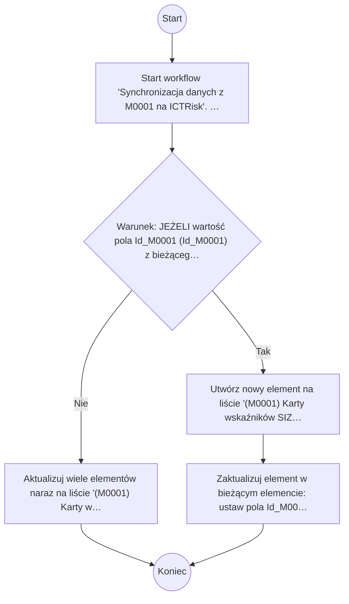

# Synchronizacja danych z M0001 na ICTRisk

> Synchronizacja danych (jednokierunkowa) z listą (M0001) Karty wskaźników SIZ (https://teams.sp.creditagricole/team/ITMM/ictrisk/Lists/M0001/)

## Podstawowe informacje

- **Lista źródłowa:** Karty wskaźników SIZ
- **Plik źródłowy:** `Synchronizacja_danych_z_M0001_na_ICTRisk.nwf`
- **Inne listy używane przez workflow:** Zadania przepływu pracy

## Diagram przepływu



## Kroki workflow

- `[n1]` Start workflow 'Synchronizacja danych z M0001 na ICTRisk'. Uruchamiane: ręcznie, przy utworzeniu elementu.
  > **Wskazówka migracji**: Wyzwalacz procesu (Triggers: ręcznie, przy utworzeniu elementu). Punkt wejścia przyjmujący parametr itemId.
  ```plsql
  -- Pobranie bieżącego elementu przed rozpoczęciem logiki workflow:
  l_item_json := shp_api.get_list_item(
      p_site_url   => c_site_url,
      p_list_title => 'Karty wskaźników SIZ',
      p_item_id    => p_item_id
  );
  ```
  <details><summary>Szczegóły techniczne</summary>

  ```
  StartManually = true
  StartOnCreate = true
  StartOnChange = false
  WorkflowName = Synchronizacja danych z M0001 na ICTRisk
  WorkflowDescription = Synchronizacja danych (jednokierunkowa) z listą (M0001) Karty wskaźników SIZ (https://teams.sp.creditagricole/team/ITMM/ictrisk/Lists/M0001/)
  WorkflowDuration = -1
  TaskListId = {CADFC681-2919-480C-987A-90D00F8E1831}
  StartPage = _layouts/15/NintexWorkflow/StartWorkflow.aspx
  VerboseLogging = false
  Category = List
  ContentType = 
  StartOnCreateCondition = false
  StartOnChangeCondition = false
  HistoryLogging = true
  RequireManagePermission = false
  HistoryListName = NintexWorkflowHistory
  ChangeComments = 
  Id = {9FD9E362-C88A-427D-89F4-4038EEB9FD28}
  SkipValidation = false
  ContentTypeName = Wszystkie
  DisplayStatusColumn = false
  StartFromMenu = false
  StartFromMenuLabel = 
  EcbId = 00000000-0000-0000-0000-000000000000
  CustomActionSequence = 0
  CustomActionIcon = _layouts/15/NintexWorkflow/Images/StartWorkflowECB.png
  UsesConditionalStart = false
  ```
  </details>
- `[n2]` Warunek: JEŻELI wartość pola Id_M0001 (Id_M0001) z bieżącego elementu jest równe 0
  > **Wskazówka migracji**: Bramka decyzyjna (Exclusive Gateway / IF): sprawdzenie warunku logicznego: wartość pola Id_M0001 (Id_M0001) z bieżącego elementu jest równe 0.
  ```plsql
  IF json_value(l_item_json, '$.data.Id_M0001') = '0' THEN
      -- Gałąź Tak
  ELSE
      -- Gałąź Nie
  END IF;
  ```
  <details><summary>Szczegóły techniczne</summary>

  ```
  ConditionUse=Child
  ```
  </details>
    - `[n3]` Aktualizuj wiele elementów naraz na liście '(M0001) Karty wskaźników SIZ' (warunek: ID jest równe '{ItemProperty:Id_M0001}').
      > **Wskazówka migracji**: Masowa aktualizacja rekordów na liście (M0001) Karty wskaźników SIZ spełniających warunek ID jest równe '{ItemProperty:Id_M0001}'.
      ```plsql
      -- Masowa aktualizacja elementów listy (M0001) Karty wskaźników SIZ:
      -- Warunek: ID jest równe '{ItemProperty:Id_M0001}'
      shp_api.update_list_item(
          p_site_url    => c_site_url,
          p_list_title  => '(M0001) Karty wskaźników SIZ',
          p_item_id     => l_target_item_id,
          p_fields_json => JSON_OBJECT(...)
      );
      ```
      <details><summary>Szczegóły techniczne</summary>

      ```
      Lista = (M0001) Karty wskaźników SIZ
      Warunek = ID jest równe '{ItemProperty:Id_M0001}'
      ```
      </details>
    - `[n4]` Utwórz nowy element na liście '(M0001) Karty wskaźników SIZ'.
      > **Wskazówka migracji**: Tworzenie nowego rekordu na liście (M0001) Karty wskaźników SIZ.
      ```plsql
      l_new_item_id := shp_api.create_list_item(
          p_site_url    => c_site_url,
          p_list_title  => '(M0001) Karty wskaźników SIZ',
          p_fields_json => JSON_OBJECT('Title' VALUE 'Nowy element')
      );
      ```
      <details><summary>Szczegóły techniczne</summary>

      ```
      Lista = (M0001) Karty wskaźników SIZ
      Output = 
      ```
      </details>
    - `[n5]` Zaktualizuj element w bieżącym elemencie: ustaw pola Id_M0001 (Id_M0001).
      > **Wskazówka migracji**: Aktualizacja danych elementu (Id_M0001 (Id_M0001)). W systemie docelowym UPDATE lub REST PATCH/MERGE.
      ```plsql
      l_resp := shp_api.update_list_item(
          p_site_url    => c_site_url,
          p_list_title  => 'Karty wskaźników SIZ',
          p_item_id     => p_item_id,
          p_fields_json => json_object(
              'Id_M0001' value l_id_m0001
          )
      );
      ```
      <details><summary>Szczegóły techniczne</summary>

      ```
      ListId = {1D3B1CFB-74B5-46BC-BA03-8E443CDC952D}
      ThisItem = True
      ```
      </details>

## Pola odczytywane / zapisywane

| Pole | Odczyt | Zapis |
|---|---|---|
| Identyfikator (ID) | X |  |
| Id_INF013 |  | X |
| Id_M0001 (Id_M0001) | X | X |
| Nazwa_x0020_wska_x017a_nika |  | X |
| Status_x0020_karty |  | X |
| Nazwa wskaźnika (Title) |  | X |

### Słownik pól i identyfikatory techniczne

| Nazwa biznesowa | SharePoint InternalName | Typ | Odczyt | Zapis |
|---|---|---|---|---|
| Identyfikator | `ID` | Tekst/Ref | Tak | - |
| Id_INF013 | `Id_INF013` | Tekst/Ref | - | Tak |
| Id_M0001 | `Id_M0001` | Tekst/Ref | Tak | Tak |
| Nazwa_x0020_wska_x017a_nika | `Nazwa_x0020_wska_x017a_nika` | Tekst/Ref | - | Tak |
| Status_x0020_karty | `Status_x0020_karty` | Tekst/Ref | - | Tak |
| Nazwa wskaźnika | `Title` | Tekst/Ref | - | Tak |

## Kompletna procedura orkiestracji PL/SQL (Oracle APEX / SHP_API)

Poniższy kod stanowi gotowy, kompletny szkielet procedury PL/SQL do wdrożenia w Oracle APEX, realizujący całą logikę workflow za pośrednictwem pakietu `SHP_API`:

```plsql
CREATE OR REPLACE PROCEDURE process_wf_synchronizacja_danych_z_m0001_na_ictrisk (
    p_item_id IN NUMBER
) AS
    c_site_url CONSTANT VARCHAR2(400) := 'https://sharepoint.domain.com/sites/...';
    l_item_json CLOB;
    l_resp      CLOB;
    l_ref_json  CLOB;
BEGIN
    apex_debug.info('Start workflow: Synchronizacja danych z M0001 na ICTRisk, item_id: ' || p_item_id);

    -- 1. Pobranie danych biezacego elementu
    l_item_json := shp_api.get_list_item(
        p_site_url   => c_site_url,
        p_list_title => 'Karty wskaźników SIZ',
        p_item_id    => p_item_id
    );

    -- 2. Logika biznesowa workflow
    IF json_value(l_item_json, '$.data.Id_M0001') = '0' THEN
        l_new_item_id := shp_api.create_list_item(
            p_site_url    => c_site_url,
            p_list_title  => '(M0001) Karty wskaźników SIZ',
            p_fields_json => JSON_OBJECT('Title' VALUE 'Nowy element')
        );
        l_resp := shp_api.update_list_item(
            p_site_url    => c_site_url,
            p_list_title  => 'Karty wskaźników SIZ',
            p_item_id     => p_item_id,
            p_fields_json => json_object(
                'Id_M0001' value l_id_m0001
            )
        );
    ELSE
        -- Masowa aktualizacja elementów listy (M0001) Karty wskaźników SIZ:
        -- Warunek: ID jest równe '{ItemProperty:Id_M0001}'
        shp_api.update_list_item(
            p_site_url    => c_site_url,
            p_list_title  => '(M0001) Karty wskaźników SIZ',
            p_item_id     => l_target_item_id,
            p_fields_json => JSON_OBJECT(...)
        );
    END IF;

    apex_debug.info('Koniec workflow: Synchronizacja danych z M0001 na ICTRisk, item_id: ' || p_item_id);
END process_wf_synchronizacja_danych_z_m0001_na_ictrisk;
/
```
