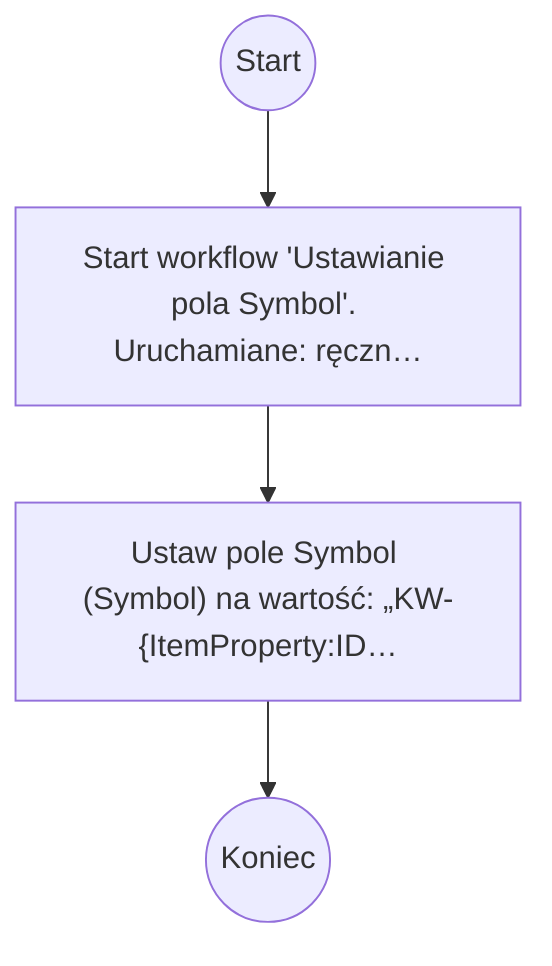

# Ustawianie pola Symbol

## Podstawowe informacje

- **Lista źródłowa:** Karty wskaźników SIZ
- **Plik źródłowy:** `Ustawianie_pola_Symbol.nwf`
- **Inne listy używane przez workflow:** Zadania przepływu pracy

## Diagram przepływu



## Kroki workflow

- `[n1]` Start workflow 'Ustawianie pola Symbol'. Uruchamiane: ręcznie, przy utworzeniu elementu, przy zmianie elementu.
  > **Wskazówka migracji**: Wyzwalacz procesu (Triggers: ręcznie, przy utworzeniu elementu, przy zmianie elementu). Punkt wejścia przyjmujący parametr itemId.
  ```plsql
  -- Pobranie bieżącego elementu przed rozpoczęciem logiki workflow:
  l_item_json := shp_api.get_list_item(
      p_site_url   => c_site_url,
      p_list_title => 'Karty wskaźników SIZ',
      p_item_id    => p_item_id
  );
  ```
  <details><summary>Szczegóły techniczne</summary>

  ```
  StartManually = true
  StartOnCreate = true
  StartOnChange = true
  WorkflowName = Ustawianie pola Symbol
  WorkflowDescription = 
  WorkflowDuration = -1
  TaskListId = {CADFC681-2919-480C-987A-90D00F8E1831}
  StartPage = _layouts/15/NintexWorkflow/StartWorkflow.aspx
  VerboseLogging = false
  Category = List
  ContentType = 
  StartOnCreateCondition = false
  StartOnChangeCondition = true
  HistoryLogging = true
  RequireManagePermission = false
  HistoryListName = NintexWorkflowHistory
  ChangeComments = 
  Id = {22574802-535A-4DD5-95B9-1D04245405EB}
  SkipValidation = false
  ContentTypeName = Wszystkie
  DisplayStatusColumn = false
  StartFromMenu = false
  StartFromMenuLabel = 
  EcbId = 00000000-0000-0000-0000-000000000000
  CustomActionSequence = 0
  CustomActionIcon = _layouts/15/NintexWorkflow/Images/StartWorkflowECB.png
  UsesConditionalStart = true
  ```
  </details>
- `[n2]` Ustaw pole Symbol (Symbol) na wartość: „KW-{ItemProperty:ID}”. _(wyłączona)_
  > **Wskazówka migracji**: Ustawienie pola Symbol (Symbol) = 'KW-{ItemProperty:ID}'.
  ```plsql
  l_resp := shp_api.update_list_item(
      p_site_url    => c_site_url,
      p_list_title  => 'Karty wskaźników SIZ',
      p_item_id     => p_item_id,
      p_fields_json => json_object('Symbol' value 'KW-' || TO_CHAR(p_item_id))
  );
  ```
  <details><summary>Szczegóły techniczne</summary>

  ```
  LookupField = Symbol
  LookupFieldType = Text
  LookupFieldValue = KW-{ItemProperty:ID}
  ```
  </details>

## Pola odczytywane / zapisywane

| Pole | Odczyt | Zapis |
|---|---|---|
| Symbol (Symbol) |  | X |

### Słownik pól i identyfikatory techniczne

| Nazwa biznesowa | SharePoint InternalName | Typ | Odczyt | Zapis |
|---|---|---|---|---|
| Symbol | `Symbol` | Tekst/Ref | - | Tak |

## Kompletna procedura orkiestracji PL/SQL (Oracle APEX / SHP_API)

Poniższy kod stanowi gotowy, kompletny szkielet procedury PL/SQL do wdrożenia w Oracle APEX, realizujący całą logikę workflow za pośrednictwem pakietu `SHP_API`:

```plsql
CREATE OR REPLACE PROCEDURE process_wf_ustawianie_pola_symbol (
    p_item_id IN NUMBER
) AS
    c_site_url CONSTANT VARCHAR2(400) := 'https://sharepoint.domain.com/sites/...';
    l_item_json CLOB;
    l_resp      CLOB;
    l_ref_json  CLOB;
BEGIN
    apex_debug.info('Start workflow: Ustawianie pola Symbol, item_id: ' || p_item_id);

    -- 1. Pobranie danych biezacego elementu
    l_item_json := shp_api.get_list_item(
        p_site_url   => c_site_url,
        p_list_title => 'Karty wskaźników SIZ',
        p_item_id    => p_item_id
    );

    -- 2. Logika biznesowa workflow
    NULL;

    apex_debug.info('Koniec workflow: Ustawianie pola Symbol, item_id: ' || p_item_id);
END process_wf_ustawianie_pola_symbol;
/
```
