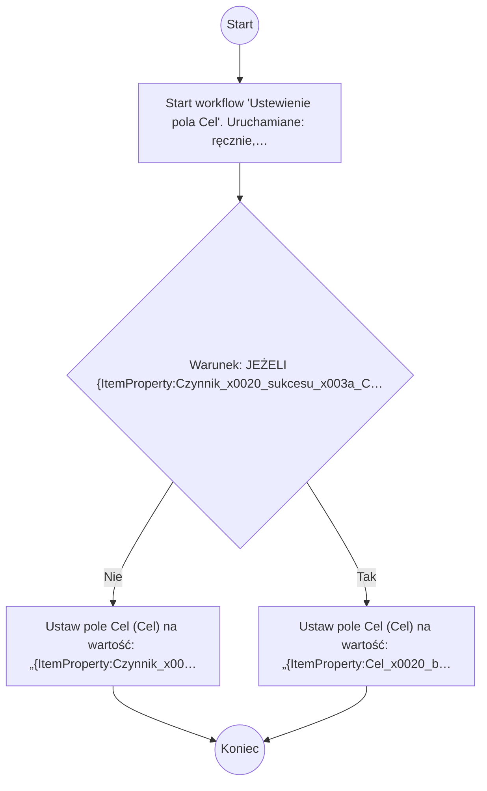

# Ustewienie pola Cel

## Podstawowe informacje

- **Lista źródłowa:** INF014 - Wskaźniki
- **Plik źródłowy:** `Ustewienie_pola_Cel.nwf`
- **Inne listy używane przez workflow:** Zadania przepływu pracy

## Diagram przepływu



## Kroki workflow

- `[n1]` Start workflow 'Ustewienie pola Cel'. Uruchamiane: ręcznie, przy utworzeniu elementu, przy zmianie elementu.
  > **Wskazówka migracji**: Wyzwalacz procesu (Triggers: ręcznie, przy utworzeniu elementu, przy zmianie elementu). Punkt wejścia przyjmujący parametr itemId.
  ```plsql
  -- Pobranie bieżącego elementu przed rozpoczęciem logiki workflow:
  l_item_json := shp_api.get_list_item(
      p_site_url   => c_site_url,
      p_list_title => 'INF014 - Wskaźniki',
      p_item_id    => p_item_id
  );
  ```
  <details><summary>Szczegóły techniczne</summary>

  ```
  StartManually = true
  StartOnCreate = true
  StartOnChange = true
  WorkflowName = Ustewienie pola Cel
  WorkflowDescription = 
  WorkflowDuration = -1
  TaskListId = {CADFC681-2919-480C-987A-90D00F8E1831}
  StartPage = _layouts/15/NintexWorkflow/StartWorkflow.aspx
  VerboseLogging = false
  Category = List
  ContentType = 
  StartOnCreateCondition = false
  StartOnChangeCondition = false
  HistoryLogging = true
  RequireManagePermission = false
  HistoryListName = NintexWorkflowHistory
  ChangeComments = 
  Id = {16CDB885-F7FB-44E0-B227-B5EAE58E9BDD}
  SkipValidation = false
  ContentTypeName = Wszystkie
  DisplayStatusColumn = false
  StartFromMenu = false
  StartFromMenuLabel = 
  EcbId = 00000000-0000-0000-0000-000000000000
  CustomActionSequence = 0
  CustomActionIcon = _layouts/15/NintexWorkflow/Images/StartWorkflowECB.png
  UsesConditionalStart = false
  ```
  </details>
- `[n2]` Warunek: JEŻELI {ItemProperty:Czynnik_x0020_sukcesu_x003a_CSF_} jest puste
  > **Wskazówka migracji**: Bramka decyzyjna (Exclusive Gateway / IF): sprawdzenie warunku logicznego: {ItemProperty:Czynnik_x0020_sukcesu_x003a_CSF_} jest puste.
  ```plsql
  IF json_value(l_item_json, '$.data.Czynnik_x0020_sukcesu_x003a_CSF_') IS NULL THEN
      -- Gałąź Tak
  ELSE
      -- Gałąź Nie
  END IF;
  ```
  <details><summary>Szczegóły techniczne</summary>

  ```
  ConditionUse=Child
  ```
  </details>
    - `[n3]` Ustaw pole Cel (Cel) na wartość: „{ItemProperty:Czynnik_x0020_sukcesu_x003a_CSF_}”.
      > **Wskazówka migracji**: Ustawienie pola Cel (Cel) = '{ItemProperty:Czynnik_x0020_sukcesu_x003a_CSF_}'.
      ```plsql
      l_resp := shp_api.update_list_item(
          p_site_url    => c_site_url,
          p_list_title  => 'INF014 - Wskaźniki',
          p_item_id     => p_item_id,
          p_fields_json => json_object('Cel' value json_value(l_item_json, '$.data.Czynnik_x0020_sukcesu_x003a_CSF_'))
      );
      ```
      <details><summary>Szczegóły techniczne</summary>

      ```
      LookupField = Cel
      LookupFieldType = Text
      LookupFieldValue = {ItemProperty:Czynnik_x0020_sukcesu_x003a_CSF_}
      ```
      </details>
    - `[n4]` Ustaw pole Cel (Cel) na wartość: „{ItemProperty:Cel_x0020_biznesowy}”.
      > **Wskazówka migracji**: Ustawienie pola Cel (Cel) = '{ItemProperty:Cel_x0020_biznesowy}'.
      ```plsql
      l_resp := shp_api.update_list_item(
          p_site_url    => c_site_url,
          p_list_title  => 'INF014 - Wskaźniki',
          p_item_id     => p_item_id,
          p_fields_json => json_object('Cel' value json_value(l_item_json, '$.data.Cel_x0020_biznesowy'))
      );
      ```
      <details><summary>Szczegóły techniczne</summary>

      ```
      LookupField = Cel
      LookupFieldType = Text
      LookupFieldValue = {ItemProperty:Cel_x0020_biznesowy}
      ```
      </details>

## Pola odczytywane / zapisywane

| Pole | Odczyt | Zapis |
|---|---|---|
| Cel (Cel) |  | X |

### Słownik pól i identyfikatory techniczne

| Nazwa biznesowa | SharePoint InternalName | Typ | Odczyt | Zapis |
|---|---|---|---|---|
| Cel | `Cel` | Tekst/Ref | - | Tak |

## Kompletna procedura orkiestracji PL/SQL (Oracle APEX / SHP_API)

Poniższy kod stanowi gotowy, kompletny szkielet procedury PL/SQL do wdrożenia w Oracle APEX, realizujący całą logikę workflow za pośrednictwem pakietu `SHP_API`:

```plsql
CREATE OR REPLACE PROCEDURE process_wf_ustewienie_pola_cel (
    p_item_id IN NUMBER
) AS
    c_site_url CONSTANT VARCHAR2(400) := 'https://sharepoint.domain.com/sites/...';
    l_item_json CLOB;
    l_resp      CLOB;
    l_ref_json  CLOB;
BEGIN
    apex_debug.info('Start workflow: Ustewienie pola Cel, item_id: ' || p_item_id);

    -- 1. Pobranie danych biezacego elementu
    l_item_json := shp_api.get_list_item(
        p_site_url   => c_site_url,
        p_list_title => 'INF014 - Wskaźniki',
        p_item_id    => p_item_id
    );

    -- 2. Logika biznesowa workflow
    IF json_value(l_item_json, '$.data.Czynnik_x0020_sukcesu_x003a_CSF_') IS NULL THEN
        l_resp := shp_api.update_list_item(
            p_site_url    => c_site_url,
            p_list_title  => 'INF014 - Wskaźniki',
            p_item_id     => p_item_id,
            p_fields_json => json_object('Cel' value json_value(l_item_json, '$.data.Cel_x0020_biznesowy'))
        );
    ELSE
        l_resp := shp_api.update_list_item(
            p_site_url    => c_site_url,
            p_list_title  => 'INF014 - Wskaźniki',
            p_item_id     => p_item_id,
            p_fields_json => json_object('Cel' value json_value(l_item_json, '$.data.Czynnik_x0020_sukcesu_x003a_CSF_'))
        );
    END IF;

    apex_debug.info('Koniec workflow: Ustewienie pola Cel, item_id: ' || p_item_id);
END process_wf_ustewienie_pola_cel;
/
```
