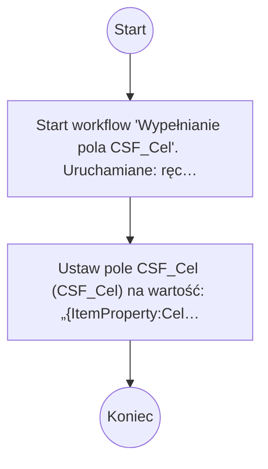

# Wypełnianie pola CSF_Cel

## Podstawowe informacje

- **Lista źródłowa:** INF017 - Czynniki sukcesu
- **Plik źródłowy:** `Wypełnianie_pola_CSF_Cel.nwf`
- **Inne listy używane przez workflow:** Zadania przepływu pracy

## Diagram przepływu



## Kroki workflow

- `[n1]` Start workflow 'Wypełnianie pola CSF_Cel'. Uruchamiane: ręcznie, przy utworzeniu elementu, przy zmianie elementu.
  > **Wskazówka migracji**: Wyzwalacz procesu (Triggers: ręcznie, przy utworzeniu elementu, przy zmianie elementu). Punkt wejścia przyjmujący parametr itemId.
  ```plsql
  -- Pobranie bieżącego elementu przed rozpoczęciem logiki workflow:
  l_item_json := shp_api.get_list_item(
      p_site_url   => c_site_url,
      p_list_title => 'INF017 - Czynniki sukcesu',
      p_item_id    => p_item_id
  );
  ```
  <details><summary>Szczegóły techniczne</summary>

  ```
  StartManually = true
  StartOnCreate = true
  StartOnChange = true
  WorkflowName = Wypełnianie pola CSF_Cel
  WorkflowDescription = 
  WorkflowDuration = -1
  TaskListId = {CADFC681-2919-480C-987A-90D00F8E1831}
  StartPage = _layouts/15/NintexWorkflow/StartWorkflow.aspx
  VerboseLogging = false
  Category = List
  ContentType = 
  StartOnCreateCondition = false
  StartOnChangeCondition = false
  HistoryLogging = true
  RequireManagePermission = false
  HistoryListName = NintexWorkflowHistory
  ChangeComments = 
  Id = {FD376EA3-F0DD-45EC-BE6F-4D5CE950513E}
  SkipValidation = false
  ContentTypeName = Wszystkie
  DisplayStatusColumn = true
  StartFromMenu = false
  StartFromMenuLabel = 
  EcbId = 00000000-0000-0000-0000-000000000000
  CustomActionSequence = 0
  CustomActionIcon = _layouts/15/NintexWorkflow/Images/StartWorkflowECB.png
  UsesConditionalStart = false
  ```
  </details>
- `[n2]` Ustaw pole CSF_Cel (CSF_Cel) na wartość: „{ItemProperty:Cel}”.
  > **Wskazówka migracji**: Ustawienie pola CSF_Cel (CSF_Cel) = '{ItemProperty:Cel}'.
  ```plsql
  l_resp := shp_api.update_list_item(
      p_site_url    => c_site_url,
      p_list_title  => 'INF017 - Czynniki sukcesu',
      p_item_id     => p_item_id,
      p_fields_json => json_object('CSF_Cel' value json_value(l_item_json, '$.data.Cel'))
  );
  ```
  <details><summary>Szczegóły techniczne</summary>

  ```
  LookupField = CSF_Cel
  LookupFieldType = Text
  LookupFieldValue = {ItemProperty:Cel}
  ```
  </details>

## Pola odczytywane / zapisywane

| Pole | Odczyt | Zapis |
|---|---|---|
| CSF_Cel (CSF_Cel) |  | X |

### Słownik pól i identyfikatory techniczne

| Nazwa biznesowa | SharePoint InternalName | Typ | Odczyt | Zapis |
|---|---|---|---|---|
| CSF_Cel | `CSF_Cel` | Tekst/Ref | - | Tak |

## Kompletna procedura orkiestracji PL/SQL (Oracle APEX / SHP_API)

Poniższy kod stanowi gotowy, kompletny szkielet procedury PL/SQL do wdrożenia w Oracle APEX, realizujący całą logikę workflow za pośrednictwem pakietu `SHP_API`:

```plsql
CREATE OR REPLACE PROCEDURE process_wf_wype_nianie_pola_csf_cel (
    p_item_id IN NUMBER
) AS
    c_site_url CONSTANT VARCHAR2(400) := 'https://sharepoint.domain.com/sites/...';
    l_item_json CLOB;
    l_resp      CLOB;
    l_ref_json  CLOB;
BEGIN
    apex_debug.info('Start workflow: Wypełnianie pola CSF_Cel, item_id: ' || p_item_id);

    -- 1. Pobranie danych biezacego elementu
    l_item_json := shp_api.get_list_item(
        p_site_url   => c_site_url,
        p_list_title => 'INF017 - Czynniki sukcesu',
        p_item_id    => p_item_id
    );

    -- 2. Logika biznesowa workflow
    l_resp := shp_api.update_list_item(
        p_site_url    => c_site_url,
        p_list_title  => 'INF017 - Czynniki sukcesu',
        p_item_id     => p_item_id,
        p_fields_json => json_object('CSF_Cel' value json_value(l_item_json, '$.data.Cel'))
    );

    apex_debug.info('Koniec workflow: Wypełnianie pola CSF_Cel, item_id: ' || p_item_id);
END process_wf_wype_nianie_pola_csf_cel;
/
```
